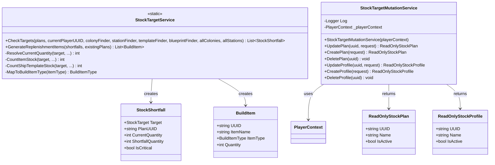

<!-- Extracted from spec/design/services.md — Stock Targets domain -->
# Services — Stock Targets

## StockTargetService (Iteration 7)

Static service in `Services/StockTargetService.cs`.

```csharp
public static class StockTargetService
{
    public static List<StockShortfall> CheckTargets(
        IEnumerable<StockPlan> plans, string currentPlayerUUID,
        Func<string, Colony> colonyFinder, Func<string, Station> stationFinder,
        Func<string, ShipTemplate> templateFinder, Func<string, Blueprint> blueprintFinder,
        IEnumerable<Colony> allColonies, IEnumerable<Station> allStations);

    public static List<BuildItem> GenerateReplenishmentItems(
        List<StockShortfall> shortfalls, IEnumerable<BuildPlan> existingPlans);
}

public class StockShortfall
{
    public StockTarget Target { get; set; }
    public string PlanUUID { get; set; }
    public int CurrentQuantity { get; set; }
    public int ShortfallQuantity { get; set; }
    public bool IsCritical { get; set; }
}
```

- Within a plan: OR pooling (max across overlapping components).
- Across plans: AND/dedicated (summed).

## Class Diagram


