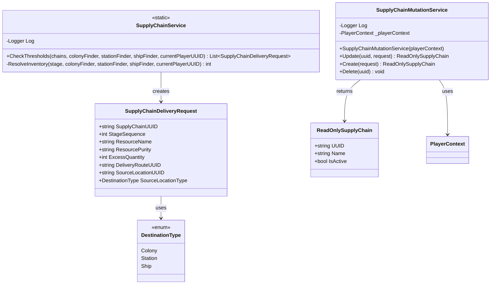

<!-- Extracted from spec/design/services.md — Supply Chain domain -->
# Services — Supply Chain

## SupplyChainService (Iteration 6)

Static service in `Services/SupplyChainService.cs`.

```csharp
public static class SupplyChainService
{
    public static List<SupplyChainDeliveryRequest> CheckThresholds(
        IEnumerable<SupplyChain> chains,
        Func<string, Colony> colonyFinder,
        Func<string, Station> stationFinder,
        Func<string, Ship> shipFinder,
        string currentPlayerUUID);
}

public class SupplyChainDeliveryRequest
{
    public string SupplyChainUUID { get; set; }
    public int StageSequence { get; set; }
    public string ResourceName { get; set; }
    public string ResourcePurity { get; set; }
    public int ExcessQuantity { get; set; }
    public string DeliveryRouteUUID { get; set; }
    public string SourceLocationUUID { get; set; }
    public DestinationType SourceLocationType { get; set; }
}
```

- Filters to `IsActive` chains only.
- Inventory resolution: Colony → `colony.Items`, Station → `station.Holds[currentPlayerUUID]`, Ship → `ship.Cargo`.
- ExcessQuantity = quantity - threshold.

## Class Diagram


