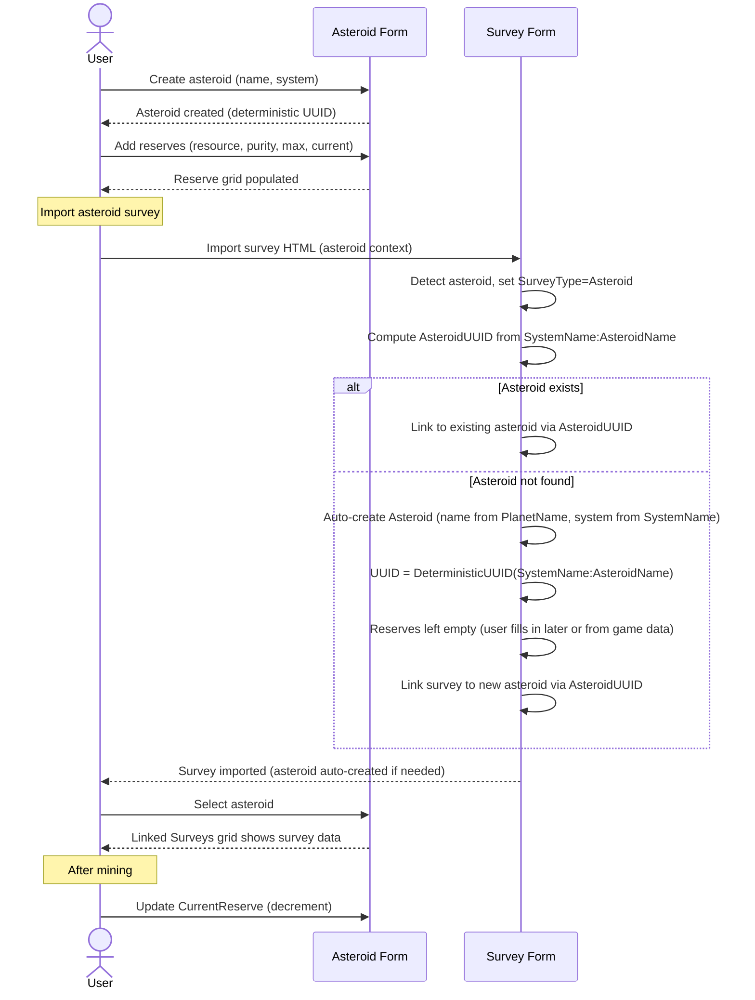

# User Flows — Asteroids

### Flow 12: Asteroid — Create and Track Reserves

```mermaid
sequenceDiagram
    actor User
    participant AF as Asteroid Form
    participant SF as Survey Form

    User->>AF: Create asteroid (name, system)
    AF-->>User: Asteroid created (deterministic UUID)

    User->>AF: Add reserves (resource, purity, max, current)
    AF-->>User: Reserve grid populated

    Note over User: Import asteroid survey
    User->>SF: Import survey HTML (asteroid context)
    SF->>SF: Detect asteroid, set SurveyType=Asteroid
    SF->>SF: Compute AsteroidUUID from SystemName:AsteroidName
    alt Asteroid exists
        SF->>SF: Link to existing asteroid via AsteroidUUID
    else Asteroid not found
        SF->>SF: Auto-create Asteroid (name from PlanetName, system from SystemName)
        SF->>SF: UUID = DeterministicUUID(SystemName:AsteroidName)
        SF->>SF: Reserves left empty (user fills in later or from game data)
        SF->>SF: Link survey to new asteroid via AsteroidUUID
    end
    SF-->>User: Survey imported (asteroid auto-created if needed)

    User->>AF: Select asteroid
    AF-->>User: Linked Surveys grid shows survey data

    Note over User: After mining
    User->>AF: Update CurrentReserve (decrement)
```

