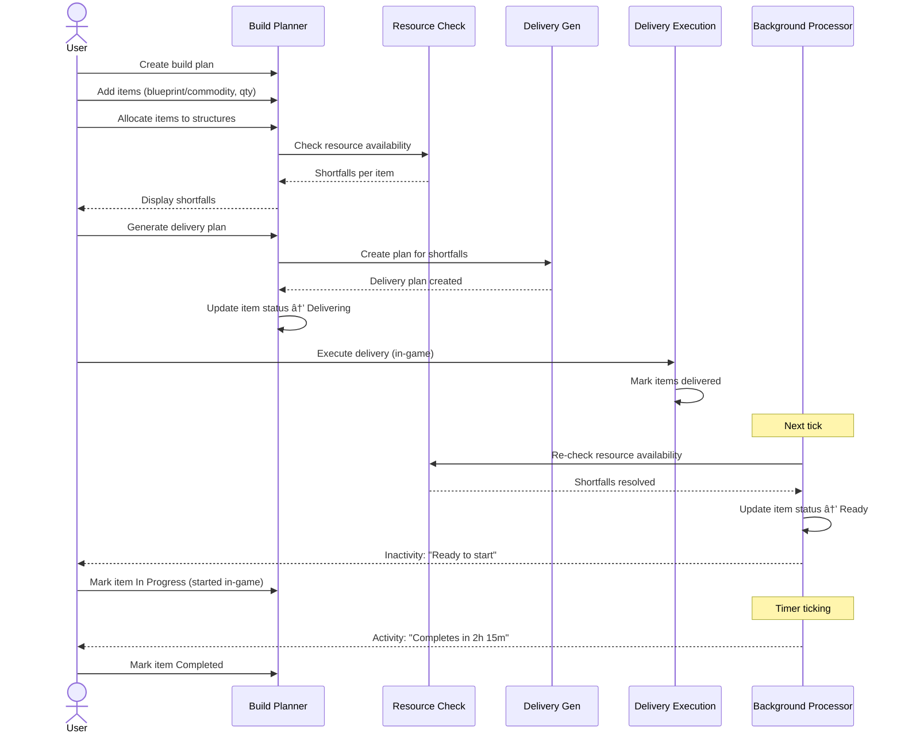
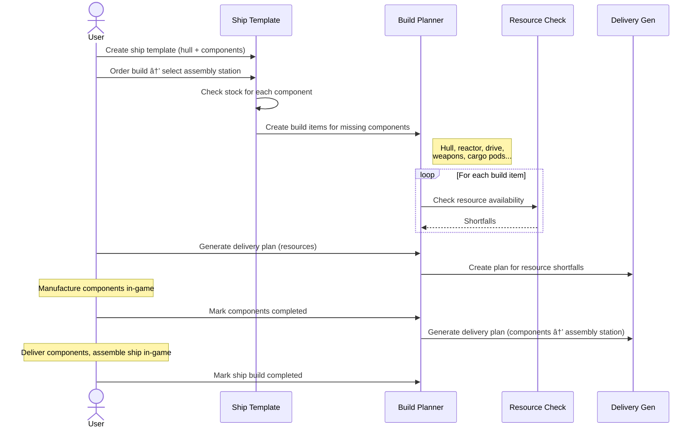
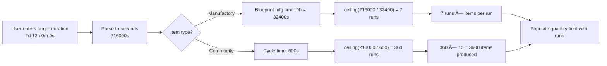
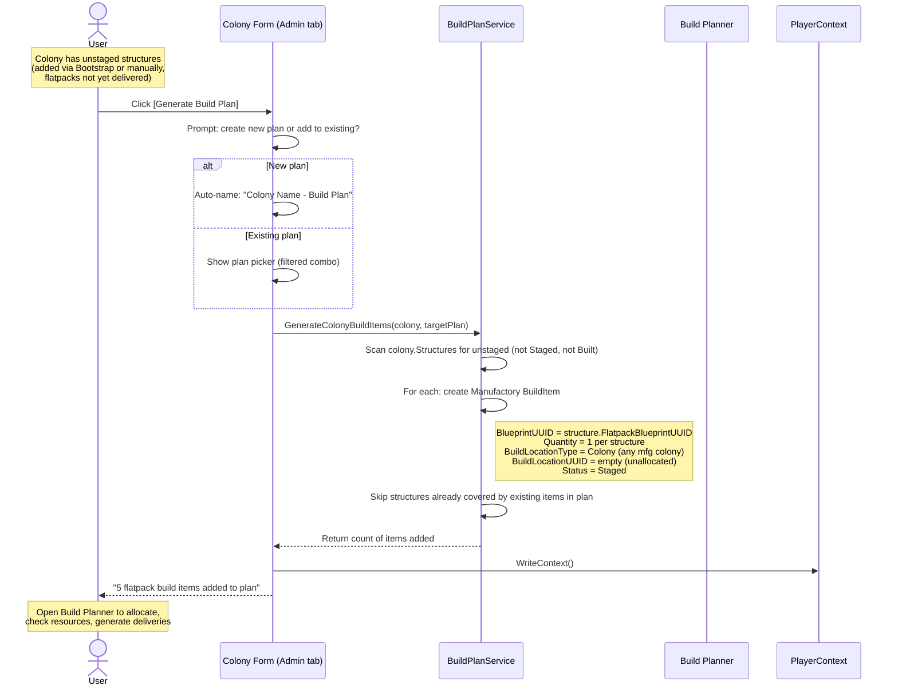

# User Flows — Build Planner

### Flow 1: Build Planner — Manufacturing Workflow

### Flow 2: Ship Build — Template to Assembly

### Flow 6: Queue Calculator

### Flow 16: Colony Plan → Build Plan Generation

### Flow 17: Multi-Plan Consolidated Delivery

```mermaid
sequenceDiagram
    actor User
    participant BP as Build Planner
    participant RC as Resource Check
    participant DG as Delivery Gen
    participant DE as Delivery Execution

    Note over User: Has per-colony build plans:<br/>Plan A (Colony Alpha flatpacks)<br/>Plan B (Colony Beta flatpacks)<br/>Plan C (Colony Gamma flatpacks)<br/>All items allocated to mfg colonies

    Note over User: Phase 1: Resource Delivery
    User->>BP: Generate Delivery ▼ → Consolidated Resource Delivery
    BP->>BP: Show plan checklist (check A, B, C)
    BP->>RC: ComputePlanShortfalls for each selected plan
    RC-->>BP: Shortfalls per plan
    BP->>DG: GenerateConsolidatedDeliveryPlan(plans, route)
    DG->>DG: Merge shortfalls by mfg colony
    Note right of DG: Colony X needs 800 Titanium<br/>(500 from Plan A + 300 from Plan B)
    DG-->>BP: One consolidated delivery plan
    BP-->>User: "Resource delivery plan created"
    User->>DE: Execute resource delivery in-game

    Note over User: Phase 2: Manufacturing
    Note over User: Manufacture flatpacks at mfg colonies
    User->>BP: Mark items Completed as they finish

    Note over User: Phase 3: Flatpack Delivery
    User->>BP: Generate Delivery ▼ → Flatpack Delivery
    BP->>BP: Show plan checklist (check A, B, C)
    BP->>DG: GenerateFlatpackDeliveryPlan(plans, route)
    DG->>DG: Scan Completed items, group by destination colony
    Note right of DG: Colony Alpha gets 3 flatpacks<br/>Colony Beta gets 2 flatpacks<br/>Colony Gamma gets 4 flatpacks
    DG-->>BP: One flatpack delivery plan
    BP-->>User: "Flatpack delivery plan created"
    User->>DE: Execute flatpack delivery in-game
    User->>DE: Mark flatpacks delivered → structures staged
```

