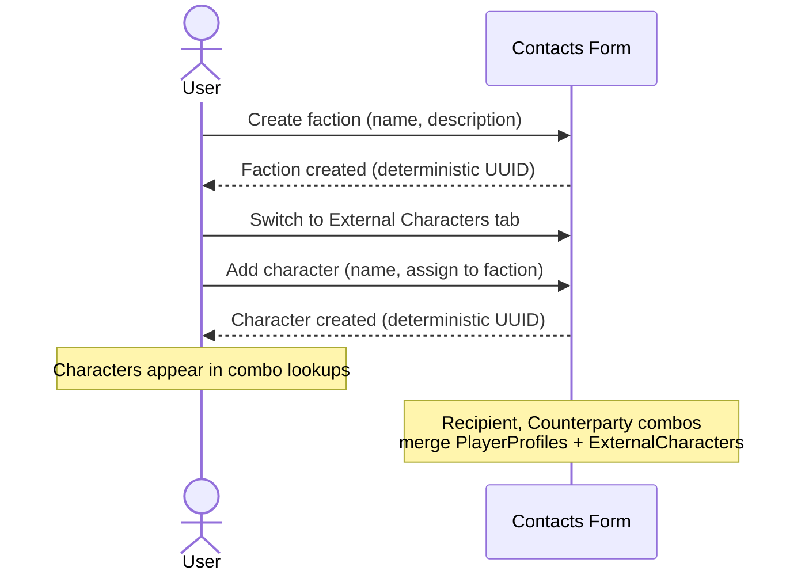

# User Flows — Contacts

### Flow 11: Contacts — Factions and External Characters

```mermaid
sequenceDiagram
    actor User
    participant FC as Contacts Form

    User->>FC: Create faction (name, description)
    FC-->>User: Faction created (deterministic UUID)

    User->>FC: Switch to External Characters tab
    User->>FC: Add character (name, assign to faction)
    FC-->>User: Character created (deterministic UUID)

    Note over User: Characters appear in combo lookups
    Note over FC: Recipient, Counterparty combos<br/>merge PlayerProfiles + ExternalCharacters
```

