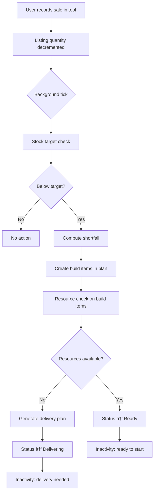
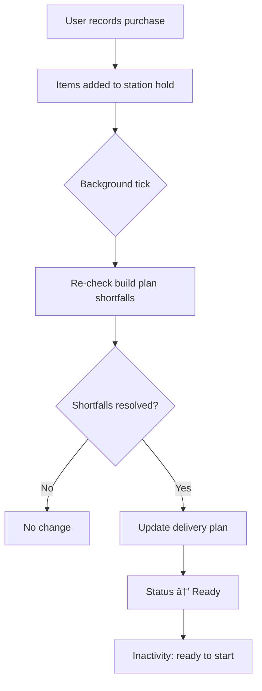

# User Flows — Market

### Flow 3: Market Sale — Cascade to Manufacturing

```mermaid
flowchart TD
    A[User records sale in tool] --> B[Listing quantity decremented]
    B --> C{Background tick}
    C --> D[Stock target check]
    D --> E{Below target?}
    E -->|No| F[No action]
    E -->|Yes| G[Compute shortfall]
    G --> H[Create build items in plan]
    H --> I[Resource check on build items]
    I --> J{Resources available?}
    J -->|Yes| K[Status → Ready]
    J -->|No| L[Generate delivery plan]
    L --> M[Status → Delivering]
    M --> N[Inactivity: delivery needed]
    K --> O[Inactivity: ready to start]
```

### Flow 4: Market Purchase — Resource Fulfillment

```mermaid
flowchart TD
    A[User records purchase] --> B[Items added to station hold]
    B --> C{Background tick}
    C --> D[Re-check build plan shortfalls]
    D --> E{Shortfalls resolved?}
    E -->|No| F[No change]
    E -->|Yes| G[Update delivery plan]
    G --> H[Status → Ready]
    H --> I[Inactivity: ready to start]
```

