# Pre-Empire-Systems User Flows

User interaction flows for features implemented before the empire-systems spec.
These cover data import, daily operations, pricing, evolution, and colony management.

---

## Flow 1: Colony Import

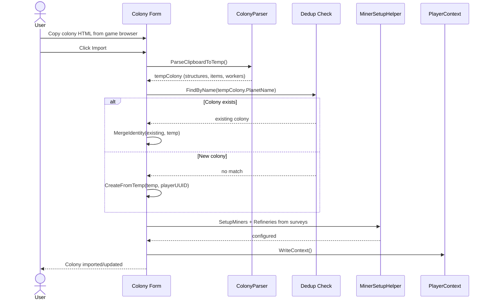

---

## Flow 2: Blueprint Import (Individual)

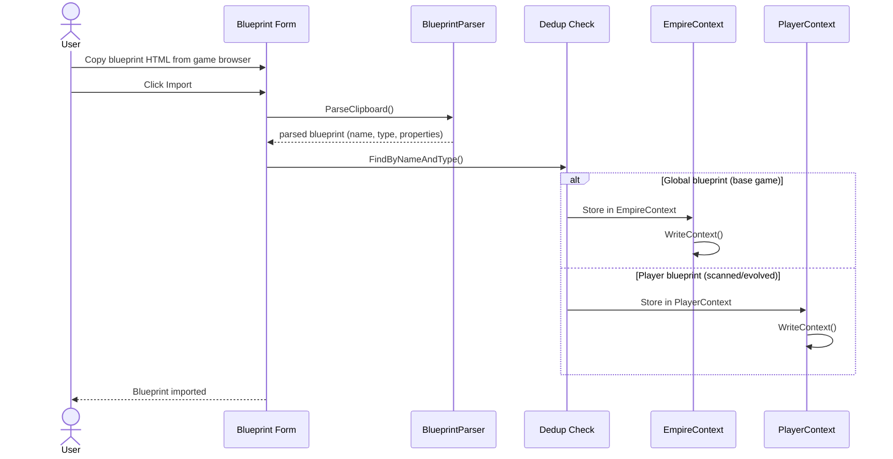

---

## Flow 3: Blueprint Import (Market/Bulk)

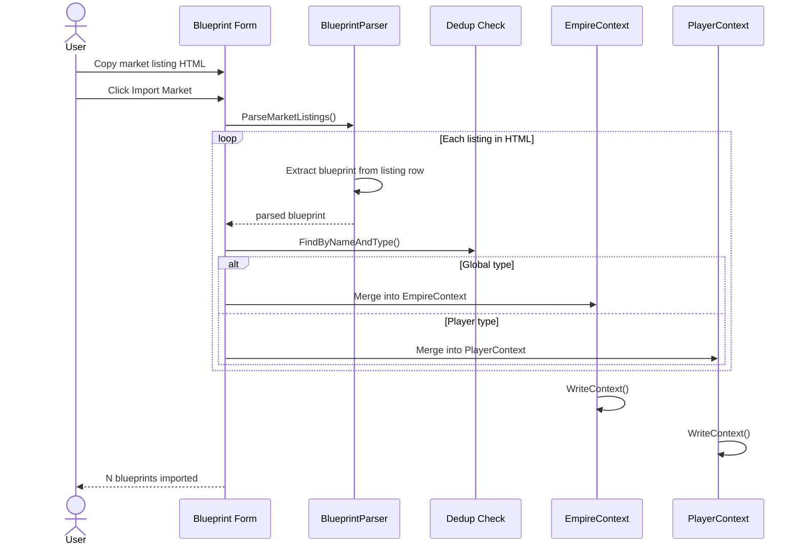

---

## Flow 4: Survey Import

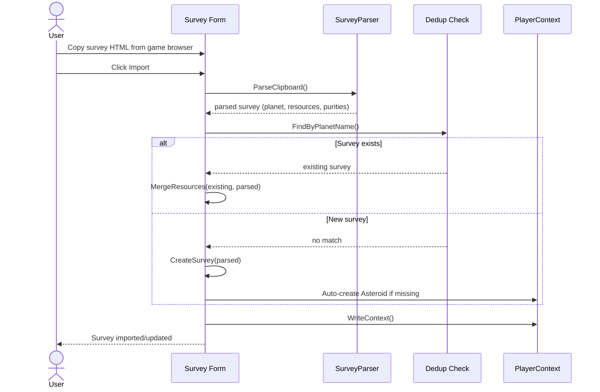

---

## Flow 5: Player Profile Import

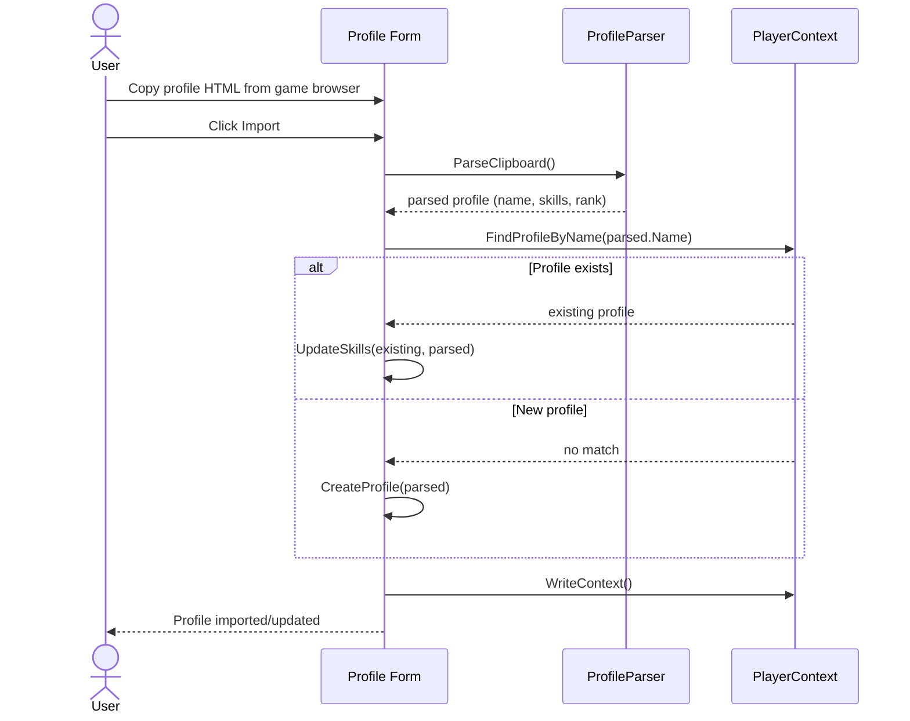

---

## Flow 6: Colony Daily Build

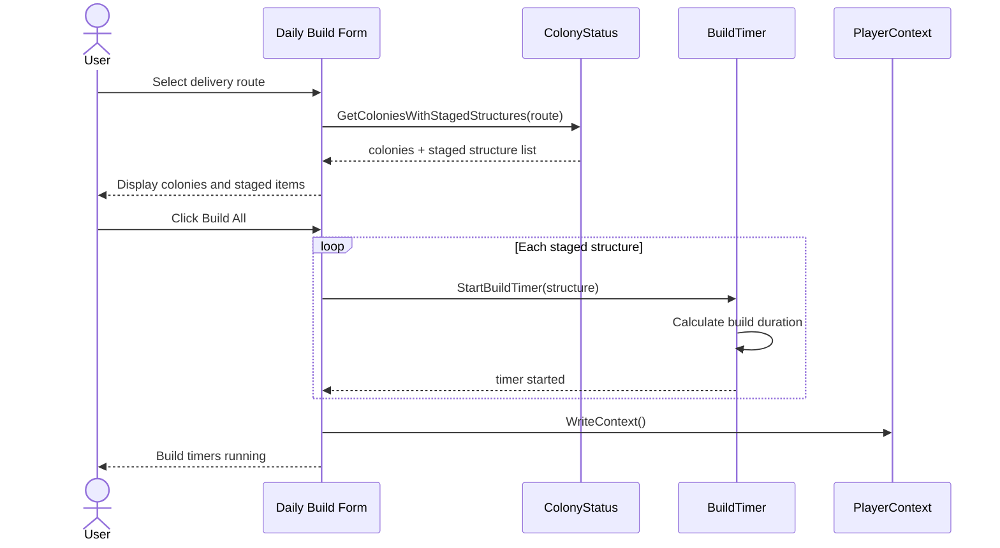

---

## Flow 7: Delivery Execution

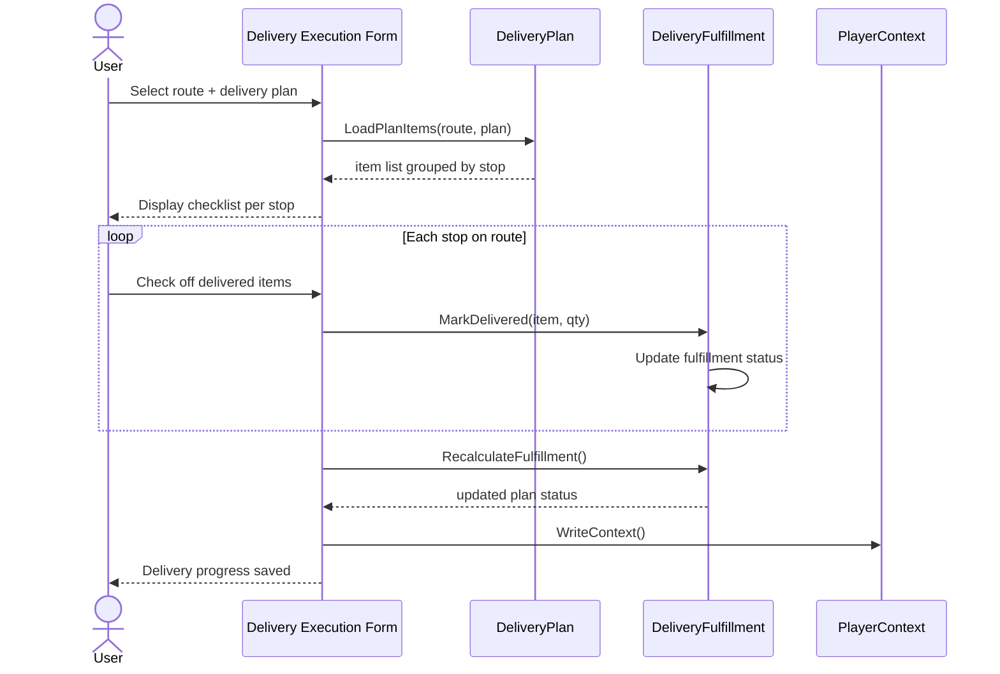

---

## Flow 8: Pricing Plan Calculation

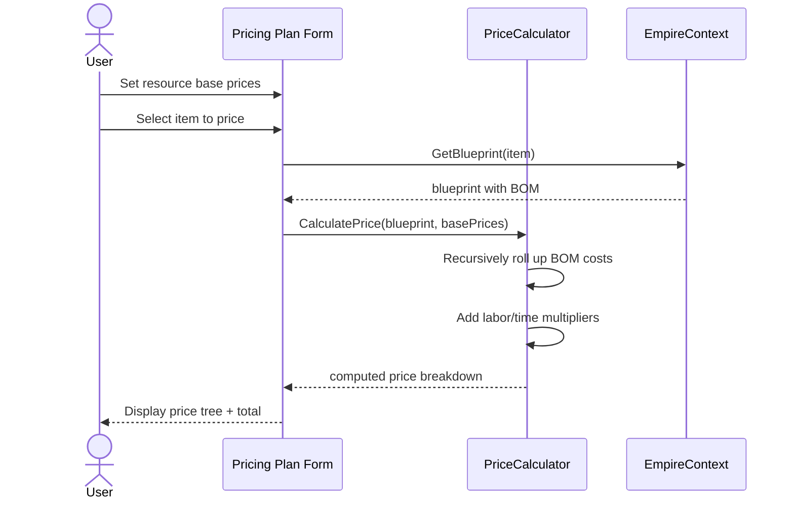

---

## Flow 9: Blueprint Evolution Graph

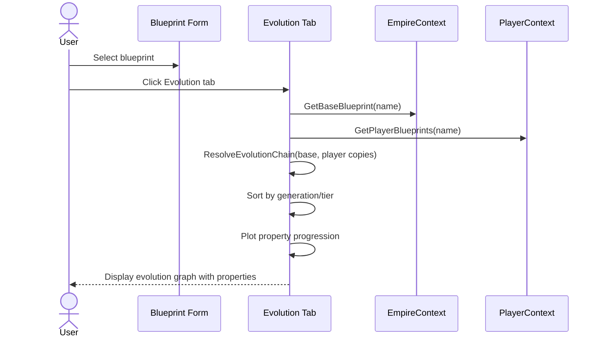

---

## Flow 10: Colony Bootstrap

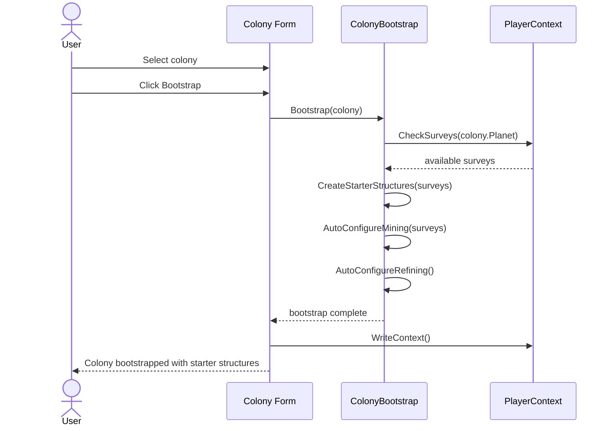

---

## Flow 11: Colony Build Order Optimization

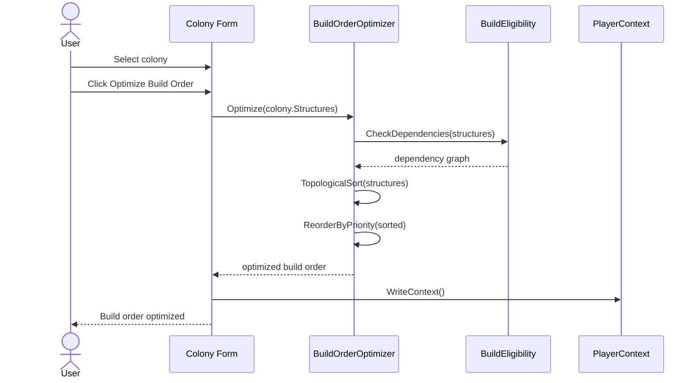
