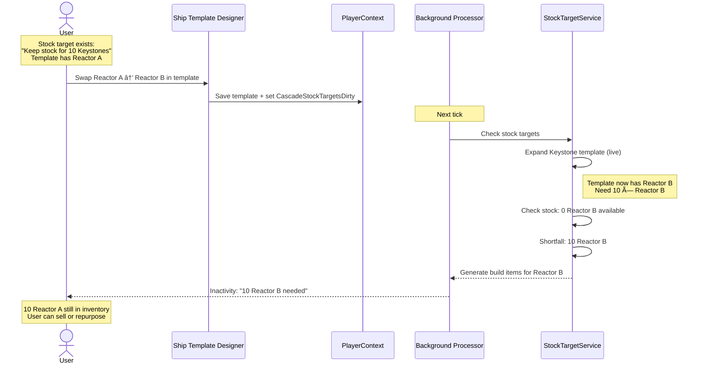
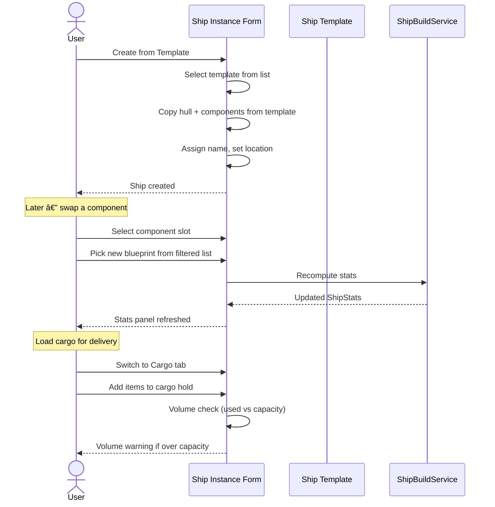

# User Flows — Ships

### Flow 7: Ship Template Modification — Stock Target Cascade

```mermaid
sequenceDiagram
    actor User
    participant STD as Ship Template Designer
    participant PC as PlayerContext
    participant BG as Background Processor
    participant STS as StockTargetService

    Note over User: Stock target exists:<br/>"Keep stock for 10 Keystones"<br/>Template has Reactor A

    User->>STD: Swap Reactor A → Reactor B in template
    STD->>PC: Save template + set CascadeStockTargetsDirty

    Note over BG: Next tick
    BG->>STS: Check stock targets
    STS->>STS: Expand Keystone template (live)
    Note right of STS: Template now has Reactor B<br/>Need 10 × Reactor B
    STS->>STS: Check stock: 0 Reactor B available
    STS->>STS: Shortfall: 10 Reactor B
    STS-->>BG: Generate build items for Reactor B
    BG-->>User: Inactivity: "10 Reactor B needed"

    Note over User: 10 Reactor A still in inventory<br/>User can sell or repurpose
```

### Flow 8: Ship Instance — Create, Configure, Load Cargo

```mermaid
sequenceDiagram
    actor User
    participant SI as Ship Instance Form
    participant ST as Ship Template
    participant SBS as ShipBuildService

    User->>SI: Create from Template
    SI->>SI: Select template from list
    SI->>SI: Copy hull + components from template
    SI->>SI: Assign name, set location
    SI-->>User: Ship created

    Note over User: Later — swap a component
    User->>SI: Select component slot
    User->>SI: Pick new blueprint from filtered list
    SI->>SBS: Recompute stats
    SBS-->>SI: Updated ShipStats
    SI-->>User: Stats panel refreshed

    Note over User: Load cargo for delivery
    User->>SI: Switch to Cargo tab
    User->>SI: Add items to cargo hold
    SI->>SI: Volume check (used vs capacity)
    SI-->>User: Volume warning if over capacity
```

