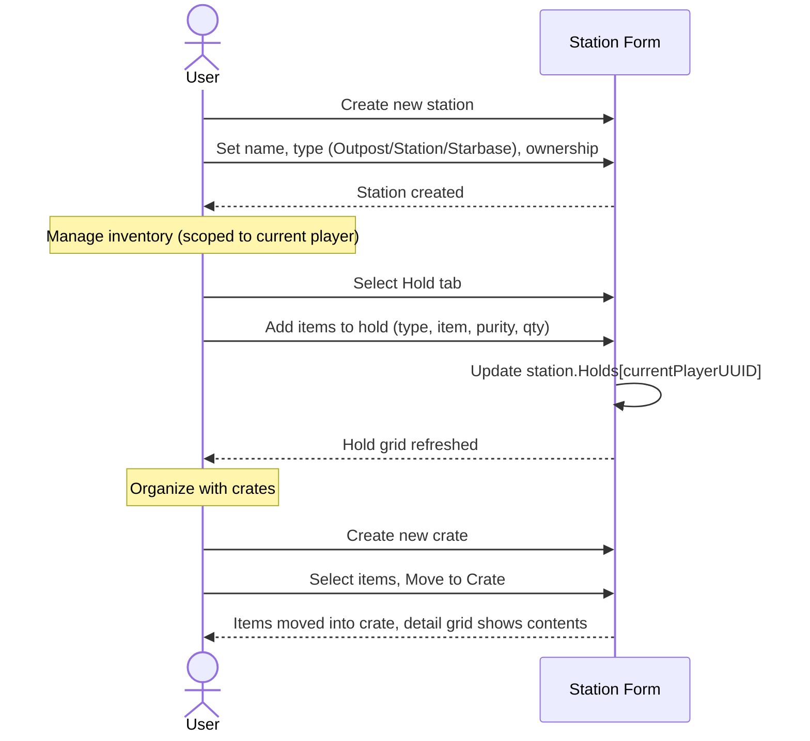

# User Flows — Stations

### Flow 9: Station — Create, Manage Holds

```mermaid
sequenceDiagram
    actor User
    participant STN as Station Form

    User->>STN: Create new station
    User->>STN: Set name, type (Outpost/Station/Starbase), ownership
    STN-->>User: Station created

    Note over User: Manage inventory (scoped to current player)
    User->>STN: Select Hold tab
    User->>STN: Add items to hold (type, item, purity, qty)
    STN->>STN: Update station.Holds[currentPlayerUUID]
    STN-->>User: Hold grid refreshed

    Note over User: Organize with crates
    User->>STN: Create new crate
    User->>STN: Select items, Move to Crate
    STN-->>User: Items moved into crate, detail grid shows contents
```

