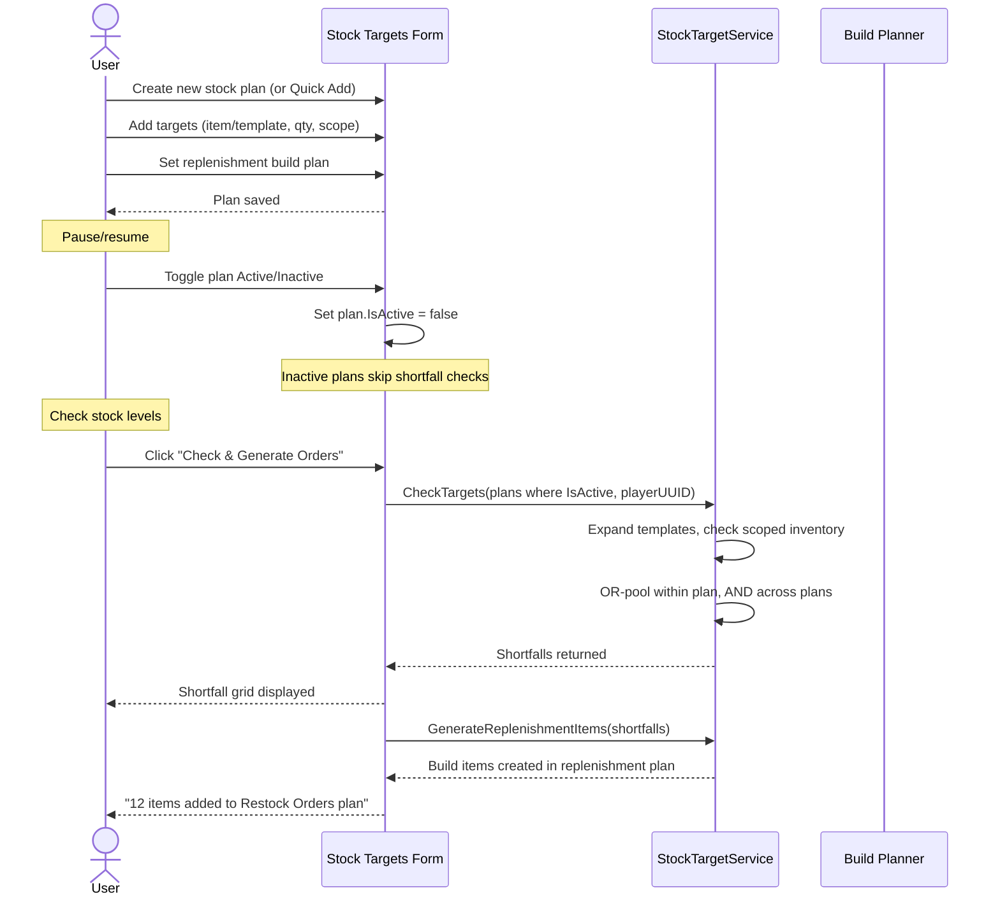
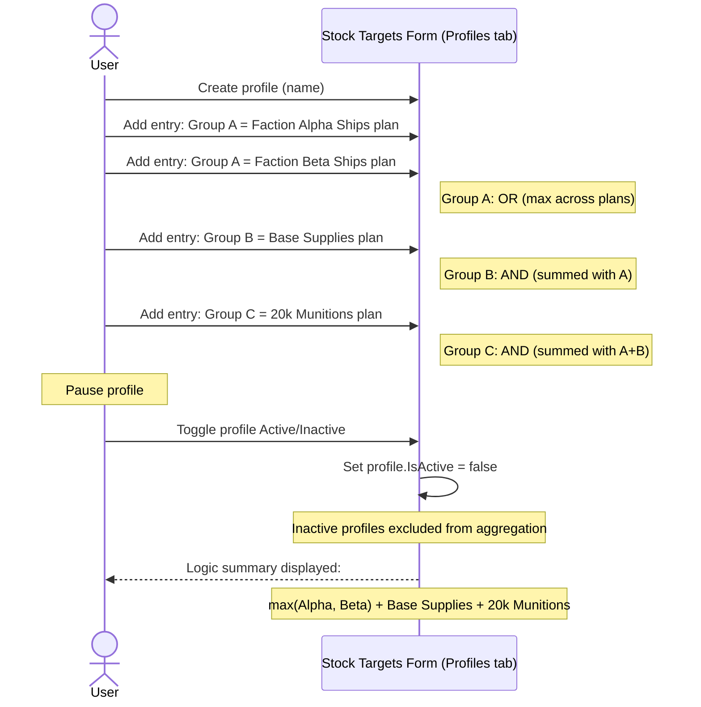

# User Flows — Stock Targets

### Flow 10: Stock Targets — Plan Creation and Order Generation

```mermaid
sequenceDiagram
    actor User
    participant ST as Stock Targets Form
    participant STS as StockTargetService
    participant BP as Build Planner

    User->>ST: Create new stock plan (or Quick Add)
    User->>ST: Add targets (item/template, qty, scope)
    User->>ST: Set replenishment build plan
    ST-->>User: Plan saved

    Note over User: Pause/resume
    User->>ST: Toggle plan Active/Inactive
    ST->>ST: Set plan.IsActive = false
    Note over ST: Inactive plans skip shortfall checks

    Note over User: Check stock levels
    User->>ST: Click "Check & Generate Orders"
    ST->>STS: CheckTargets(plans where IsActive, playerUUID)
    STS->>STS: Expand templates, check scoped inventory
    STS->>STS: OR-pool within plan, AND across plans
    STS-->>ST: Shortfalls returned
    ST-->>User: Shortfall grid displayed

    ST->>STS: GenerateReplenishmentItems(shortfalls)
    STS-->>ST: Build items created in replenishment plan
    ST-->>User: "12 items added to Restock Orders plan"
```

### Flow 15: Stock Profile — AND/OR Composition

```mermaid
sequenceDiagram
    actor User
    participant SP as Stock Targets Form (Profiles tab)

    User->>SP: Create profile (name)
    User->>SP: Add entry: Group A = Faction Alpha Ships plan
    User->>SP: Add entry: Group A = Faction Beta Ships plan
    Note right of SP: Group A: OR (max across plans)
    User->>SP: Add entry: Group B = Base Supplies plan
    Note right of SP: Group B: AND (summed with A)
    User->>SP: Add entry: Group C = 20k Munitions plan
    Note right of SP: Group C: AND (summed with A+B)

    Note over User: Pause profile
    User->>SP: Toggle profile Active/Inactive
    SP->>SP: Set profile.IsActive = false
    Note over SP: Inactive profiles excluded from aggregation

    SP-->>User: Logic summary displayed:
    Note over SP: max(Alpha, Beta) + Base Supplies + 20k Munitions
```

