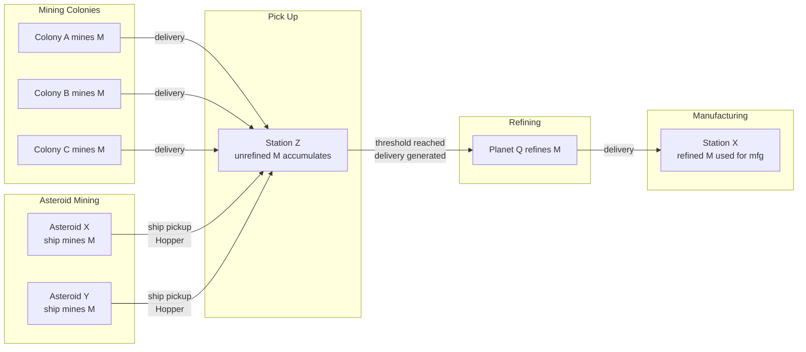
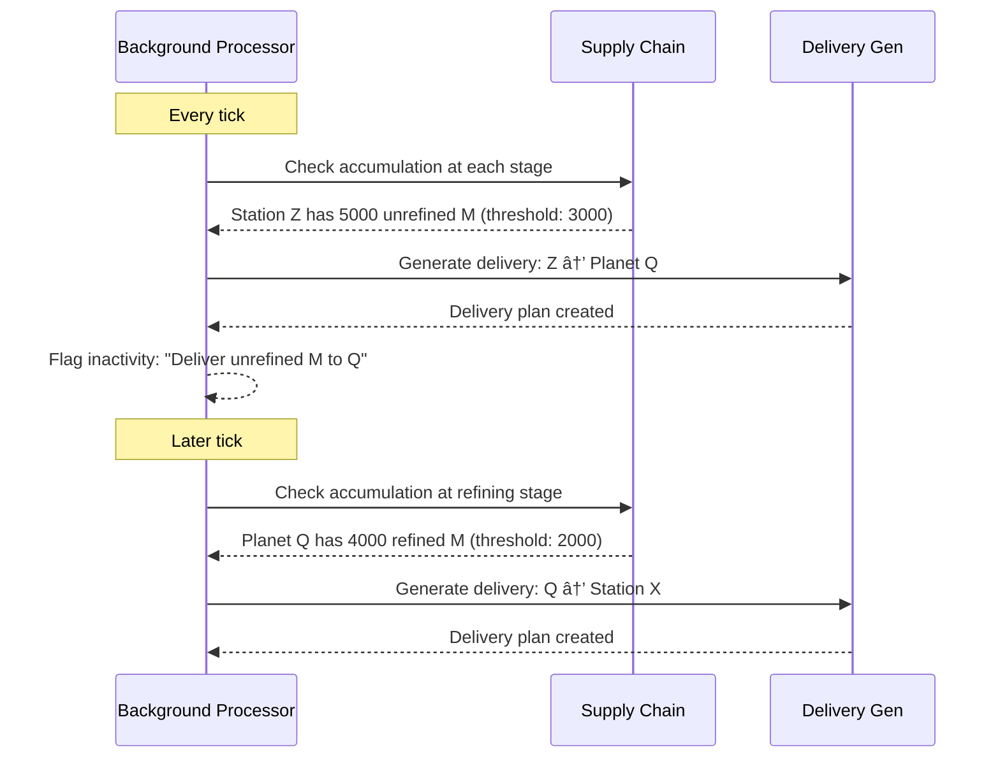
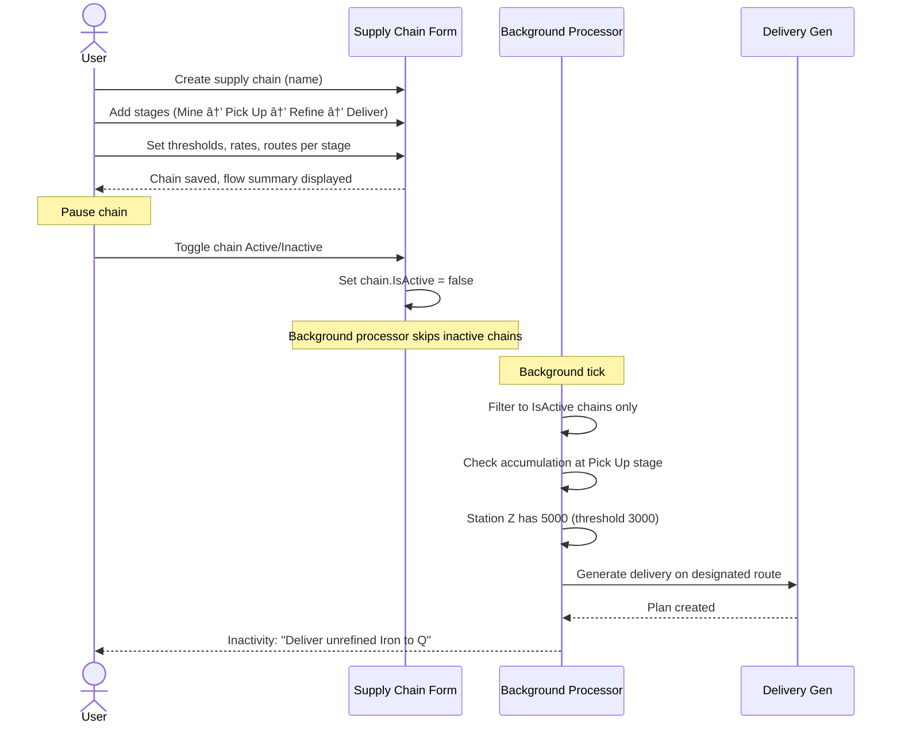
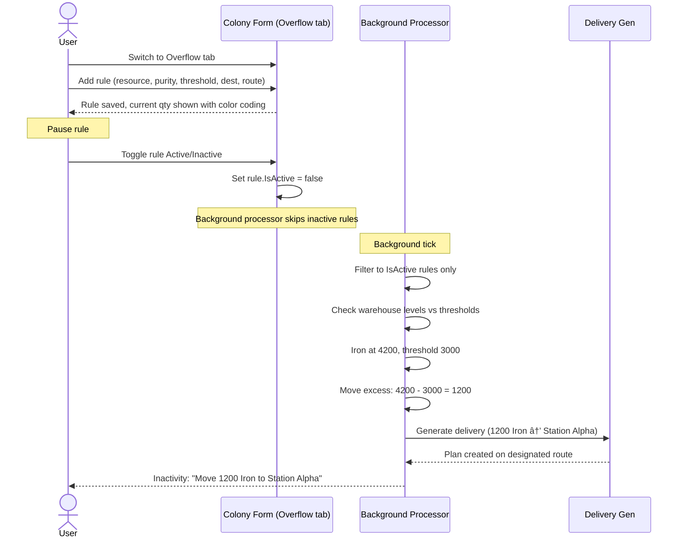

# User Flows — Supply Chain

### Flow 5: Supply Chain — Mining to Manufacturing

```mermaid
flowchart LR
    subgraph Mining Colonies
        A1[Colony A mines M]
        A2[Colony B mines M]
        A3[Colony C mines M]
    end

    subgraph Asteroid Mining
        AM1[Asteroid X<br/>ship mines M]
        AM2[Asteroid Y<br/>ship mines M]
    end

    subgraph "Pick Up"
        B1[Station Z<br/>unrefined M accumulates]
    end

    subgraph Refining
        C1[Planet Q refines M]
    end

    subgraph Manufacturing
        D1[Station X<br/>refined M used for mfg]
    end

    A1 -->|delivery| B1
    A2 -->|delivery| B1
    A3 -->|delivery| B1
    AM1 -->|ship pickup<br/>Hopper| B1
    AM2 -->|ship pickup<br/>Hopper| B1
    B1 -->|threshold reached<br/>delivery generated| C1
    C1 -->|delivery| D1
```

```mermaid
sequenceDiagram
    participant BG as Background Processor
    participant SC as Supply Chain
    participant DG as Delivery Gen

    Note over BG: Every tick
    BG->>SC: Check accumulation at each stage
    SC-->>BG: Station Z has 5000 unrefined M (threshold: 3000)
    BG->>DG: Generate delivery: Z → Planet Q
    DG-->>BG: Delivery plan created
    BG-->>BG: Flag inactivity: "Deliver unrefined M to Q"

    Note over BG: Later tick
    BG->>SC: Check accumulation at refining stage
    SC-->>BG: Planet Q has 4000 refined M (threshold: 2000)
    BG->>DG: Generate delivery: Q → Station X
    DG-->>BG: Delivery plan created
```

### Flow 13: Supply Chain — Define and Monitor Pipeline

```mermaid
sequenceDiagram
    actor User
    participant SC as Supply Chain Form
    participant BG as Background Processor
    participant DG as Delivery Gen

    User->>SC: Create supply chain (name)
    User->>SC: Add stages (Mine → Pick Up → Refine → Deliver)
    User->>SC: Set thresholds, rates, routes per stage
    SC-->>User: Chain saved, flow summary displayed

    Note over User: Pause chain
    User->>SC: Toggle chain Active/Inactive
    SC->>SC: Set chain.IsActive = false
    Note over SC: Background processor skips inactive chains

    Note over BG: Background tick
    BG->>BG: Filter to IsActive chains only
    BG->>BG: Check accumulation at Pick Up stage
    BG->>BG: Station Z has 5000 (threshold 3000)
    BG->>DG: Generate delivery on designated route
    DG-->>BG: Plan created
    BG-->>User: Inactivity: "Deliver unrefined Iron to Q"
```

### Flow 14: Warehouse Overflow — Colony Tab

```mermaid
sequenceDiagram
    actor User
    participant CF as Colony Form (Overflow tab)
    participant BG as Background Processor
    participant DG as Delivery Gen

    User->>CF: Switch to Overflow tab
    User->>CF: Add rule (resource, purity, threshold, dest, route)
    CF-->>User: Rule saved, current qty shown with color coding

    Note over User: Pause rule
    User->>CF: Toggle rule Active/Inactive
    CF->>CF: Set rule.IsActive = false
    Note over CF: Background processor skips inactive rules

    Note over BG: Background tick
    BG->>BG: Filter to IsActive rules only
    BG->>BG: Check warehouse levels vs thresholds
    BG->>BG: Iron at 4200, threshold 3000
    BG->>BG: Move excess: 4200 - 3000 = 1200
    BG->>DG: Generate delivery (1200 Iron → Station Alpha)
    DG-->>BG: Plan created on designated route
    BG-->>User: Inactivity: "Move 1200 Iron to Station Alpha"
```

