<!-- Extracted from .kiro/specs/empire-systems/design.md — User Interaction Flows & Cascades -->
# User Interaction Flows & Cascades
### Flow 1: Build Planner — Manufacturing Workflow

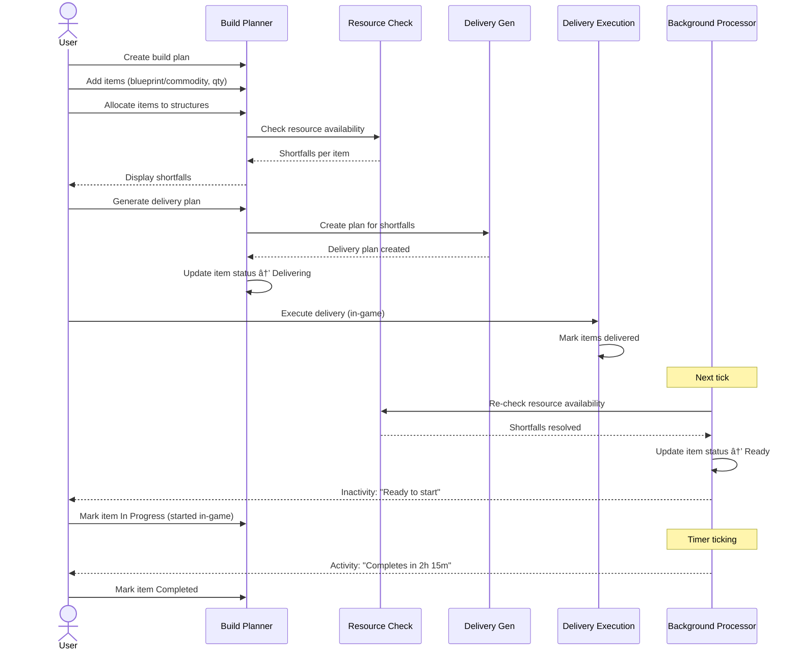
```mermaid
sequenceDiagram
    actor User
    participant BP as Build Planner
    participant RC as Resource Check
    participant DG as Delivery Gen
    participant DE as Delivery Execution
    participant BG as Background Processor

    User->>BP: Create build plan
    User->>BP: Add items (blueprint/commodity, qty)
    User->>BP: Allocate items to structures
    BP->>RC: Check resource availability
    RC-->>BP: Shortfalls per item
    BP-->>User: Display shortfalls

    User->>BP: Generate delivery plan
    BP->>DG: Create plan for shortfalls
    DG-->>BP: Delivery plan created
    BP->>BP: Update item status → Delivering

    User->>DE: Execute delivery (in-game)
    DE->>DE: Mark items delivered
    Note over BG: Next tick
    BG->>RC: Re-check resource availability
    RC-->>BG: Shortfalls resolved
    BG->>BG: Update item status → Ready
    BG-->>User: Inactivity: "Ready to start"

    User->>BP: Mark item In Progress (started in-game)
    Note over BG: Timer ticking
    BG-->>User: Activity: "Completes in 2h 15m"

    User->>BP: Mark item Completed
```

### Flow 2: Ship Build — Template to Assembly

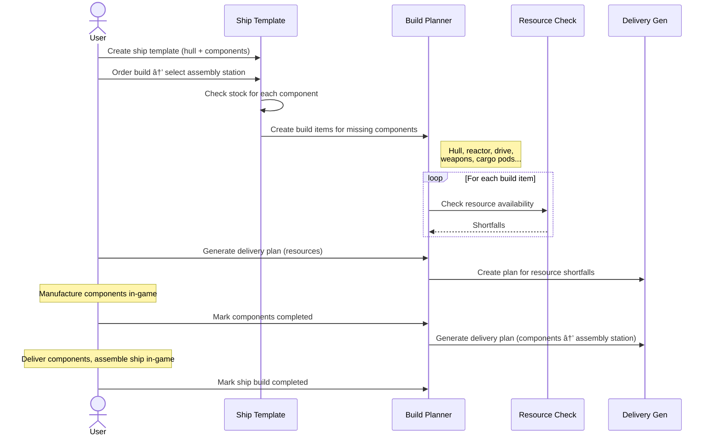
```mermaid
sequenceDiagram
    actor User
    participant ST as Ship Template
    participant BP as Build Planner
    participant RC as Resource Check
    participant DG as Delivery Gen

    User->>ST: Create ship template (hull + components)
    User->>ST: Order build → select assembly station

    ST->>ST: Check stock for each component
    ST->>BP: Create build items for missing components
    Note right of BP: Hull, reactor, drive,<br/>weapons, cargo pods...

    loop For each build item
        BP->>RC: Check resource availability
        RC-->>BP: Shortfalls
    end

    User->>BP: Generate delivery plan (resources)
    BP->>DG: Create plan for resource shortfalls

    Note over User: Manufacture components in-game
    User->>BP: Mark components completed

    BP->>DG: Generate delivery plan (components → assembly station)
    Note over User: Deliver components, assemble ship in-game
    User->>BP: Mark ship build completed
```

### Flow 3: Market Sale — Cascade to Manufacturing

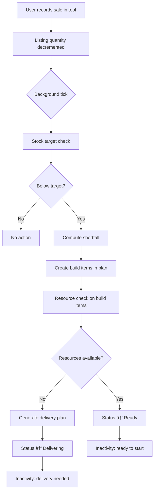
```mermaid
flowchart TD
    A[User records sale in tool] --> B[Listing quantity decremented]
    B --> C{Background tick}
    C --> D[Stock target check]
    D --> E{Below target?}
    E -->|No| F[No action]
    E -->|Yes| G[Compute shortfall]
    G --> H[Create build items in plan]
    H --> I[Resource check on build items]
    I --> J{Resources available?}
    J -->|Yes| K[Status → Ready]
    J -->|No| L[Generate delivery plan]
    L --> M[Status → Delivering]
    M --> N[Inactivity: delivery needed]
    K --> O[Inactivity: ready to start]
```

### Flow 4: Market Purchase — Resource Fulfillment

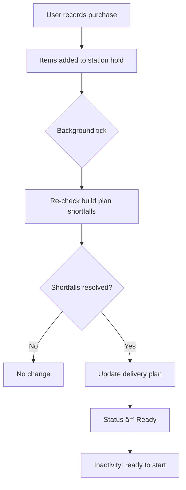
```mermaid
flowchart TD
    A[User records purchase] --> B[Items added to station hold]
    B --> C{Background tick}
    C --> D[Re-check build plan shortfalls]
    D --> E{Shortfalls resolved?}
    E -->|No| F[No change]
    E -->|Yes| G[Update delivery plan]
    G --> H[Status → Ready]
    H --> I[Inactivity: ready to start]
```

### Flow 5: Supply Chain — Mining to Manufacturing

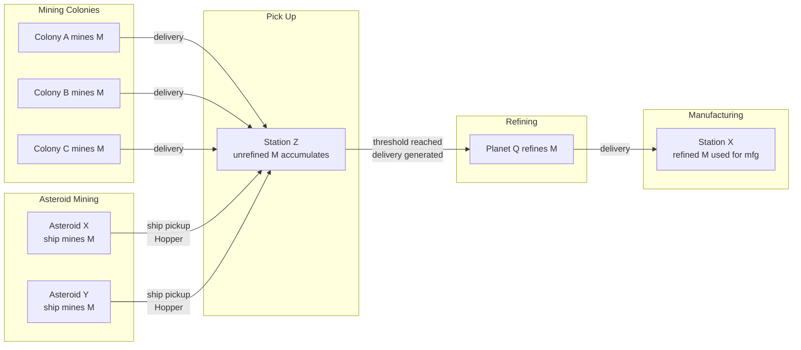
```mermaid
flowchart LR
    subgraph Mining Colonies
        A1[Colony A mines M]
        A2[Colony B mines M]
        A3[Colony C mines M]
    end

    subgraph Asteroid Mining
        AM1[Asteroid X<br/>ship mines M]
        AM2[Asteroid Y<br/>ship mines M]
    end

    subgraph "Pick Up"
        B1[Station Z<br/>unrefined M accumulates]
    end

    subgraph Refining
        C1[Planet Q refines M]
    end

    subgraph Manufacturing
        D1[Station X<br/>refined M used for mfg]
    end

    A1 -->|delivery| B1
    A2 -->|delivery| B1
    A3 -->|delivery| B1
    AM1 -->|ship pickup<br/>Hopper| B1
    AM2 -->|ship pickup<br/>Hopper| B1
    B1 -->|threshold reached<br/>delivery generated| C1
    C1 -->|delivery| D1
```

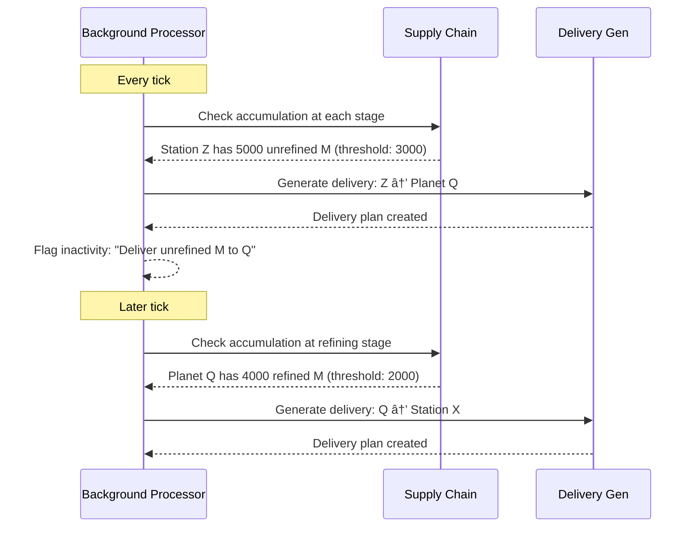
```mermaid
sequenceDiagram
    participant BG as Background Processor
    participant SC as Supply Chain
    participant DG as Delivery Gen

    Note over BG: Every tick
    BG->>SC: Check accumulation at each stage
    SC-->>BG: Station Z has 5000 unrefined M (threshold: 3000)
    BG->>DG: Generate delivery: Z → Planet Q
    DG-->>BG: Delivery plan created
    BG-->>BG: Flag inactivity: "Deliver unrefined M to Q"

    Note over BG: Later tick
    BG->>SC: Check accumulation at refining stage
    SC-->>BG: Planet Q has 4000 refined M (threshold: 2000)
    BG->>DG: Generate delivery: Q → Station X
    DG-->>BG: Delivery plan created
```

### Flow 6: Queue Calculator

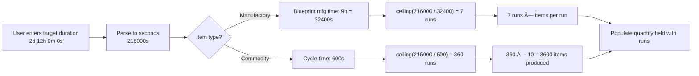
```mermaid
flowchart LR
    A[User enters target duration<br/>'2d 12h 0m 0s'] --> B[Parse to seconds<br/>216000s]
    B --> C{Item type?}
    C -->|Manufactory| D[Blueprint mfg time: 9h = 32400s]
    D --> E["ceiling(216000 / 32400) = 7 runs"]
    E --> E2["7 runs × items per run"]
    C -->|Commodity| F[Cycle time: 600s]
    F --> G["ceiling(216000 / 600) = 360 runs"]
    G --> H["360 × 10 = 3600 items produced"]
    E2 --> I[Populate quantity field with runs]
    H --> I
```

### Flow 7: Ship Template Modification — Stock Target Cascade

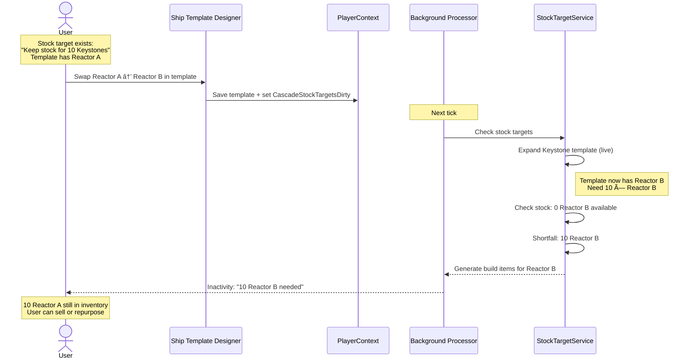
```mermaid
sequenceDiagram
    actor User
    participant STD as Ship Template Designer
    participant PC as PlayerContext
    participant BG as Background Processor
    participant STS as StockTargetService

    Note over User: Stock target exists:<br/>"Keep stock for 10 Keystones"<br/>Template has Reactor A

    User->>STD: Swap Reactor A → Reactor B in template
    STD->>PC: Save template + set CascadeStockTargetsDirty

    Note over BG: Next tick
    BG->>STS: Check stock targets
    STS->>STS: Expand Keystone template (live)
    Note right of STS: Template now has Reactor B<br/>Need 10 × Reactor B
    STS->>STS: Check stock: 0 Reactor B available
    STS->>STS: Shortfall: 10 Reactor B
    STS-->>BG: Generate build items for Reactor B
    BG-->>User: Inactivity: "10 Reactor B needed"

    Note over User: 10 Reactor A still in inventory<br/>User can sell or repurpose
```

### Flow 8: Ship Instance — Create, Configure, Load Cargo

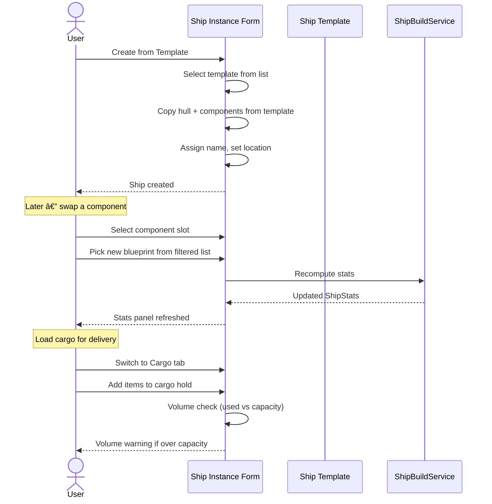
```mermaid
sequenceDiagram
    actor User
    participant SI as Ship Instance Form
    participant ST as Ship Template
    participant SBS as ShipBuildService

    User->>SI: Create from Template
    SI->>SI: Select template from list
    SI->>SI: Copy hull + components from template
    SI->>SI: Assign name, set location
    SI-->>User: Ship created

    Note over User: Later — swap a component
    User->>SI: Select component slot
    User->>SI: Pick new blueprint from filtered list
    SI->>SBS: Recompute stats
    SBS-->>SI: Updated ShipStats
    SI-->>User: Stats panel refreshed

    Note over User: Load cargo for delivery
    User->>SI: Switch to Cargo tab
    User->>SI: Add items to cargo hold
    SI->>SI: Volume check (used vs capacity)
    SI-->>User: Volume warning if over capacity
```

### Flow 9: Station — Create, Manage Holds

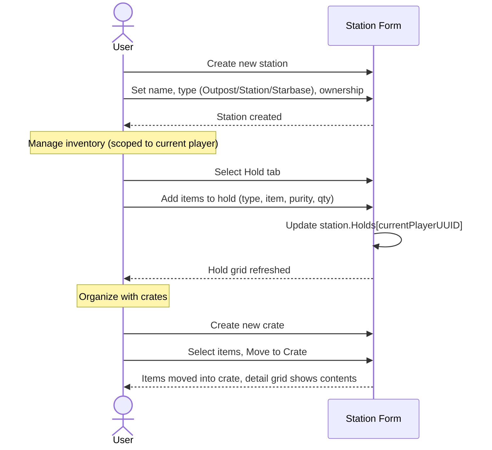
```mermaid
sequenceDiagram
    actor User
    participant STN as Station Form

    User->>STN: Create new station
    User->>STN: Set name, type (Outpost/Station/Starbase), ownership
    STN-->>User: Station created

    Note over User: Manage inventory (scoped to current player)
    User->>STN: Select Hold tab
    User->>STN: Add items to hold (type, item, purity, qty)
    STN->>STN: Update station.Holds[currentPlayerUUID]
    STN-->>User: Hold grid refreshed

    Note over User: Organize with crates
    User->>STN: Create new crate
    User->>STN: Select items, Move to Crate
    STN-->>User: Items moved into crate, detail grid shows contents
```

### Flow 10: Stock Targets — Plan Creation and Order Generation

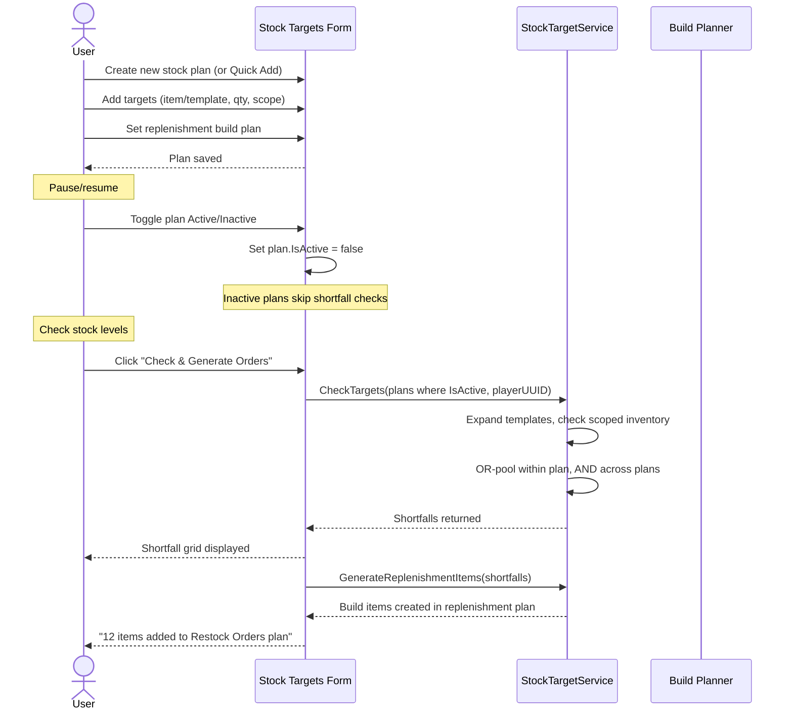
```mermaid
sequenceDiagram
    actor User
    participant ST as Stock Targets Form
    participant STS as StockTargetService
    participant BP as Build Planner

    User->>ST: Create new stock plan (or Quick Add)
    User->>ST: Add targets (item/template, qty, scope)
    User->>ST: Set replenishment build plan
    ST-->>User: Plan saved

    Note over User: Pause/resume
    User->>ST: Toggle plan Active/Inactive
    ST->>ST: Set plan.IsActive = false
    Note over ST: Inactive plans skip shortfall checks

    Note over User: Check stock levels
    User->>ST: Click "Check & Generate Orders"
    ST->>STS: CheckTargets(plans where IsActive, playerUUID)
    STS->>STS: Expand templates, check scoped inventory
    STS->>STS: OR-pool within plan, AND across plans
    STS-->>ST: Shortfalls returned
    ST-->>User: Shortfall grid displayed

    ST->>STS: GenerateReplenishmentItems(shortfalls)
    STS-->>ST: Build items created in replenishment plan
    ST-->>User: "12 items added to Restock Orders plan"
```

### Flow 11: Contacts — Factions and External Characters

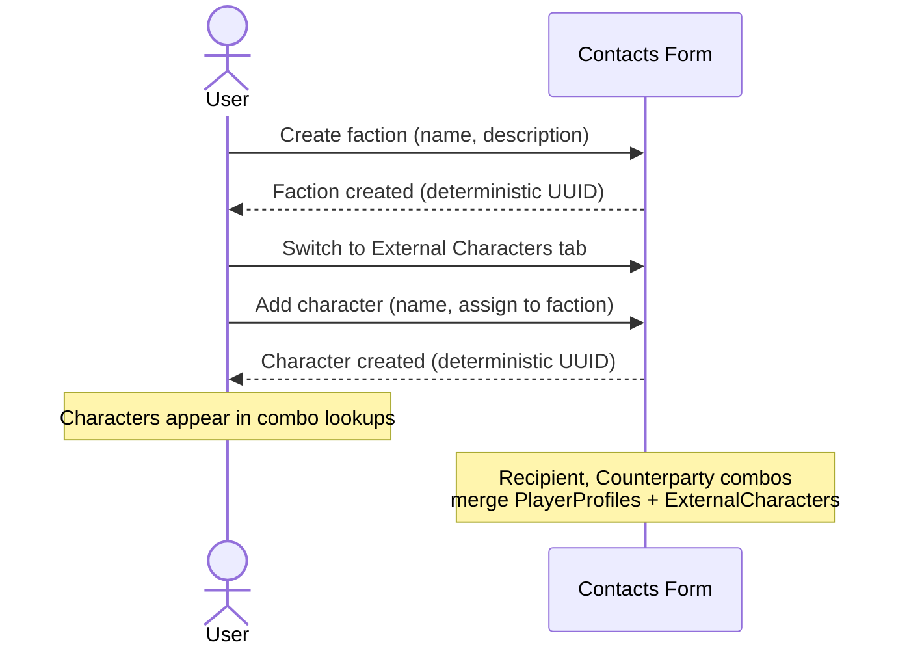
```mermaid
sequenceDiagram
    actor User
    participant FC as Contacts Form

    User->>FC: Create faction (name, description)
    FC-->>User: Faction created (deterministic UUID)

    User->>FC: Switch to External Characters tab
    User->>FC: Add character (name, assign to faction)
    FC-->>User: Character created (deterministic UUID)

    Note over User: Characters appear in combo lookups
    Note over FC: Recipient, Counterparty combos<br/>merge PlayerProfiles + ExternalCharacters
```

### Flow 12: Asteroid — Create and Track Reserves

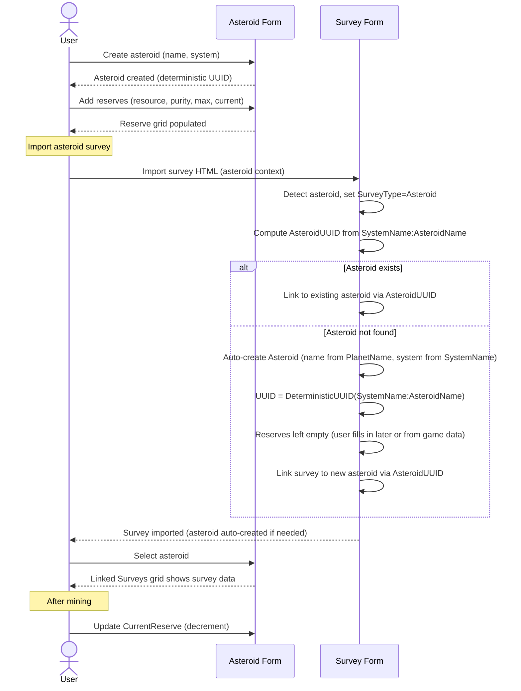
```mermaid
sequenceDiagram
    actor User
    participant AF as Asteroid Form
    participant SF as Survey Form

    User->>AF: Create asteroid (name, system)
    AF-->>User: Asteroid created (deterministic UUID)

    User->>AF: Add reserves (resource, purity, max, current)
    AF-->>User: Reserve grid populated

    Note over User: Import asteroid survey
    User->>SF: Import survey HTML (asteroid context)
    SF->>SF: Detect asteroid, set SurveyType=Asteroid
    SF->>SF: Compute AsteroidUUID from SystemName:AsteroidName
    alt Asteroid exists
        SF->>SF: Link to existing asteroid via AsteroidUUID
    else Asteroid not found
        SF->>SF: Auto-create Asteroid (name from PlanetName, system from SystemName)
        SF->>SF: UUID = DeterministicUUID(SystemName:AsteroidName)
        SF->>SF: Reserves left empty (user fills in later or from game data)
        SF->>SF: Link survey to new asteroid via AsteroidUUID
    end
    SF-->>User: Survey imported (asteroid auto-created if needed)

    User->>AF: Select asteroid
    AF-->>User: Linked Surveys grid shows survey data

    Note over User: After mining
    User->>AF: Update CurrentReserve (decrement)
```

### Flow 13: Supply Chain — Define and Monitor Pipeline

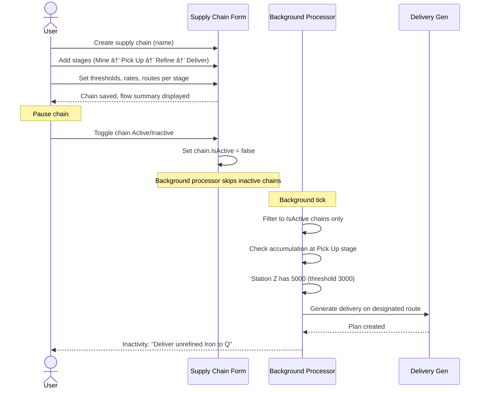
```mermaid
sequenceDiagram
    actor User
    participant SC as Supply Chain Form
    participant BG as Background Processor
    participant DG as Delivery Gen

    User->>SC: Create supply chain (name)
    User->>SC: Add stages (Mine → Pick Up → Refine → Deliver)
    User->>SC: Set thresholds, rates, routes per stage
    SC-->>User: Chain saved, flow summary displayed

    Note over User: Pause chain
    User->>SC: Toggle chain Active/Inactive
    SC->>SC: Set chain.IsActive = false
    Note over SC: Background processor skips inactive chains

    Note over BG: Background tick
    BG->>BG: Filter to IsActive chains only
    BG->>BG: Check accumulation at Pick Up stage
    BG->>BG: Station Z has 5000 (threshold 3000)
    BG->>DG: Generate delivery on designated route
    DG-->>BG: Plan created
    BG-->>User: Inactivity: "Deliver unrefined Iron to Q"
```

### Flow 14: Warehouse Overflow — Colony Tab

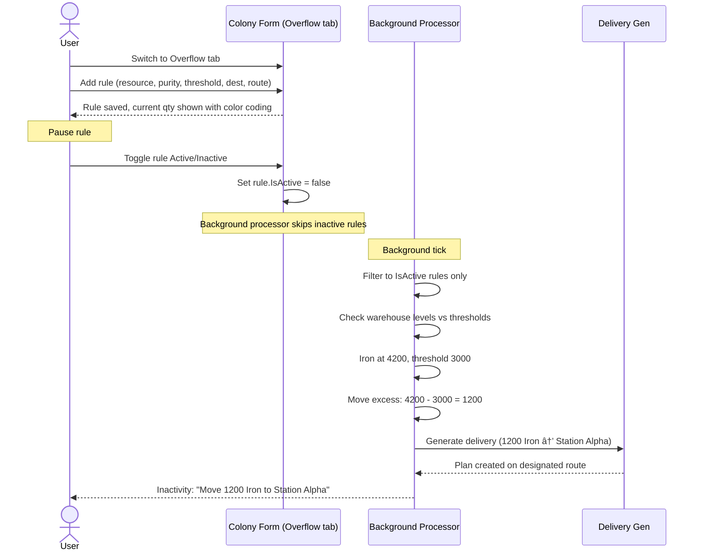
```mermaid
sequenceDiagram
    actor User
    participant CF as Colony Form (Overflow tab)
    participant BG as Background Processor
    participant DG as Delivery Gen

    User->>CF: Switch to Overflow tab
    User->>CF: Add rule (resource, purity, threshold, dest, route)
    CF-->>User: Rule saved, current qty shown with color coding

    Note over User: Pause rule
    User->>CF: Toggle rule Active/Inactive
    CF->>CF: Set rule.IsActive = false
    Note over CF: Background processor skips inactive rules

    Note over BG: Background tick
    BG->>BG: Filter to IsActive rules only
    BG->>BG: Check warehouse levels vs thresholds
    BG->>BG: Iron at 4200, threshold 3000
    BG->>BG: Move excess: 4200 - 3000 = 1200
    BG->>DG: Generate delivery (1200 Iron → Station Alpha)
    DG-->>BG: Plan created on designated route
    BG-->>User: Inactivity: "Move 1200 Iron to Station Alpha"
```

### Flow 15: Stock Profile — AND/OR Composition

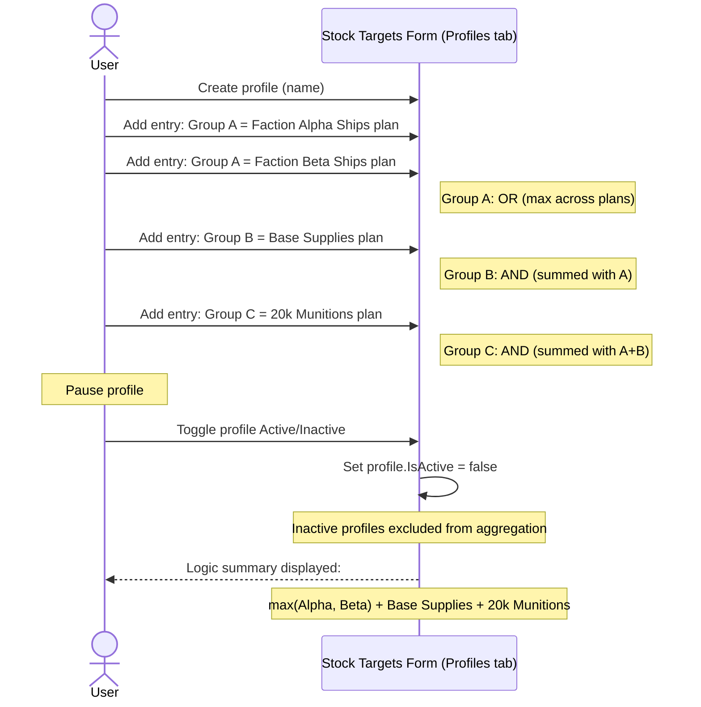
```mermaid
sequenceDiagram
    actor User
    participant SP as Stock Targets Form (Profiles tab)

    User->>SP: Create profile (name)
    User->>SP: Add entry: Group A = Faction Alpha Ships plan
    User->>SP: Add entry: Group A = Faction Beta Ships plan
    Note right of SP: Group A: OR (max across plans)
    User->>SP: Add entry: Group B = Base Supplies plan
    Note right of SP: Group B: AND (summed with A)
    User->>SP: Add entry: Group C = 20k Munitions plan
    Note right of SP: Group C: AND (summed with A+B)

    Note over User: Pause profile
    User->>SP: Toggle profile Active/Inactive
    SP->>SP: Set profile.IsActive = false
    Note over SP: Inactive profiles excluded from aggregation

    SP-->>User: Logic summary displayed:
    Note over SP: max(Alpha, Beta) + Base Supplies + 20k Munitions
```

### Flow 16: Colony Plan → Build Plan Generation

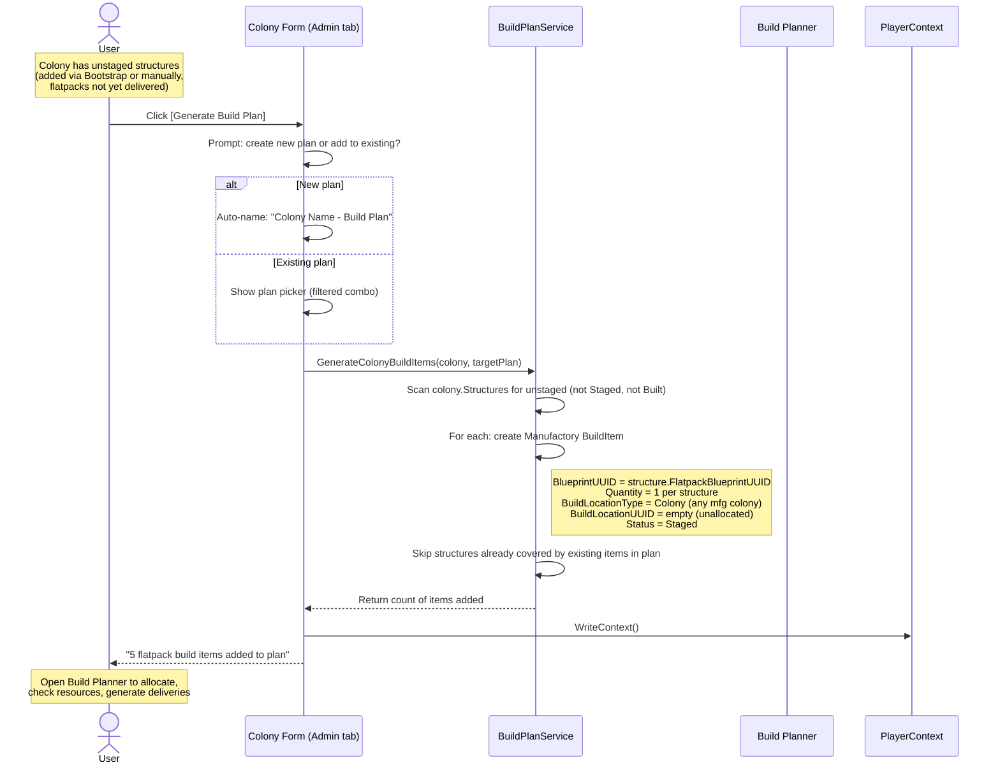
```mermaid
sequenceDiagram
    actor User
    participant CF as Colony Form (Admin tab)
    participant BPS as BuildPlanService
    participant BP as Build Planner
    participant PC as PlayerContext

    Note over User: Colony has unstaged structures<br/>(added via Bootstrap or manually,<br/>flatpacks not yet delivered)

    User->>CF: Click [Generate Build Plan]
    CF->>CF: Prompt: create new plan or add to existing?
    alt New plan
        CF->>CF: Auto-name: "Colony Name - Build Plan"
    else Existing plan
        CF->>CF: Show plan picker (filtered combo)
    end

    CF->>BPS: GenerateColonyBuildItems(colony, targetPlan)
    BPS->>BPS: Scan colony.Structures for unstaged (not Staged, not Built)
    BPS->>BPS: For each: create Manufactory BuildItem
    Note right of BPS: BlueprintUUID = structure.FlatpackBlueprintUUID<br/>Quantity = 1 per structure<br/>BuildLocationType = Colony (any mfg colony)<br/>BuildLocationUUID = empty (unallocated)<br/>Status = Staged
    BPS->>BPS: Skip structures already covered by existing items in plan
    BPS-->>CF: Return count of items added

    CF->>PC: WriteContext()
    CF-->>User: "5 flatpack build items added to plan"

    Note over User: Open Build Planner to allocate,<br/>check resources, generate deliveries
```

### Flow 17: Multi-Plan Consolidated Delivery

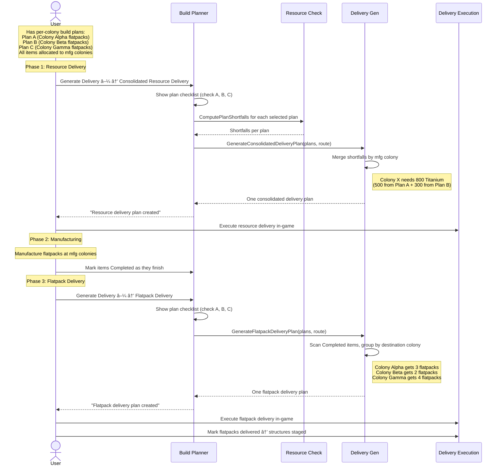
```mermaid
sequenceDiagram
    actor User
    participant BP as Build Planner
    participant RC as Resource Check
    participant DG as Delivery Gen
    participant DE as Delivery Execution

    Note over User: Has per-colony build plans:<br/>Plan A (Colony Alpha flatpacks)<br/>Plan B (Colony Beta flatpacks)<br/>Plan C (Colony Gamma flatpacks)<br/>All items allocated to mfg colonies

    Note over User: Phase 1: Resource Delivery
    User->>BP: Generate Delivery ▼ → Consolidated Resource Delivery
    BP->>BP: Show plan checklist (check A, B, C)
    BP->>RC: ComputePlanShortfalls for each selected plan
    RC-->>BP: Shortfalls per plan
    BP->>DG: GenerateConsolidatedDeliveryPlan(plans, route)
    DG->>DG: Merge shortfalls by mfg colony
    Note right of DG: Colony X needs 800 Titanium<br/>(500 from Plan A + 300 from Plan B)
    DG-->>BP: One consolidated delivery plan
    BP-->>User: "Resource delivery plan created"
    User->>DE: Execute resource delivery in-game

    Note over User: Phase 2: Manufacturing
    Note over User: Manufacture flatpacks at mfg colonies
    User->>BP: Mark items Completed as they finish

    Note over User: Phase 3: Flatpack Delivery
    User->>BP: Generate Delivery ▼ → Flatpack Delivery
    BP->>BP: Show plan checklist (check A, B, C)
    BP->>DG: GenerateFlatpackDeliveryPlan(plans, route)
    DG->>DG: Scan Completed items, group by destination colony
    Note right of DG: Colony Alpha gets 3 flatpacks<br/>Colony Beta gets 2 flatpacks<br/>Colony Gamma gets 4 flatpacks
    DG-->>BP: One flatpack delivery plan
    BP-->>User: "Flatpack delivery plan created"
    User->>DE: Execute flatpack delivery in-game
    User->>DE: Mark flatpacks delivered → structures staged
```

