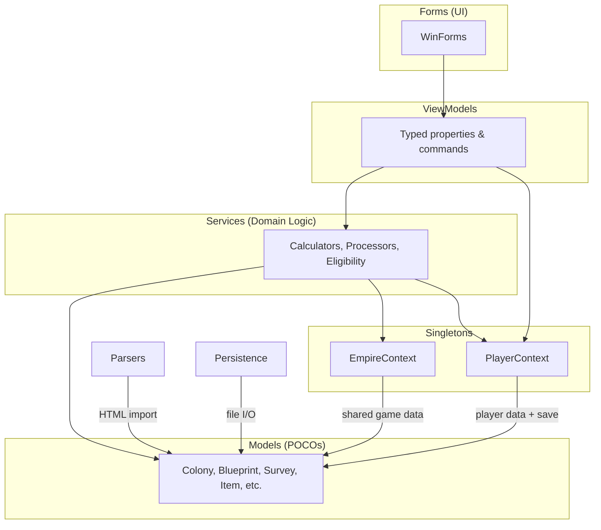

# Architecture Requirements

## Layered Architecture Overview

## Persistence

**REQ-ARCH-001** All player data (profiles, blueprints, surveys, colonies) SHALL be persisted to a single JSON file via PlayerContext.writeContext().  
**REQ-ARCH-002** The data file path SHALL be configurable; the default SHALL be `..\..\PlayerData.json` relative to the executable.  
**REQ-ARCH-003** PlayerContext SHALL be a singleton; EmpireContext.PlayerContext SHALL be the single access point.  
**REQ-ARCH-004** On load, if the data file does not exist, PlayerContext SHALL initialize with empty lists and not throw.  
**REQ-ARCH-005** All lists (profiles, blueprints, surveys, colonies) SHALL be sorted on load: profiles by Name, blueprints by Name, surveys by PlanetName then DateTime, colonies by PlanetName.

## MVVM Pattern

**REQ-ARCH-010** UI forms SHALL NOT directly access PropertyBag methods (getBoolean, setProperty, etc.) on data objects. All such access SHALL go through a ViewModel.  
**REQ-ARCH-011** UI forms SHALL NOT directly manipulate data object lists or collections (Colony.Structures, Colony.Items, Colony.Commodities, PlayerContext lists, etc.). All such access SHALL go through a ViewModel.  
**REQ-ARCH-012** ViewModels SHALL be plain C# classes with no WinForms dependencies.  
**REQ-ARCH-013** ViewModels SHALL expose typed properties (bool IsBuilt, string PlanetName) rather than raw PropertyBag access.  
**REQ-ARCH-014** The MVVM pattern SHALL be applied to ALL forms before any new feature work is started. Forms requiring ViewModels: FormColony (complete), FormPlayerProfile, FormBlueprint, FormSurvey, MainWindow.

## Unit Testing

**REQ-ARCH-020** All data classes SHALL have unit tests covering their public API.  
**REQ-ARCH-021** Tests SHALL NOT depend on file I/O, EmpireContext singleton initialization, or WinForms message loops.  
**REQ-ARCH-022** Tests that involve time-sensitive values (CountDownTime) SHALL use a tolerance of at least 2 seconds.  
**REQ-ARCH-023** JSON round-trip tests SHALL verify that serializing then deserializing produces an object equal to the original.  
**REQ-ARCH-024** ColonyStatusCalculator SHALL have unit tests using mock IColonyStructureWorkers implementations, without requiring a full EmpireContext.

## Logging

**REQ-ARCH-030** The application SHALL use NLog for all logging.  
**REQ-ARCH-031** Log files SHALL be written to a `logs/` subdirectory next to the executable, rolling daily, retaining 7 days.  
**REQ-ARCH-032** Debug and above SHALL be written to the Visual Studio debugger output window.  
**REQ-ARCH-033** Info and above SHALL be written to the rolling log file.  
**REQ-ARCH-034** All exceptions caught in form event handlers SHALL be logged at Error level.  
**REQ-ARCH-035** PlayerContext load and save operations SHALL be logged at Info level.

## Serialization

**REQ-ARCH-040** Newtonsoft.Json SHALL be used for all JSON serialization.  
**REQ-ARCH-041** Computed properties SHALL be decorated with [JsonIgnore] and not appear in serialized JSON. ExtendedName is a computed UI display property present on Item, Blueprint, Survey, Commodity, and SurveyResource — all SHALL be [JsonIgnore]. ExtendedName concatenates identifying fields (e.g. Class, Evolution, Name, TechLevel, NickName for Blueprint) into a human-readable string for display in combo boxes and grids.  
**REQ-ARCH-042** Custom JsonConverters SHALL be used for PropertyBag, ItemBag, and LockTracking to control the exact JSON format.  
**REQ-ARCH-043** JSON files SHALL be written with Formatting.Indented for human readability.  
**REQ-ARCH-044** JSON serialization SHALL use `DefaultValueHandling.Ignore` to skip fields with default values (null strings, empty strings, false booleans, zero integers/decimals). This reduces file size without data loss — deserialization initializes these fields to their defaults.  
**REQ-ARCH-045** Custom JsonConverters for PropertyBag and ItemBag SHALL also apply default-value skipping to nested items.

## Correctness Invariants

**REQ-ARCH-050** For any colony, finalActualStatus SHALL equal the last entry in the per-structure Actual status chain.  
**REQ-ARCH-051** For any colony, Ideal resource values SHALL be >= Actual resource values for all provided resources (Power, Habitation, Food, Entertainment, Warehouse).  
**REQ-ARCH-052** ItemBag.CountByType(t, id) - LockTracking.GetLockedQuantity(t, id) SHALL represent the available (unlocked) quantity of that item type.  
**REQ-ARCH-053** WorkerDetail IDs (no spaces, e.g. `BlueCollarDetail`) SHALL be used as `BaseItemTypeID` for WorkDetail items and lock keys. Blueprint property keys for worker counts (with spaces, e.g. `"Blue Collar Detail"`) SHALL match the game data. See REQ-DM-079 for the full distinction.

## Worker & Lock Infrastructure (Implemented)

**REQ-ARCH-060** LockTracking SHALL be added to Colony and serialized as part of the colony JSON.  
**REQ-ARCH-061** The dgvItems Locked Amount column SHALL display the real locked quantity from LockTracking.  
**REQ-ARCH-062** ActualColonyStructureWorkers.IsUnassignedWorkerAvailable(workerKey) SHALL check whether the colony warehouse (ItemBag) contains at least 1 unlocked WorkDetail item whose BaseItemTypeID equals workerKey (the full WorkerDetail ID: "BlueCollarDetail", "WhiteCollarDetail", or "SpecialistDetail"). Unlocked means CountByType minus GetLockedQuantity > 0.  
**REQ-ARCH-062a** One unassigned worker of a given type supports all structures in the colony that need that type — it is not consumed per structure.  
**REQ-ARCH-062b** When a worker is assigned to a specific structure slot (e.g. BlueCollar1), the corresponding WorkDetail item in the warehouse SHALL be locked via LockTracking using the structure's UUID as the process key and the WorkerDetail ID as the item key. Implemented in ColonyStatusCalculator.LockAssignedWorkers().  
**REQ-ARCH-062c** When a worker is unassigned from a structure slot, the corresponding lock SHALL be cleared via LockTracking.ClearLocksForProcess. Implemented in ColonyStatusCalculator.ClearAllWorkerLocks() which rebuilds all locks from current state on each recalculation.

## Planned Forms (Implemented)

**REQ-ARCH-063** A Timed Event Review form SHALL display all active CountDownTime instances sorted by TimeRemaining. Implemented as FormColonyActivity (Colony Activity form) with countdown timers, activity type filtering, and 1-second refresh.  
**REQ-ARCH-064** A Commodity Delivery form SHALL summarize all CommodityRequested entries across all colonies. Implemented as the Delivery Plan and Delivery Execution forms (REQ-DEL-030 through REQ-DEL-062) with auto-fill from unfulfilled commodity requests.  
**REQ-ARCH-065** A Flatpack Building form SHALL list colonies with staged but unbuilt structures. Implemented as FormColonyDailyBuild (Colony Daily Build form) with route-based colony filtering and build initiation.  
**REQ-ARCH-066** A Worker Delivery form SHALL list colonies with built structures that have unassigned workers. Implemented as the Worker auto-fill in the Delivery Plan (REQ-DEL-060) which fills from ideal vs actual worker gaps.

## Colony Timed Processing (Future — partial implementation exists for Mining)

**REQ-ARCH-080** Colony.ProcessColony() SHALL process structures in the following order per cycle:
1. Structure Building (BuildCompletionTime expires → set Built=true)
2. Mining (MiningRig structures → add resources to warehouse)
3. Refining Base Resources
4. Refining S1 Synthetics
5. Refining S2 Synthetics
6. Manufacturing
7. Research

**REQ-ARCH-081** Steps 1 (Structure Building) and 2 (Mining) are implemented. Steps 3–7 are planned features.  
**REQ-ARCH-082** Structure Building (step 1): when BuildCompletionTime.IntervalsPassed > 0, the structure SHALL be marked Built=true and BuildCompletionTime SHALL be cleared.  
**REQ-ARCH-083** Refining, Manufacturing, and Research processing types require blueprint definitions that specify inputs, outputs, and cycle times. These SHALL be designed before implementation.

**REQ-ARCH-070** The application SHALL support multiple PlayerProfiles. Each Colony, Blueprint, and Survey SHALL have an OwnerUUID field identifying the PlayerProfile that owns it.  
**REQ-ARCH-070a** Colony.OwnerUUID, Blueprint.OwnerUUID, and Survey.OwnerUUID SHALL be serialized to JSON and SHALL default to empty string for backward compatibility with existing save files.  
**REQ-ARCH-070b** On load, if any Colony, Blueprint, or Survey has an empty OwnerUUID, it SHALL be auto-assigned to the first PlayerProfile (alphabetically by Name). This handles migration of existing save data.  
**REQ-ARCH-071** PlayerContext SHALL maintain a CurrentPlayerUUID property identifying the currently selected player. All colony, blueprint, and survey lists displayed in forms SHALL be filtered to show only items owned by the current player.  
**REQ-ARCH-071a** CurrentPlayerUUID SHALL be persisted (e.g. in the save file or a settings file) so the last selected player is restored on app restart.  
**REQ-ARCH-071b** MainWindow SHALL display a player selection dropdown. Changing the selection SHALL update CurrentPlayerUUID and fire a `CurrentPlayerChanged` event on PlayerContext.  
**REQ-ARCH-071c** All open forms (Colony, Blueprint, Survey) SHALL subscribe to `CurrentPlayerChanged` and immediately refresh their data to reflect the newly selected player.  
**REQ-ARCH-072** Colony.ProcessColony() SHALL look up the owning player's skills via OwnerUUID and apply skill-based multipliers:  
- ExtractionFocus: mining quantity per interval × `(1 + level * 0.01)`  
- RefiningFocus: refining output rate × `(1 + level * 0.02)`  
- ProductionFocus: manufacture time × `(1 - level * 0.03)` (minimum 1 second)  
- Builder: build time × `(1 - level * 0.02)` (minimum 1 second)  
- ResearchFocus: research time × `(1 - level * 0.03)` (minimum 1 second)  
**REQ-ARCH-073** The Colony Form SHALL only display colonies owned by the currently selected player. No cross-player colony view at this time.  
**REQ-ARCH-074** Blueprint transfer: a blueprint can be copied (deep copy with new UUID, same properties/resources) and the copy transferred to another player by setting its OwnerUUID. The original remains with the source player. Blueprint.CopyCost is user-entered and opaque (not calculated).  
**REQ-ARCH-074a** Survey transfer: a survey can be transferred to another player by changing its OwnerUUID. Surveys cannot be copied — each scan produces a unique survey.  
**REQ-ARCH-074b** Transfer UI is deferred to a later phase. The data model (OwnerUUID) SHALL support transfers, but no transfer UI is required in the initial implementation.  
**REQ-ARCH-075** When a user creates a new Colony, Blueprint, or Survey, it SHALL automatically be assigned to the currently selected player (CurrentPlayerUUID).

## Blueprint Reference Counting

**REQ-ARCH-090** BlueprintReferenceCounter SHALL be a stateless service class in `OE2EmpireTracker.Services`.  
**REQ-ARCH-091** BlueprintReferenceCounter SHALL accept `IEnumerable<Colony>`, `IEnumerable<Blueprint>`, and `IEnumerable<Survey>` as constructor parameters for testability. Null collections SHALL be treated as empty.  
**REQ-ARCH-092** BlueprintReferenceCounter SHALL expose a single method `CountReferences(string blueprintUUID)` that scans five reference source fields and returns a ReferenceReport:
- ColonyStructure.FlatpackBlueprintUUID (across all colonies, all players)
- ColonyStructure.ResearchingBlueprintUUID (across all colonies, all players)
- ColonyStructure.ManufacturingBlueprintUUID (across all colonies, all players)
- Blueprint.BaseBlueprintUUID (player and global blueprint lists)
- Survey.ScannerBlueprintUUID (all player surveys)

**REQ-ARCH-093** CountReferences SHALL exclude self-references: if the blueprint being checked has its own UUID as BaseBlueprintUUID, that match SHALL NOT be counted in BaseBlueprintCount.  
**REQ-ARCH-094** CountReferences SHALL return ReferenceReport.Empty when the provided blueprintUUID is null or empty.  
**REQ-ARCH-095** CountReferences SHALL handle colonies with null Structures lists gracefully by skipping them.

## FormBlueprint Delete Button State

**REQ-ARCH-096** FormBlueprint SHALL compute the ReferenceReport for the selected blueprint when the selection changes in the Blueprint_List_View.  
**REQ-ARCH-097** WHEN the ReferenceReport total count is greater than zero, the Delete button SHALL be disabled and its text SHALL be set to `"In Use ({count})"`.  
**REQ-ARCH-098** WHEN the ReferenceReport total count is zero, the Delete button SHALL be enabled and its text SHALL be set to `"Delete"`.  
**REQ-ARCH-099** WHEN no blueprint is selected, the Delete button SHALL be disabled and its text SHALL be set to `"Delete"`.  
**REQ-ARCH-100** The delete button state logic SHALL be extracted into a testable static method `GetDeleteButtonState(ReferenceReport)` returning `(bool enabled, string text)`.  
**REQ-ARCH-101** The existing `cmdDelete_Click` handler SHALL include a defense-in-depth guard that returns early if the Delete button is disabled.

## FormBlueprint Refs Column

**REQ-ARCH-102** The Blueprint_List_View SHALL include a "Refs" column displaying the TotalCount from the ReferenceReport for each blueprint.  
**REQ-ARCH-103** The Refs column SHALL be populated during `PopulateListView` by instantiating a BlueprintReferenceCounter from the current PlayerContext and EmpireContext data and calling CountReferences for each blueprint.
