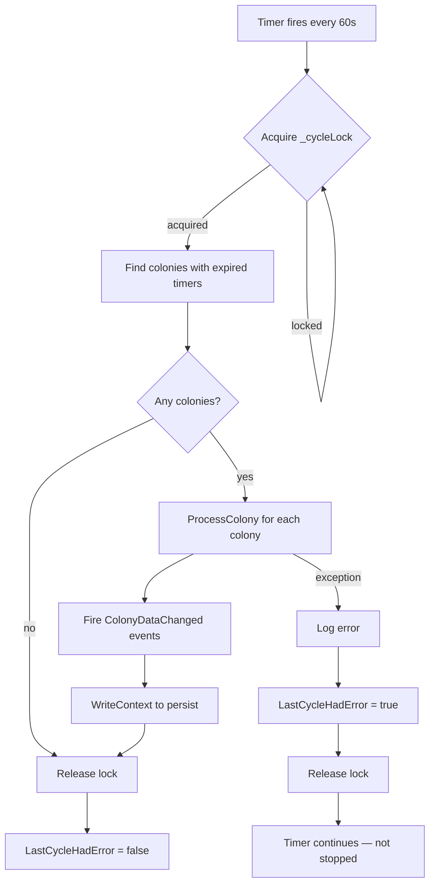
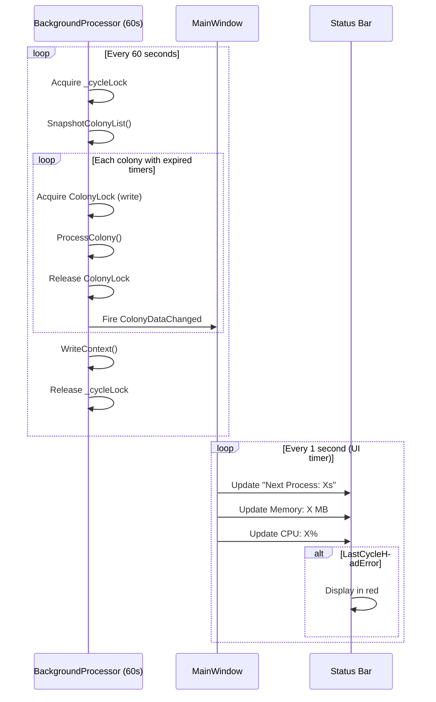

# Background Processing Requirements

## User Goal

The user wants colony production (mining, refining, manufacturing, research, building) to advance automatically on timers without manual intervention, so the tracker stays current with the game's passage of time.

## Out of Scope

- Real-time game clock synchronization (timers are local approximations)
- Processing while the application is closed (timers only advance when running)
- Parallel processing of multiple colonies simultaneously (sequential by design)

## Processing Cycle Flowchart

## Timer Architecture

**REQ-BP-001** The application SHALL run a background processing timer that fires at a configurable interval (default 60 seconds, configurable via Preferences). The interval is read from `PreferencesStore.Preferences.Thresholds.BackgroundProcessingIntervalSeconds` with a minimum of 1 second.
**REQ-BP-002** On each tick, the processor SHALL identify all colonies with expired timers and call `Colony.ProcessColony()` on each.
**REQ-BP-003** After processing, the processor SHALL fire `ColonyDataChanged` events for each processed colony to trigger UI refresh.
**REQ-BP-004** After processing, the processor SHALL call `PlayerContext.WriteContext()` to persist changes.
**REQ-BP-005** The processor SHALL use a lock (`_cycleLock`) to prevent concurrent processing cycles.

## Error Handling

**REQ-BP-010** If a processing cycle throws an exception, the processor SHALL log the error and set `LastCycleHadError = true`.
**REQ-BP-011** A successful cycle SHALL set `LastCycleHadError = false`.
**REQ-BP-012** The processor SHALL continue running after an error — a single failed cycle SHALL NOT stop the timer.

## Lifecycle

**REQ-BP-020** `Start()` SHALL begin the timer. Calling Start on an already-running processor SHALL be a no-op.
**REQ-BP-021** `Stop()` SHALL halt the timer and signal the stopping event.
**REQ-BP-022** The processor SHALL implement `IDisposable` and clean up the timer on disposal.
**REQ-BP-023** MainWindow SHALL create the processor on startup and dispose it on close.

## Status Display

**REQ-BP-030** MainWindow SHALL display a "Next Process" countdown in the status bar, updated every second via a UI timer.
**REQ-BP-031** When `LastCycleHadError` is true, the status bar text SHALL be displayed in red.
**REQ-BP-032** MainWindow SHALL display memory usage (MB) and CPU utilization (%) in the status bar.

## Thread Safety (Colony Lock)

**REQ-BP-040** The processor SHALL acquire `Colony.ColonyLock.TryEnterWriteLock(Colony.WriteLockTimeoutMs)` before calling `ProcessColony()` on each colony.
**REQ-BP-041** If the write lock times out (5000ms), the processor SHALL log a warning, skip that colony, and continue processing remaining colonies.
**REQ-BP-042** The processor SHALL release the write lock in a finally block before firing `ColonyDataChanged` events.
**REQ-BP-043** The processor SHALL use `PlayerContext.SnapshotColonyList()` to safely iterate colonies without holding _listLock during processing.
**REQ-BP-044** `WriteContext()` SHALL be called outside any ColonyLock to respect lock ordering.

## Warehouse Overflow Checks

**REQ-BP-050** On each tick, the processor SHALL evaluate all active WarehouseOverflowRules.  
**REQ-BP-051** For each active rule, the processor SHALL check the colony's warehouse quantity for the specified resource/purity against the TriggerThreshold.  
**REQ-BP-052** When the threshold is exceeded, the processor SHALL generate a delivery plan to move the excess (current - threshold) to the rule's destination via the designated route.  

## Supply Chain Threshold Checks

**REQ-BP-060** On each tick, the processor SHALL evaluate all active SupplyChains.  
**REQ-BP-061** For each active chain, the processor SHALL check accumulation at each stage against AccumulationThreshold.  
**REQ-BP-062** When a stage's accumulated quantity exceeds its threshold, the processor SHALL generate a delivery plan on the stage's designated route to move the excess to the next stage.  

## Stock Target Cascade Processing

**REQ-BP-070** When PlayerContext.CascadeStockTargetsDirty is set, the processor SHALL re-evaluate all active stock plans on the next tick.  
**REQ-BP-071** Stock target evaluation SHALL expand template targets using live template definitions, check scoped inventory, and compute shortfalls.  
**REQ-BP-072** When shortfalls are detected, the processor SHALL create replenishment build items in the linked build plan.  
**REQ-BP-073** PlayerContext.CascadeResourceCheckDirty SHALL trigger re-evaluation of build plan resource checks on the next tick.

## User Interaction Flow

### Status Bar Monitoring

