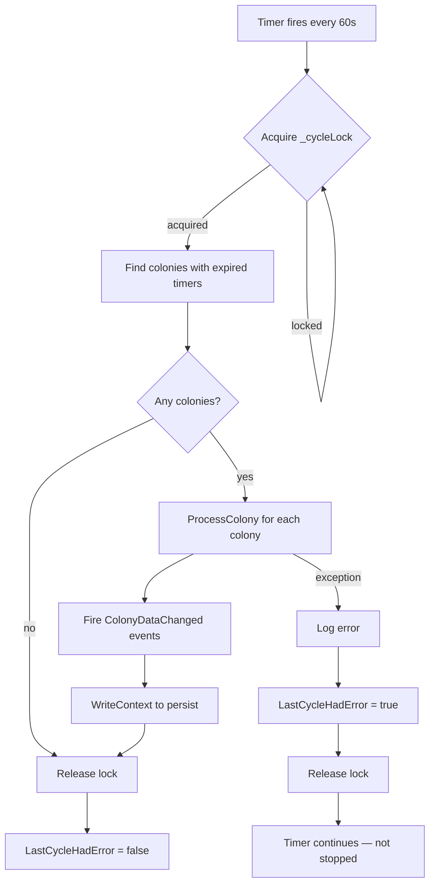

# Background Processing Requirements

## Processing Cycle Flowchart

## Timer Architecture

**REQ-BP-001** The application SHALL run a background processing timer that fires at a configurable interval (default 60 seconds, configurable via Preferences). The interval is read from `PreferencesStore.Preferences.Thresholds.BackgroundProcessingIntervalSeconds` with a minimum of 1 second.
**REQ-BP-002** On each tick, the processor SHALL identify all colonies with expired timers and call `Colony.ProcessColony()` on each.
**REQ-BP-003** After processing, the processor SHALL fire `ColonyDataChanged` events for each processed colony to trigger UI refresh.
**REQ-BP-004** After processing, the processor SHALL call `PlayerContext.WriteContext()` to persist changes.
**REQ-BP-005** The processor SHALL use a lock (`_cycleLock`) to prevent concurrent processing cycles.

## Error Handling

**REQ-BP-010** If a processing cycle throws an exception, the processor SHALL log the error and set `LastCycleHadError = true`.
**REQ-BP-011** A successful cycle SHALL set `LastCycleHadError = false`.
**REQ-BP-012** The processor SHALL continue running after an error — a single failed cycle SHALL NOT stop the timer.

## Lifecycle

**REQ-BP-020** `Start()` SHALL begin the timer. Calling Start on an already-running processor SHALL be a no-op.
**REQ-BP-021** `Stop()` SHALL halt the timer and signal the stopping event.
**REQ-BP-022** The processor SHALL implement `IDisposable` and clean up the timer on disposal.
**REQ-BP-023** MainWindow SHALL create the processor on startup and dispose it on close.

## Status Display

**REQ-BP-030** MainWindow SHALL display a "Next Process" countdown in the status bar, updated every second via a UI timer.
**REQ-BP-031** When `LastCycleHadError` is true, the status bar text SHALL be displayed in red.
**REQ-BP-032** MainWindow SHALL display memory usage (MB) and CPU utilization (%) in the status bar.
