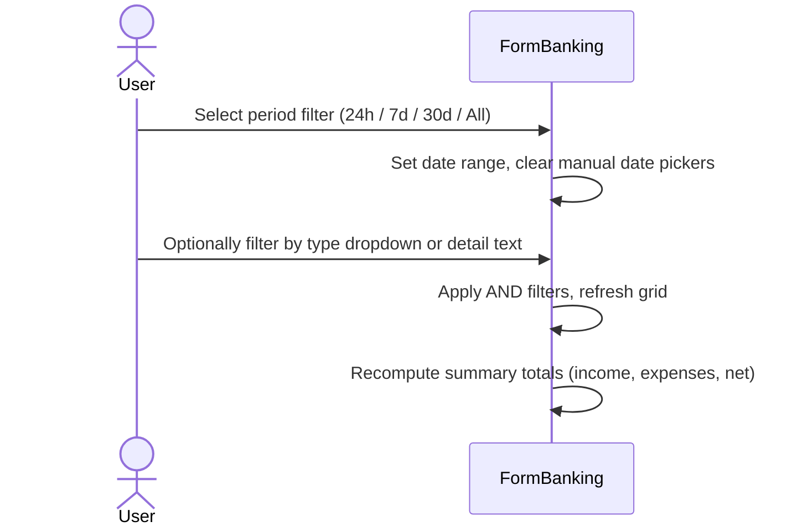
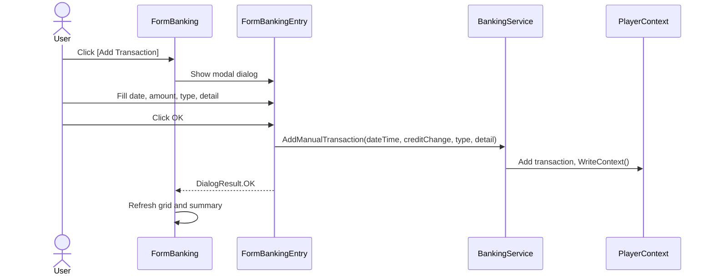

# Banking Requirements

## User Goal

The user wants to track all credit movements in their game account (worker wages, market sales/purchases, colony income, refueling costs) with automatic background synchronization, filterable transaction history, and income/expense summaries.

## Out of Scope

- Real-time push notifications of new banking transactions
- Multi-character banking aggregation (each player profile tracks its own transactions)
- Transaction editing or deletion (imported records are immutable; manual entries can be added but not modified)
- Currency conversion or multi-currency support (all values are in-game credits)

## Banking Transaction Data Model

**REQ-BNK-001** A BankingTransaction SHALL have fields: UUID, OwnerUUID, TransactionDateTime (ISO 8601 string), CreditChange (decimal), OldBalance (decimal), NewBalance (decimal), TransactionType (int), Detail (string), CharacterId (int?), SystemObjectId (int?), and SystemId (int?).
**REQ-BNK-002** BankingTransaction SHALL use decimal type for CreditChange, OldBalance, and NewBalance with default values of 0m.
**REQ-BNK-003** BankingTransaction SHALL use nullable int for CharacterId, SystemObjectId, and SystemId, defaulting to null.

## Banking Transaction Persistence

**REQ-BNK-010** PlayerContext SHALL persist BankingTransaction records as a "BankingTransaction" array within PlayerRoot.
**REQ-BNK-011** PlayerContext SHALL expose a BankingTransactionList property typed as IReadOnlyList for read access.
**REQ-BNK-012** PlayerContext SHALL deduplicate BankingTransaction records by UUID on load.
**REQ-BNK-013** Adding a BankingTransaction with a duplicate UUID SHALL throw InvalidOperationException.

## Banking Transaction Import

**REQ-BNK-020** BankingService SHALL import transactions from the game API endpoint `/v1/banking/transactions` with pagination (page size 100).
**REQ-BNK-021** BankingService SHALL skip transactions that already exist locally (matched by TransactionDateTime + CreditChange + Detail composite key).
**REQ-BNK-022** BankingService SHALL generate a UUID for each imported transaction that passes deduplication.
**REQ-BNK-023** On API error, BankingService SHALL retain all successfully imported transactions from prior pages.

## Banking Balance

**REQ-BNK-030** BankingService SHALL import the current balance from `/v1/banking/balance` with a 30-second timeout.
**REQ-BNK-031** PlayerContext SHALL expose BankingBalance as a read-only decimal property, persisted across restarts.
**REQ-BNK-032** On balance endpoint error, BankingService SHALL retain the last persisted balance value.

## Banking Form Display

**REQ-BNK-040** FormBanking SHALL be an MDI child form accessible from the main menu.
**REQ-BNK-041** FormBanking SHALL display a DataGridView with columns: Date, Type, Detail, Credit Change, Old Balance, New Balance.
**REQ-BNK-042** FormBanking SHALL display the current bank balance in a bold label above the grid.
**REQ-BNK-043** FormBanking SHALL display transactions sorted by TransactionDateTime descending (newest first).
**REQ-BNK-044** FormBanking SHALL allow filtering by transaction type via a dropdown (all known types + "All").
**REQ-BNK-045** FormBanking SHALL allow filtering by date range via checkable date pickers (From/To).
**REQ-BNK-046** FormBanking SHALL allow filtering by detail text via a text box (substring match).
**REQ-BNK-047** FormBanking SHALL provide period filter buttons: 24h, 7d, 30d, All Time.

## Banking Summary

**REQ-BNK-050** FormBanking SHALL display Total Income, Total Expenses, and Net Change for the filtered set.
**REQ-BNK-051** Total Income SHALL be the sum of positive CreditChange values; Total Expenses the sum of negative values.

## Banking Charts

**REQ-BNK-055** FormBanking SHALL display a Charts tab with Cash Flow, Income vs Expenses, and Type Breakdown charts.
**REQ-BNK-056** Charts SHALL support Hourly/Daily grouping and Net Change/Cumulative toggles.

## Manual Transaction Entry

**REQ-BNK-060** FormBanking SHALL provide an "Add Transaction" button opening a modal FormBankingEntry dialog.
**REQ-BNK-061** FormBankingEntry SHALL accept Date/Time, Credit Change (non-zero decimal), Transaction Type (dropdown), and Detail (required, max 500 chars).
**REQ-BNK-062** FormBankingEntry SHALL validate non-zero amount and non-empty detail before submission.

## Centralized Background Sync

**REQ-BNK-070** The GameApiSyncScheduler SHALL invoke BankingService.ImportTransactionsAsync after asset sync completes.
**REQ-BNK-071** The GameApiSyncScheduler SHALL invoke BankingService.ImportBalanceAsync after transaction sync.
**REQ-BNK-072** Banking sync failures SHALL be isolated from other sync steps (profile, colony, asset data preserved).
**REQ-BNK-073** FormBanking SHALL NOT display manual Import Transactions or Import Balance buttons.

## Transaction Type Classification

**REQ-BNK-080** BankingTransactionTypes SHALL maintain a static mapping from integer codes to human-readable labels.
**REQ-BNK-081** Unknown transaction types SHALL display as "{Detail} ({code})" or "Unknown ({code})" if Detail is empty.

## User Interaction Flows

### Filter Transactions

### Add Manual Transaction

