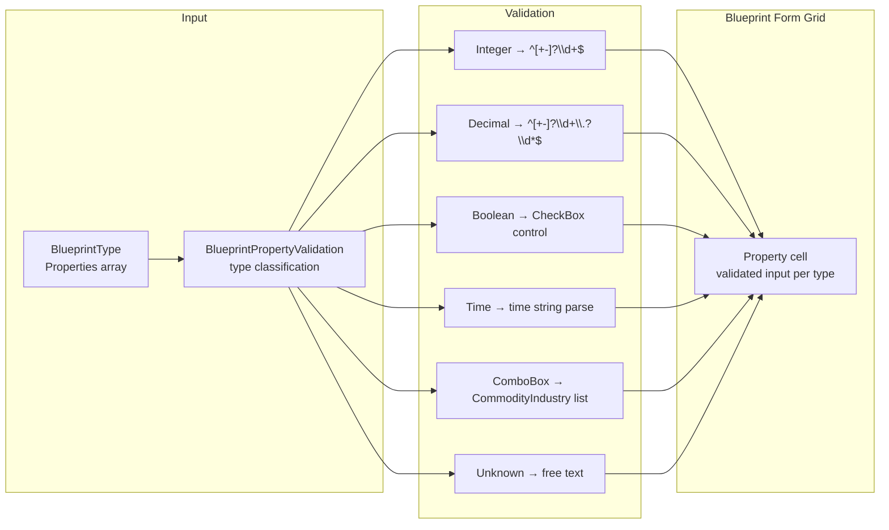

# Blueprint Property Validation Requirements

## User Goal

The user wants blueprint properties to be validated on entry so that typos and invalid values are caught immediately, ensuring data integrity for downstream calculations (pricing, manufacturing time, resource requirements).

## Out of Scope

- Automatic property discovery from the game (all properties are manually entered or imported)
- Blueprint property editing beyond validation (that's the Blueprint form's job)

## Property Types

**REQ-BPV-001** Blueprint properties SHALL be classified into the following value types: Integer, Decimal, Boolean, Time, ComboBox, CheckBox, Unknown.
**REQ-BPV-002** Unknown properties SHALL allow free-form text input with no validation.

## Integer Properties (62 total)

**REQ-BPV-010** The following properties SHALL validate as integers (`^[+-]?\d+$`):
Property names use the game canonical spaced form, matching `BlueprintPropertyValidation.cs` and `BaselineData.json`:
Accuracy, Amount Manufactured, Blue Collar Detail, Cargo Capacity, Cargo Volume Size, Crew Supported, Eng Capacity Required, Entertainment Provided, Extraction Efficiency, Food Provision, Fuel Capacity, Habitation Provision, Health, Large Weapon Mounts, Magazine Size, Manufacture Slot, Mass, Max Allowed On Ship, Max Mining Grapples, Max Mining Lasers, Max Ore Hoppers, Max Per Colony, Max Range, Medium Weapon Mounts, Min Range, Mining Cycle Time, Mining Slot, Power Generated, Power Provided, Power Required, Raw Material Capacity, Refining Rate, Refining Slot, Remote Operations, Research Slot, Shield Hitpoints, Small Weapon Mounts, Specialist Detail, Structural Integrity, Unassigned Blue Collar Detail, Unassigned Specialist Detail, Unassigned White Collar Detail, Warehouse Capacity, Weapon Slot Size, White Collar Detail, Eng Capacity Available, License Level, Max Hull Plating, Max Hull Reinforcement, Max Hull Sealant Units, Reactor Slots, Main Drive Slots, Thruster Slots, Jump Drive Slots, Nav Comp Slots, Scanner Slots, Shield Slots, Cargo Pod Slots, Fuel Tank Slots, Coupler Slots, GERTY Slots.

## Decimal Properties (42 total)

**REQ-BPV-020** The following properties SHALL validate as decimals:
Acceleration Rate, Cooldown Time, Deploy Time, Energy Damage Rating, Energy Defence, Energy Defence Rating, Fuel Transfer Rate, Fuel Used, Fuel Used / JAS / Mass, HP Percent Restored, HP% restored for a part, Hull HP Percent Restored, Hull Manufacture Time Modification, Increased Hull HP %, Jump Charge Time, Kinetic Damage Defence, Kinetic Damage Rating, Kinetic Defence Rating, Launch Velocity, Manufacturing Time Reduction, Max Effective Range, Max Jump Distance, Maximum Damage Repair, Mining Yield, Mining Yield Increase, Mining Yield Modification, Missile Damage Defence, Missile Damage Rating, Missile Defence Rating, Power Draw Per Second, Power Draw Per Shot, Power Regeneration Rate, Purity Modifier, Rate of Fire, Refining Time Modification, Reload Time, Research Time Modification, Rotational Thrust, Scan Level, Sensor Abundance Factor, Shield regen, Wear and Tear Rate.

## Boolean/CheckBox Properties (5 total)

**REQ-BPV-030** The following properties SHALL render as checkboxes: Can Manufacture, Can Research, Consumable, Mining Capable, PDT Capable.

## ComboBox Properties (1 total)

**REQ-BPV-040** Commodity Industry SHALL render as a combo box populated with CommodityIndustry names.

## Time Properties (1 total)

**REQ-BPV-050** Manufacture Run Time SHALL validate as a time string.

## Commodity Industries (14 types)

**REQ-BPV-060** The following commodity industry types SHALL be available:
Administration Block, Agridome, Centre Of Economics, Engineering Block, Healthcare Institute, Institute Of Defence, Leisure Industry Centre, Logistics Centre, Manufacturing Industry Centre, Mining Industry Centre, Off World Living Institute, Refining Industry Centre, Science Centre, Technology Institute.

## Data Flow Diagram

### Property Validation Pipeline

## Blueprint Import Routing

**REQ-BPR-040** BlueprintImportHandler.ClassifyImport SHALL classify a parsed blueprint as ResourcesOnly (resources but no properties/type), Full (has name), or NoName (fallback).  
**REQ-BPR-041** BlueprintImportHandler.FindTarget SHALL check the selected blueprint for a match (Name+Evolution+Type) first, then fall back to dedup via FindByDedupKey. Evo0 routes to global, others to player.  
**REQ-BPR-042** BlueprintImportHandler.MergeAndPersist SHALL update existing or create new blueprints with deterministic UUID (global) or random UUID (player), persist, and fire BlueprintDataChanged.  

## Clipboard Content Detection

**REQ-BPR-050** ClipboardContentDetector.Detect SHALL sniff HTML for distinctive CSS class markers to identify content type: Colony (ColonyInformation_PlanetOverview), Survey (ScanDetailOutputResourceName), Blueprint (ShipComponentProperty), PlayerProfile (ui_character_detail), MarketListing (Market_ShipComponentProperty).  
**REQ-BPR-051** Market listing detection SHALL take priority over Survey detection to avoid false positives from ScanDetailOutputResourceName_MarketListing.  
**REQ-BPR-052** All import handlers SHALL validate clipboard content type before parsing and show a descriptive error if the wrong type is detected.  