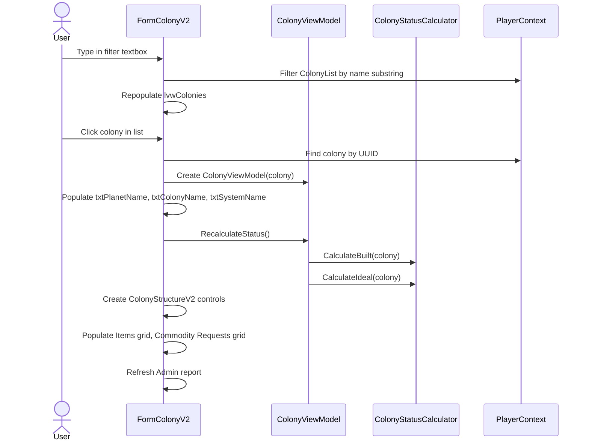
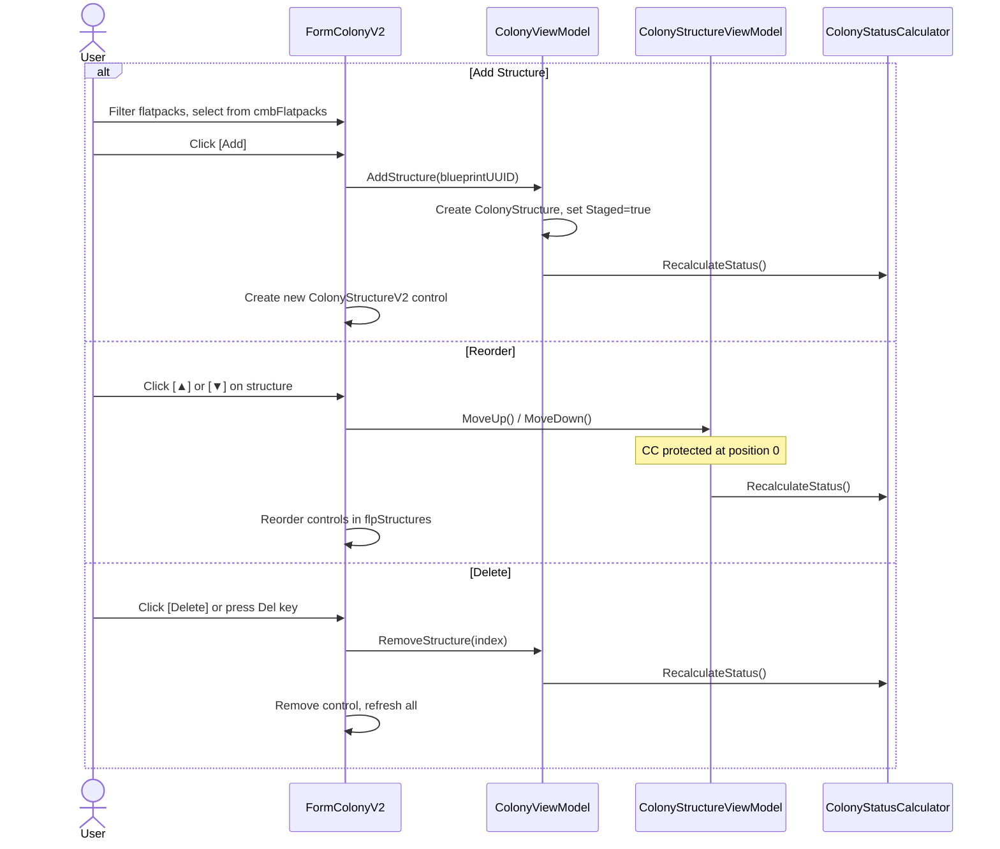
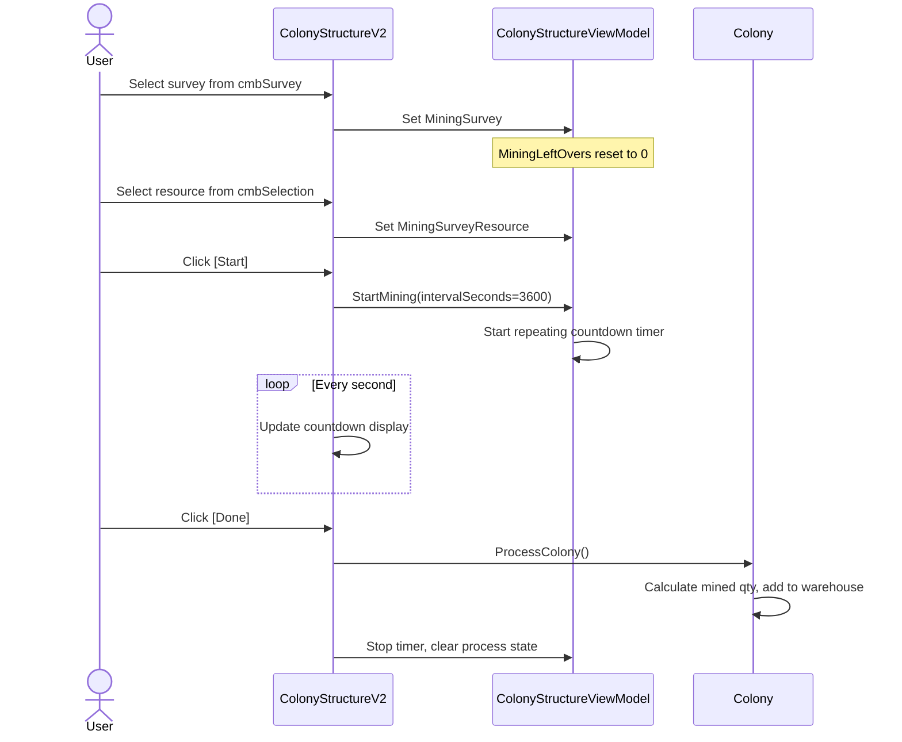
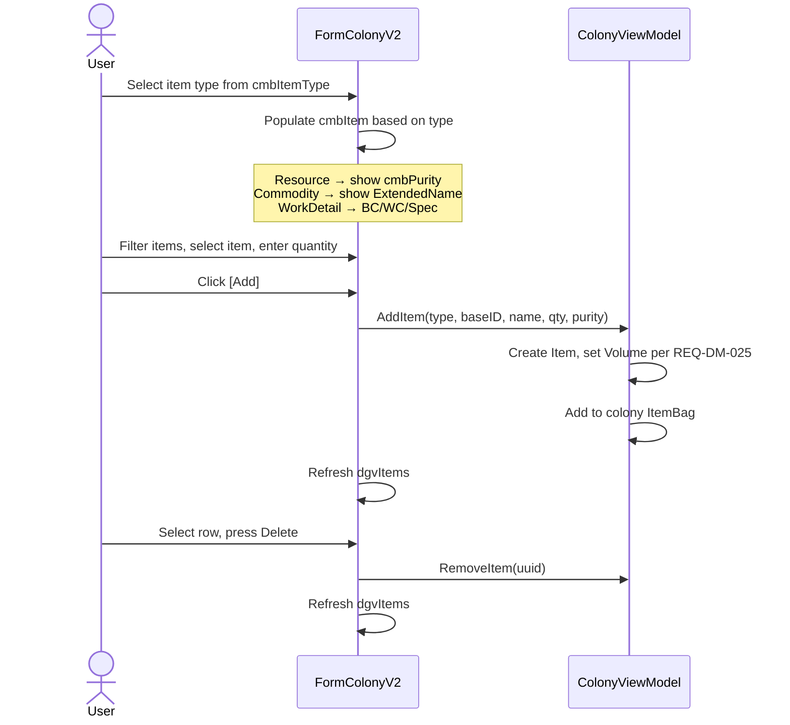
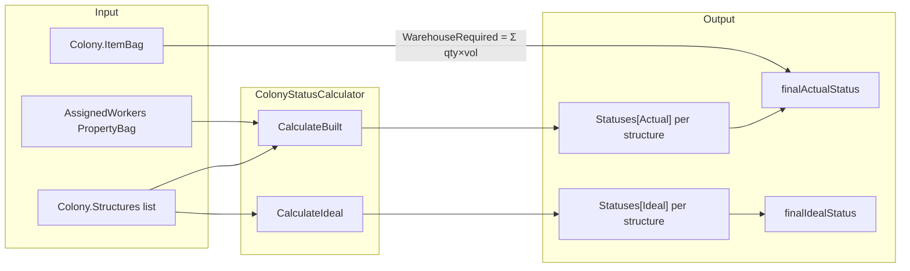
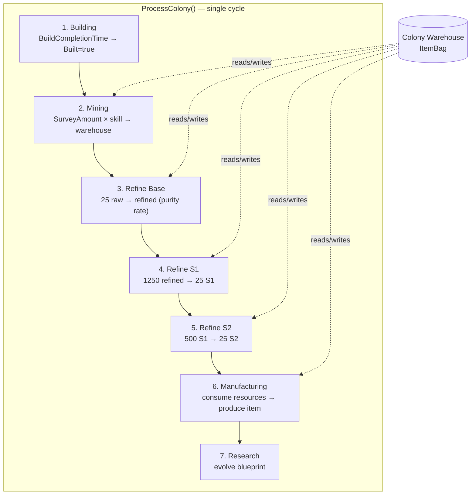

# Colony Requirements

## Structure Lifecycle

```mermaid
stateDiagram-v2
    [*] --> Staged : Flatpack delivered
    Staged --> Building : Build started (timer)
    Building --> Built : Timer expires (86400s base)
    Built --> Online : Set online

    state "Worker Assignment" as WA {
        [*] --> Unassigned
        Unassigned --> Assigned : Assign worker
        Assigned --> Unassigned : Unassign worker
    }

    note right of Online : Resources only counted\nwhen Online
    note right of Staged : Background color: Yellow
    note right of Built : Background color: PaleVioletRed (offline)
    note right of Online : Background color: Green
```

## Colony Data

**REQ-COL-001** A Colony SHALL have a UUID, PlanetName, ColonyName, an ItemBag, a list of ColonyStructures, and a list of CommodityRequested.  
**REQ-COL-001a** ColonyStructure SHALL NOT have redundant resource fields (Power, Habitation, Food, Entertainment, WarehouseCapacity, WorkersAssigned). All calculated resource values SHALL be accessed via `structure.Statuses["Actual"]` and `structure.Statuses["Ideal"]`.  
**REQ-COL-001b** ColonyStructure MAY retain incomplete-feature fields (CurrentAttitude, ContentmentIndex, WageLevel, WageAdjustmentTime) for future use.  
**REQ-COL-001c** ColonyStructure.buildQueueSequence SHALL record the explicit position of the structure in the colony's build queue, independent of its display order in the Structures list. This value SHALL be set when a structure is added to the build queue and SHALL be used by the Flatpack Building Form (REQ-ARCH-065) to determine build priority. The current implementation uses list order as a proxy; explicit assignment is a future task.  
**REQ-COL-002** Colony UUID SHALL be generated as a new GUID when first saved if not already set.  
**REQ-COL-003** Colony SHALL serialize to and deserialize from JSON, preserving all fields including nested structures and items.

## Colony Status Calculation

**REQ-COL-010** ColonyStatusCalculator.CalculateBuilt() SHALL compute cumulative resource status (Power, Habitation, Food, Entertainment, Warehouse) across all structures in order, storing the result per structure in `Statuses["Actual"]` and the final total in `finalActualStatus`.  
**REQ-COL-011** ColonyStatusCalculator.CalculateIdeal() SHALL perform the same calculation assuming all worker slots are filled and all structures are Built=true, Online=true, Staged=false, storing results in `Statuses["Ideal"]` and `finalIdealStatus`.  
**REQ-COL-012** Each resource accumulator SHALL be seeded from the previous structure's status, not from zero, so that status values are cumulative across the structure list.  
**REQ-COL-013** EntertainmentRequired accumulator SHALL be seeded from the previous structure's EntertainmentRequired (not EntertainmentProvided).  
**REQ-COL-014** WarehouseRequired accumulator SHALL be seeded from the previous structure's WarehouseRequired (not WarehouseCapacity).  
**REQ-COL-015** Power, Habitation, Entertainment, and Warehouse resources SHALL only be counted when the structure is Online.  
**REQ-COL-016** Food provision SHALL be counted regardless of Online status.  
**REQ-COL-017** Each structure's assigned workers SHALL contribute to HabitationRequired, FoodRequired, and EntertainmentRequired for that structure's status entry. A structure with N assigned workers adds N to HabitationRequired and FoodRequired, and N*2 to EntertainmentRequired (entertainment costs 2 per worker).  
**REQ-COL-017b** Unallocated workers (UnassignedBlueCollarDetail, UnassignedWhiteCollarDetail, UnassignedSpecialistDetail) are counted once per colony per type. The first structure in the list that requires an unallocated worker of a given type adds 1 to HabitationRequired, 1 to FoodRequired, and 2 to EntertainmentRequired (consistent with REQ-COL-017's 2x entertainment rule). Subsequent structures that also require the same unallocated worker type do not add again — the `UnallocatedXxxPresent` flag propagates through the status chain to prevent double-counting.  
**REQ-COL-017a** WarehouseRequired SHALL be calculated as the sum of `item.Quantity * item.Volume` across all items in the colony's ItemBag. This value is independent of structure order and SHALL be set on the final status only.  
**REQ-COL-018** Unallocated worker types (UnassignedBlueCollarDetail etc.) SHALL be counted once per colony, not once per structure — superseded by REQ-COL-017b.  
**REQ-COL-019** IColonyStructureWorkers.ActualColonyStructureWorkers SHALL read worker state from the structure's AssignedWorkers PropertyBag.  
**REQ-COL-020** IColonyStructureWorkers.IdealColonyStructureWorkers SHALL return true for all worker slots, return Built=true/Staged=false/Online=true for structure state, and be a no-op for SetWorkerAssigned.

## Colony Structure Management (UI)

**REQ-COL-030** The colony form SHALL display a list of all saved colonies filtered by a name search field.  
**REQ-COL-031** Selecting a colony from the list SHALL populate the form with that colony's data.  
**REQ-COL-032** The user SHALL be able to add a flatpack structure to the colony by selecting from a filtered list of Flatpack blueprints and clicking Add.  
**REQ-COL-033** Each structure in the colony SHALL be displayed as a ColonyStructure control showing its blueprint name, sequence number, and Actual/Ideal resource status. The sequence number (displaySequence) is a per-blueprint-type counter matching the game UI convention — structures of the same type are numbered independently (e.g. two Power Plants are #1 and #2; a Habitation is also #1).  
**REQ-COL-034** The user SHALL be able to reorder structures using Up and Down buttons; the display order SHALL update immediately.  
**REQ-COL-035** The user SHALL be able to delete a structure using a Delete button; the structure SHALL be removed from the colony and the display SHALL update immediately.  
**REQ-COL-036** Pressing the Delete key when a structure control is focused SHALL delete that structure.  
**REQ-COL-037** After any structure change (add, reorder, delete, worker assignment, state change), CalculateBuilt() and CalculateIdeal() SHALL be called and all structure controls SHALL be refreshed.  
**REQ-COL-037a** The status display SHALL color each resource label red when Required > Provided (or Capacity for Warehouse), and green otherwise. This applies to all five resources: Power, Habitation, Food, Entertainment, and Warehouse.  
**REQ-COL-038** The structure background color SHALL indicate state: Yellow=Staged, PaleVioletRed=Built but Offline, LightGreen=Online with missing workers, Green=Online with all workers.  
**REQ-COL-038a** The Structures tab SHALL display a structure type filter (lvwStructureTypes) as a checkbox ListView showing all flatpack blueprint types from BaselineData.json, sorted alphabetically by name. All types SHALL be checked by default. Unchecking a type SHALL hide all structure controls of that type. The list is static (all flatpack types, not just those in the current colony) so that unchecked selections persist reliably across colony switches and application restarts via UIPreferences.json.

## Structure State

**REQ-COL-040** Each structure SHALL have Built, Staged, and Online boolean state stored in its Properties PropertyBag.  
**REQ-COL-041** Setting Online=true SHALL also set Built=true and Staged=false.  
**REQ-COL-042** Setting Built=true SHALL also set Staged=false.  
**REQ-COL-043** Setting Staged=true SHALL also set Built=false and Online=false.  
**REQ-COL-044** Worker assignment checkboxes SHALL reflect the current AssignedWorkers state when the control is loaded.  
**REQ-COL-045** Changing a worker assignment checkbox SHALL immediately update the AssignedWorkers PropertyBag and trigger recalculation.

## Mining Rig Structures

**REQ-COL-050** When a structure's blueprint type is MiningRig, the structure control SHALL display survey selection and resource selection combos.  
**REQ-COL-051** The survey combo SHALL be filtered to surveys matching the colony's PlanetName.  
**REQ-COL-052** Selecting a survey SHALL populate the resource combo with that survey's resources.  
**REQ-COL-053** Clicking Start SHALL begin a repeating countdown timer for the mining process.  
**REQ-COL-054** The countdown display SHALL update every second while the timer is running.  
**REQ-COL-055** Clicking Done SHALL call Colony.ProcessColony(), stop the timer, and clear the process state.  
**REQ-COL-056** Colony.ProcessColony() SHALL calculate mined quantity per interval as `floor(Amount + MiningLeftOvers)`, accumulate the fractional remainder in MiningLeftOvers, add the integer quantity to the matching resource item in the colony warehouse, and consume the processed intervals.  
**REQ-COL-056a** MiningLeftOvers SHALL be reset to 0 when MiningSurvey or MiningSurveyResource changes on a structure.  
**REQ-COL-056b** The mined quantity per interval SHALL be multiplied by `(1 + ExtractionFocusLevel * 0.01)` where ExtractionFocusLevel is the Extraction Focus skill level of the player who owns the colony. This requires multi-player support (see REQ-ARCH-070 series).

## Colony Items (Warehouse)

**REQ-COL-060** The user SHALL be able to add items of type Resource, Commodity, WorkDetail, Survey, and Blueprint to the colony warehouse.  
**REQ-COL-061** Resource items SHALL require purity selection; the default purity SHALL be Refined.  
**REQ-COL-062** Commodity items SHALL be selected from a filtered combo showing ExtendedName; BaseItemTypeID SHALL be set to the commodity Name.  
**REQ-COL-063** WorkDetail items SHALL be selected from BlueCollarDetail, WhiteCollarDetail, SpecialistDetail; BaseItemTypeID SHALL be set to the WorkerDetail ID.  
**REQ-COL-064** Survey items SHALL be selected from a filtered combo showing ExtendedName; BaseItemTypeID SHALL be set to the Survey UUID.  
**REQ-COL-065** Blueprint items SHALL be selected from a filtered combo showing ExtendedName; BaseItemTypeID SHALL be set to the Blueprint UUID.  
**REQ-COL-066** The items grid SHALL display ItemType, ExtendedName, locked amount, and quantity for each item.  
**REQ-COL-067** Pressing the Delete key when an item row is selected SHALL remove that item from the colony and refresh the grid.

## Commodity Requests

**REQ-COL-070** The user SHALL be able to add a commodity request by selecting a commodity from a filtered combo and clicking Add.  
**REQ-COL-071** A new CommodityRequested SHALL be created with the commodity Name, Requested quantity from the quantity field, NeedBy date from a date field, Delivered=0, and Fulfilled=false. The quantity SHALL be passed through the ViewModel — the form SHALL NOT set it directly on the returned object.  
**REQ-COL-071b** Existing commodity requests SHALL be editable in-place via the grid. Editing the Requested amount cell SHALL immediately update the backing CommodityRequested object through CellValueChanged.  
**REQ-COL-072** The commodity requests grid SHALL display Name, Requested amount, Delivered amount, and NeedBy date for each request.  
**REQ-COL-073** Editing the Amount cell in the grid SHALL immediately update the Requested field of the backing CommodityRequested object.  
**REQ-COL-074** Pressing the Delete key when a commodity request row is selected SHALL remove that request from the colony.  
**REQ-COL-075** The commodity requests grid SHALL use FullRowSelect mode so that clicking any cell selects the entire row.

## Colony Persistence

**REQ-COL-080** Clicking Save SHALL write PlanetName and ColonyName from the form fields to the colony, add the colony to the player context if not already present, and call PlayerContext.WriteContext().  
**REQ-COL-081** The colony list SHALL be populated from PlayerContext.ColonyList on form load.  
**REQ-COL-082** After saving, the colony list SHALL reflect the updated PlanetName and ColonyName.

## Warehouse Overflow

**REQ-COL-085** The Colony form SHALL have a Warehouse Overflow tab displaying overflow rules for the selected colony.  
**REQ-COL-086** A WarehouseOverflowRule SHALL have UUID, OwnerUUID, IsActive flag, ColonyUUID, ResourceName, ResourcePurity, TriggerThreshold, DestinationType, DestinationUUID, and DeliveryRouteUUID.  
**REQ-COL-087** WarehouseOverflowRule.IsActive SHALL default to true. Inactive rules SHALL be skipped during overflow threshold checks.  
**REQ-COL-088** When warehouse quantity for a resource exceeds TriggerThreshold, the excess (current - threshold) SHALL be moved via a generated delivery plan on the designated route.  
**REQ-COL-089** The Overflow tab SHALL display current quantity vs threshold with color coding (green = below threshold, yellow = approaching, red = exceeded).

## MVVM Pattern

**REQ-COL-090** All direct PropertyBag access for Built, Staged, Online, and worker assignment SHALL go through ColonyStructureViewModel, not directly from the UI.  
**REQ-COL-091** All direct Colony.Structures, Colony.Items, and Colony.Commodities list manipulation SHALL go through ColonyViewModel, not directly from the UI.  
**REQ-COL-092** ColonyViewModel.RecalculateStatus() SHALL call both CalculateBuilt() and CalculateIdeal().  
**REQ-COL-093** ColonyViewModel.Save() SHALL ensure UUID is set, add to PlayerContext if absent, and call WriteContext().

## Flatpack Build Order Optimization

**REQ-COL-095** The colony form SHALL provide an "Optimize Build Order" action that reorders the colony's structures to satisfy resource constraints at every build step. The optimizer reorders ALL structures (built and unbuilt) because the importer groups them by flatpack type, not by the order they were actually built.

**REQ-COL-095a** Structures SHALL be classified as either Support (Power, Habitation, Food, Entertainment providers) or Primary (all others). The Colony Command Centre is classified as Support for ordering purposes.

**REQ-COL-095b** The algorithm SHALL use a "fix-before-place" approach:
1. Bootstrap: seed the build order with CC, Reactor, Hab Block, Hydroponics Bay, Entertainment Centre from the support pool. This ensures no deficits from the start.
2. For each Primary structure in order:
   a. Fix any existing deficits by placing support (priority: Power > Hab > Food > Entertainment).
   b. If the primary itself would cause a deficit, fix it before placing.
   c. Look ahead: simulate placing the primary + a Hab + Hydro. If that would cause hab/food/ent deficits, pre-place the needed support.
   d. Final check: after all look-ahead placements, verify the primary won't cause any deficit. Fix if needed.
   e. Place the primary.
3. Append leftover support, fixing deficits as each is added.

**REQ-COL-095c** When a support structure would itself cause a new deficit (e.g. Entertainment Centre needs 2 power and has a worker), the algorithm SHALL recursively place prerequisites first. The cascade chain is bounded: Hydro -> Ent -> Reactor -> done (max depth 3).

**REQ-COL-095d** When the support pool is exhausted, the algorithm SHALL create new support structures from player blueprints, respecting MaxPerColony limits.

**REQ-COL-095e** The resulting sequence SHALL guarantee that from the first primary structure onwards, Power >= PowerRequired, HabitationProvision >= HabitationRequired, FoodProvision >= FoodRequired, and EntertainmentProvided >= EntertainmentRequired at every position.

**REQ-COL-095f** Entertainment required per worker is 2 (not 1 like habitation and food). The ColonyStatusCalculator computes `EntertainmentRequired = sum(workers) * 2`.

**REQ-COL-095g** Support structures that are not consumed during optimization SHALL be appended at the end, with deficit checks for each (e.g. leftover Entertainment Centres may need Hab/Hydro for their workers).

## Colony Bootstrap (Future)

**REQ-COL-096** The colony form SHALL provide a "Bootstrap Colony" action that generates a foundation set of planned structures based on the surveys available for the colony's planet.

**REQ-COL-096a** Survey selection: for each unique resource found across all surveys for the planet, the algorithm SHALL select the survey entry that yields the highest refined output rate. Refined output rate = `Amount * (1 + ExtractionFocusLevel * 0.01) * RefiningOutputPerHour(purity)` where RefiningOutputPerHour is 1 for Low, 3 for Medium, 5 for High purity.

**REQ-COL-096b** Mining rigs: one MiningRig flatpack (BlueprintType = `Flatpacks/MiningRig`) SHALL be added per unique resource, configured with the best survey and resource selected in REQ-COL-096a.

**REQ-COL-096c** Refiners: for each resource, calculate the raw mining rate per hour as `Amount * (1 + ExtractionFocusLevel * 0.01)`. Each refiner consumes 25 raw resources per hour. The number of refiners required is `ceil(miningRatePerHour / 25)`. One Refiner flatpack SHALL be added per required refiner.

**REQ-COL-096d** Fixed structure sequence: the output structure list SHALL always begin with:
1. Command Centre (`Flatpacks/ColonyCommandCentre`)
2. Remote Operations Array (`Flatpacks/RemoteOperationsArray`)
3. Mining rigs (one per resource, in resource name order)
4. Refiners (grouped by resource, in resource name order)

**REQ-COL-096e** After the bootstrap structures are added, the build order optimization algorithm (REQ-COL-095) SHALL be applied automatically to insert Power, Habitation, Food, and Entertainment structures as needed.

**REQ-COL-096f** The bootstrap action SHALL NOT remove any existing structures from the colony. It SHALL only add new planned structures. The user can then modify the list via the UI and re-run the optimization.

**REQ-COL-096g** The ExtractionFocusLevel used in calculations SHALL come from the owning player's Extraction Focus skill (REQ-ARCH-072). Until multi-player support is implemented (REQ-ARCH-070), a level of 0 SHALL be used as the default.

## Colony Timed Processing Order

**REQ-COL-100** Colony.ProcessColony() SHALL process structures in the following order within each cycle:
1. Structure building (build completion timers)
2. Mining
3. Refining base resources
4. Refining S1 synthetics
5. Refining S2 synthetics
6. Manufacturing
7. Research

This ordering ensures that resources mined in a cycle are available for refining in the same cycle, and refined resources are available for manufacturing.

## User Interaction Flows

### Colony Selection and Display



### Structure Add / Reorder / Delete



### Mining Rig Workflow



### Warehouse Item Management



## Data Flow Diagrams

### Colony Status Calculation Flow



### Colony Processing Pipeline (per cycle)



## Form Mockups

### FormColonyV2 — Main Layout

```
┌─────────────────────────────────────────────────────────────────────────────┐
│ #1 - Manage Colonies                                                    [_][□][X] │
├──────────────────┬──────────────────────────────────────────────────────────┤
│ [Filter_________]│  Planet Name [________________]  Colony Name [________________] │
│                  │  System Name [________________]                                 │
│ ┌──────────────┐ │  ┌─────────────────────────────────────────────────────────┐    │
│ │ Colony List   │ │  │ Administration │ Structures │ Workers │ Warehousing │   │    │
│ │              │ │  ├─────────────────────────────────────────────────────────┤    │
│ │ Helorix M1   │◄├──┤                                                       │    │
│ │ Zeh Vaz M1   │ │  │  (tab content — see below)                            │    │
│ │ Proxima M2   │ │  │                                                       │    │
│ │              │ │  │                                                       │    │
│ │              │ │  │                                                       │    │
│ │              │ │  │                                                       │    │
│ │              │ │  │                                                       │    │
│ └──────────────┘ │  └─────────────────────────────────────────────────────────┘    │
│                  │  [New] [Save] [Delete] [Import Colony] [Import Clipboard]       │
├──────────────────┴────────────────────────────────────────────────────────────────┤
│  ◄ splitter (8px, draggable) ►                                                    │
└───────────────────────────────────────────────────────────────────────────────────┘
```

### Structures Tab

```
┌─────────────────────────────────────────────────────────────────────────────┐
│ Structures tab                                                              │
├──────────────────┬──────────────────────────────────────────────────────────┤
│ ☑ Power Plant    │  Actual: Power:70/72 Hab:75/34 Food:75/34 Ent:150/70    │
│ ☑ Habitation     │         WH:2350.0/260000                                │
│ ☑ Hydroponics    │  Ideal:  Power:70/78 Hab:31/34 Food:31/34 Ent:62/70    │
│ ☑ Entertainment  │         WH:2350.0/260000                                │
│ ☑ Mining Rig     │ ┌──────────────────────────────────────────────────────┐ │
│ ☑ Refinery       │ │ Colony Command Centre #1  ☐Staged ☑Built ☑Online   │ │
│ ☑ Manufactory    │ │ Power:2/0 Hab:0/1 Food:0/1 Ent:0/2 WH:0           │ │
│ ☑ Research Lab   │ │ ☑BC1 ☐WC1                                          │ │
│ ☑ Comm Factory   │ │ [▲] [▼] [Delete]                                   │ │
│ ☑ Remote Ops     │ ├──────────────────────────────────────────────────────┤ │
│ ☑ Colony CC      │ │ Power Plant #1            ☐Staged ☑Built ☑Online   │ │
│                  │ │ Power:24/2 Hab:0/1 Food:0/1 Ent:0/2 WH:0          │ │
│ (structure type  │ │ ☑BC1                                                │ │
│  filter list)    │ │ [▲] [▼] [Delete]                                   │ │
│                  │ ├──────────────────────────────────────────────────────┤ │
│                  │ │ Mining Rig #1             ☐Staged ☑Built ☑Online   │ │
│                  │ │ Power:0/4 Hab:0/2 Food:0/2 Ent:0/4 WH:0           │ │
│                  │ │ ☑BC1 ☑BC2                                          │ │
│                  │ │ Survey [filter] [▼ Helorix Survey 1234        ]    │ │
│                  │ │ Resource [filter] [▼ Alkali Metals (High)     ]    │ │
│                  │ │ Qty [1] ☐Stage  [Start] [Done]                    │ │
│                  │ │ ▌▌▌▌▌▌▌▌░░░░ 45m 12s  Completion: 14:32          │ │
│                  │ │ [▲] [▼] [Delete]                                   │ │
│                  │ └──────────────────────────────────────────────────────┘ │
│                  │  Filter [________] [▼ Mining Rig Flatpack    ] [Add]    │
└──────────────────┴──────────────────────────────────────────────────────────┘
```

### Warehousing Tab

```
┌─────────────────────────────────────────────────────────────────────────────┐
│ Warehousing tab                                                             │
│ ┌──────────┬──────────────────────────┬────────┬──────────┐                 │
│ │ Type     │ Name                     │ Locked │ Quantity │                 │
│ ├──────────┼──────────────────────────┼────────┼──────────┤                 │
│ │ Resource │ Alkali Metals (Refined)  │ 0      │ 1250     │                 │
│ │ Resource │ Alkali Metals (High)     │ 0      │ 500      │                 │
│ │ Commodity│ Health Scanners          │ 0      │ 42       │                 │
│ │ WorkDetail│ Blue Collar Detail      │ 2      │ 5        │                 │
│ └──────────┴──────────────────────────┴────────┴──────────┘                 │
│                                                                             │
│ [▼ Resource  ] [filter___] [▼ Alkali Metals        ] [▼ Refined] [1] [Add] │
└─────────────────────────────────────────────────────────────────────────────┘
```

### Administration Tab

```
┌─────────────────────────────────────────────────────────────────────────────┐
│ Administration tab                                                          │
│                                                                             │
│ [Bootstrap Colony] [Optimize Build Order]                                   │
│                                                                             │
│ ┌─────────────────────────────────────────────────────────────────────────┐ │
│ │ BUILDING                                                                │ │
│ │   Habitation Block #3    23h 14m 02s    completes 2026-04-19 13:32     │ │
│ │                                                                        │ │
│ │ COMMODITY REQUESTS                                                     │ │
│ │   Health Scanners x35    due 2026-04-21                                │ │
│ │                                                                        │ │
│ │ INACTIVITY                                                             │ │
│ │   Colony Import Staleness: 6d 2h (last import 2026-04-12)             │ │
│ │   Idle Mining: Mining Rig #2                                           │ │
│ │                                                                        │ │
│ │ ACTIVITY                                                               │ │
│ │   Manufacturing: (2/5) C3 Ev(4) Mining Rig (TL5)                      │ │
│ │     next: 1h 23m 45s    batch: 5h 12m 00s                             │ │
│ │   Mining: Alkali Metals 125.50/h (3 rigs)                              │ │
│ │   Refining: Alkali Metals (High) 75:375/h                             │ │
│ └─────────────────────────────────────────────────────────────────────────┘ │
└─────────────────────────────────────────────────────────────────────────────┘
```

## Colony Status Calculation

**REQ-COL-110** ColonyStatusCalculator SHALL compute colony-wide resource totals by iterating all structures and accumulating provided/required values for Power, Habitation, Food, Entertainment, and Warehouse capacity.  
**REQ-COL-111** ColonyStructureStatus SHALL track provided vs required pairs for each resource category, plus unallocated worker flags per worker type (BlueCollar, WhiteCollar, Specialist).  
**REQ-COL-112** StructureStatusDelta SHALL represent the incremental resource contribution of a single structure, enabling O(1) recalculation when a single structure changes state.  
**REQ-COL-113** ColonyWorker SHALL represent a worker slot on a structure with Structure reference, WorkerType key, and Assigned flag.  
**REQ-COL-114** ResearchTimeEntry SHALL map evolution levels (0-14) to research durations in seconds. Data SHALL be loaded from BaselineData.json with hardcoded fallbacks in ResearchTimeLookup.  