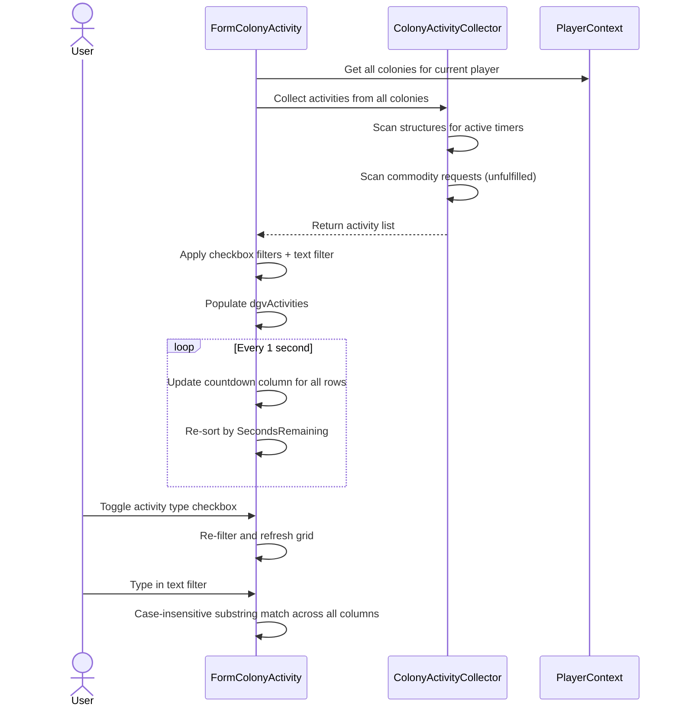
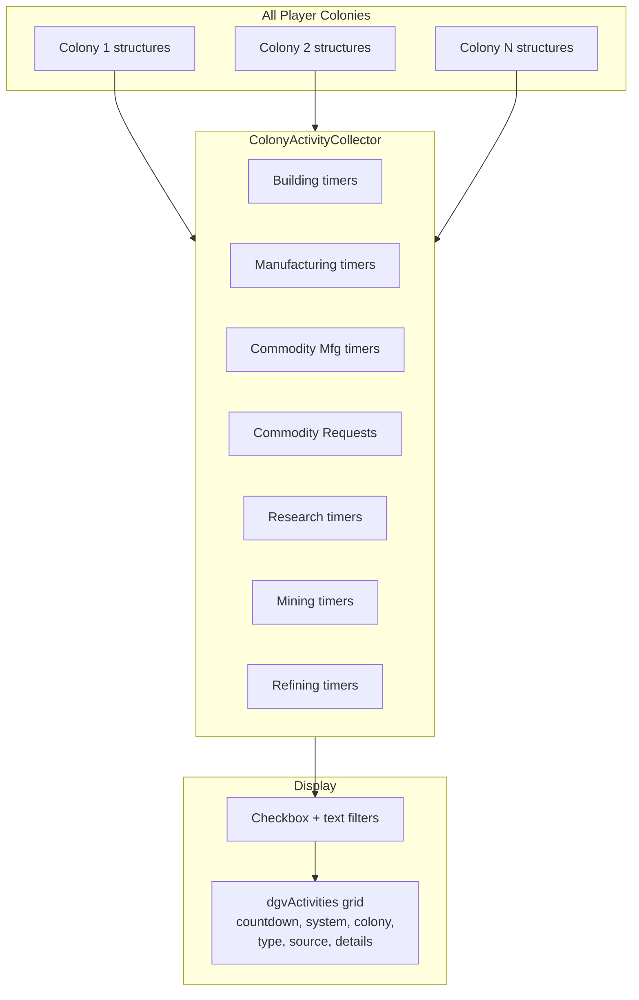

# Colony Activity Form Requirements

## User Goal

The user wants a single dashboard showing all active timers and pending commodity requests across all colonies, so they can see at a glance what's completing soon and what needs attention.

## Overview

**REQ-CA-001** The Colony Activity form SHALL display all active countdown timers and unfulfilled commodity requests across all colonies for the current player.

## Activity Types

**REQ-CA-010** The following activity types SHALL be collected and displayed:
- Building: structures with active BuildCompletionTime
- Manufacturing: structures with active manufacturing process timer
- CommodityManufacturing: commodity factory structures with active process timer
- CommodityRequest: unfulfilled commodity requests with a NeedBy date
- Research: structures with active research process timer
- Mining: mining rig structures with active process timer
- Refining: refinery structures with active process timer

## Display

**REQ-CA-020** Each activity row SHALL show: countdown timer, system name, colony name, activity type, source name, and process details.
**REQ-CA-021** The countdown column SHALL update every 1 second via a refresh timer.
**REQ-CA-022** The grid SHALL be sortable by any column. Default sort: by countdown ascending.
**REQ-CA-023** A hidden SecondsRemaining column SHALL be used for numeric sorting of the countdown.

## Filtering

**REQ-CA-030** The form SHALL provide checkboxes for each activity type to filter the display.
**REQ-CA-031** Building, Manufacturing, CommodityManufacturing, CommodityRequest, and Research SHALL be checked by default. Mining and Refining SHALL be unchecked by default.
**REQ-CA-032** A text filter SHALL perform case-insensitive substring matching across all visible columns.

## Process Details Format

**REQ-CA-040** Building: "Building"
**REQ-CA-041** Mining: "{amount}/h {resource} ({purity})"
**REQ-CA-042** Refining (normal): "{consumeRate}:{outputRate} {resource} ({purity})"
**REQ-CA-043** Refining (synthetic): "{consumeRate}:{produceRate} {outputResource}"
**REQ-CA-044** Manufacturing: "({completed+1}/{total}) {blueprintExtendedName}" (1-based display)
**REQ-CA-045** CommodityManufacturing: "({completed+1}/{total}) {commodityName} x{perCycle}" (1-based display)
**REQ-CA-046** Research: "Evo {current}->{next} {blueprintName}"
**REQ-CA-047** CommodityRequest: "{commodityName} x{requestedAmount}"

## Data Events

**REQ-CA-050** The form SHALL subscribe to CurrentPlayerChanged and ColonyDataChanged events.
**REQ-CA-051** The form SHALL unsubscribe from events in OnFormClosed.

## User Interaction Flows

### Activity Filtering and Display



## Data Flow Diagram



## Form Mockup

### FormColonyActivity

```
┌─────────────────────────────────────────────────────────────────────────────┐
│ #1 - Colony Activity                                                    [_][□][X] │
├─────────────────────────────────────────────────────────────────────────────┤
│ ☑Building ☑Manufacturing ☑CommodityMfg ☑CommodityReq ☑Research            │
│ ☐Mining ☐Refining ☐ImportStaleness ☐ShowInactive  Filter [______________] │
├─────────────────────────────────────────────────────────────────────────────┤
│ ┌──────────┬──────────┬──────────────┬──────────┬──────────┬─────────────┐ │
│ │ Countdown│ System   │ Colony       │ Type     │ Source   │ Details     │ │
│ ├──────────┼──────────┼──────────────┼──────────┼──────────┼─────────────┤ │
│ │ 2h 14m   │ Zeta Sys │ Helorix M1   │ Building │ Hab #3   │ Building    │ │
│ │ 5h 32m   │ Zeta Sys │ Helorix M1   │ Mfg      │ Mfg #1   │ (2/5) Rig  │ │
│ │ 45m 12s  │ Alpha Sys│ Proxima M2   │ Mining   │ Rig #1   │ 125/h Alk  │ │
│ │ 2d 3h    │ Delta Sys│ Zeh Vaz M1   │ CmdReq   │ —        │ Scanners x35│ │
│ │ 12d 6h   │ Zeta Sys │ Helorix M1   │ Research │ Lab #1   │ Ev 4->5 Rig│ │
│ └──────────┴──────────┴──────────────┴──────────┴──────────┴─────────────┘ │
└─────────────────────────────────────────────────────────────────────────────┘
```
