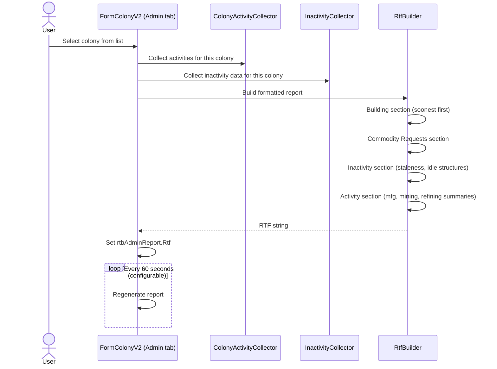
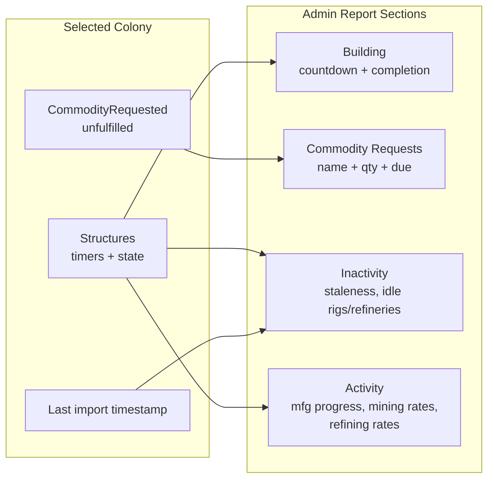

# Colony Administration Summary Requirements

## User Goal

The user wants a quick at-a-glance status report for each colony showing what's active, what's idle, and what needs attention — without drilling into individual structures.

## Overview

The Colony form's Administration tab displays a per-colony status report summarizing active processes and idle structures in a formatted RichTextBox.

## Status Report

**REQ-CAS-001** When a colony is selected, the Administration tab SHALL display a read-only RichTextBox status report scoped to that colony.  
**REQ-CAS-002** The report SHALL combine activity data (active timers, commodity requests) and inactivity data (idle structures, import staleness).  
**REQ-CAS-003** When no colony is selected, the report SHALL be empty.

## Report Sections — Order

**REQ-CAS-010** Building section first (soonest completion first). Each row shows source name, countdown, and completion time in local timezone.  
**REQ-CAS-011** Commodity Requests section second. Each row shows commodity name, requested quantity, and NeedBy date.  
**REQ-CAS-012** Inactivity section third, in fixed group order: Colony Import Staleness, Idle Mining, Idle Refining, Idle Manufacturing, Idle Commodity Manufacturing, Idle Research, Underutilized Refining. Empty groups omitted.  
**REQ-CAS-013** Activity section last: Manufacturing, Commodity Manufacturing, Research (sorted by soonest completion), then Mining and Refining summaries.  
**REQ-CAS-014** Manufacturing/Commodity Manufacturing rows SHALL show both next-item and full-batch completion times.  
**REQ-CAS-015** Mining rows SHALL aggregate by resource, showing rate per hour to 2 decimal places.  
**REQ-CAS-016** Refining rows SHALL aggregate by resource+purity, showing consume and produce rate totals.  
**REQ-CAS-017** Empty sections SHALL be omitted entirely.

## Formatting

**REQ-CAS-020** The report SHALL use RtfBuilder with colored text for section headers, countdowns, and completion times, assigned to RichTextBox.Rtf in a single operation.

## Refresh

**REQ-CAS-030** The report SHALL refresh every 60 seconds (configurable via Preferences), on colony selection change, and on ColonyDataChanged events.  
**REQ-CAS-031** On CurrentPlayerChanged, the report SHALL clear.

## Layout

**REQ-CAS-040** The report SHALL coexist with existing Bootstrap and Optimize buttons, filling remaining vertical space below them.

## User Interaction Flow

### Admin Report Generation

## Data Flow Diagram

