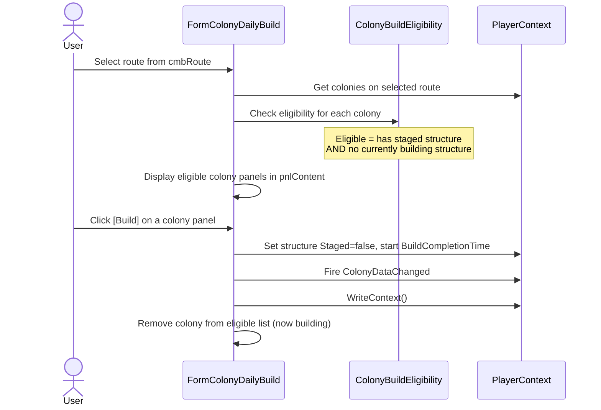
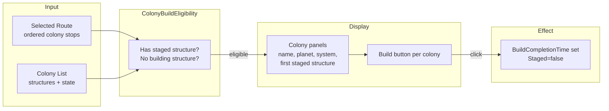

# Colony Daily Build Form Requirements

## Overview

**REQ-CDB-001** The Colony Daily Build form SHALL display all colonies eligible for building and allow the user to initiate builds.

## Eligibility

**REQ-CDB-010** A colony is eligible when it has at least one staged structure and no currently building structure (see REQ-GM-070 through REQ-GM-073).
**REQ-CDB-011** The form SHALL refresh the eligible colony list when ColonyDataChanged fires.

## Display

**REQ-CDB-020** The form SHALL provide a route selector (filtered combo box) to choose a delivery route. Only colonies on the selected route that are eligible for building SHALL be displayed.
**REQ-CDB-021** Each eligible colony SHALL be shown as a panel with colony name, planet name, system name, and the first staged structure's details.
**REQ-CDB-022** A "Build" button on each colony panel SHALL initiate building on the first staged structure of that colony.

## Build Action

**REQ-CDB-030** Building SHALL set the structure's Staged=false, start a BuildCompletionTime timer using the calculated build time (REQ-GM-060/061).
**REQ-CDB-031** After initiating a build, the form SHALL refresh to remove the colony from the eligible list (since it now has a building structure).
**REQ-CDB-032** The form SHALL fire ColonyDataChanged after initiating a build.

## Data Events

**REQ-CDB-040** The form SHALL subscribe to CurrentPlayerChanged and ColonyDataChanged events.
**REQ-CDB-041** The form SHALL unsubscribe from events in OnFormClosed.

## User Interaction Flows

### Daily Build Workflow



## Data Flow Diagram



## Form Mockup

### FormColonyDailyBuild

```
┌─────────────────────────────────────────────────────────────────────────────┐
│ #1 - Colony Daily Build                                                 [_][□][X] │
├──────────────────┬──────────────────────────────────────────────────────────┤
│ Route            │  ┌──────────────────────────────────────────────────┐    │
│ [filter________] │  │ Helorix M1 — Helorix-Zeta II, Zeta System       │    │
│ [▼ Alpha Run   ] │  │ First staged: Habitation Block Flatpack          │    │
│                  │  │ Build time: 20h 10m 24s (Builder Lv 3)           │    │
│                  │  │                                        [Build]   │    │
│                  │  └──────────────────────────────────────────────────┘    │
│                  │  ┌──────────────────────────────────────────────────┐    │
│                  │  │ Zeh Vaz M1 — Zeh Vazoran II, Delta System        │    │
│                  │  │ First staged: Power Plant Flatpack                │    │
│                  │  │ Build time: 20h 10m 24s (Builder Lv 3)           │    │
│                  │  │                                        [Build]   │    │
│                  │  └──────────────────────────────────────────────────┘    │
│                  │                                                          │
│                  │  (scrollable — more colonies below)                      │
└──────────────────┴──────────────────────────────────────────────────────────┘
```
