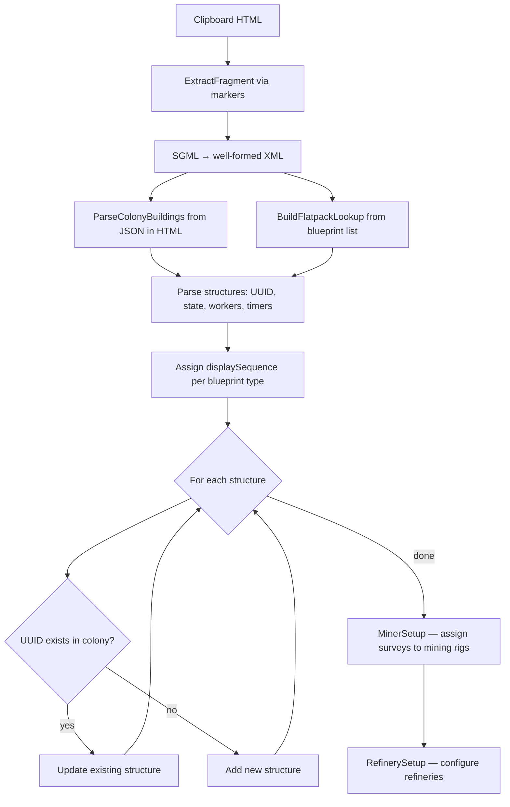
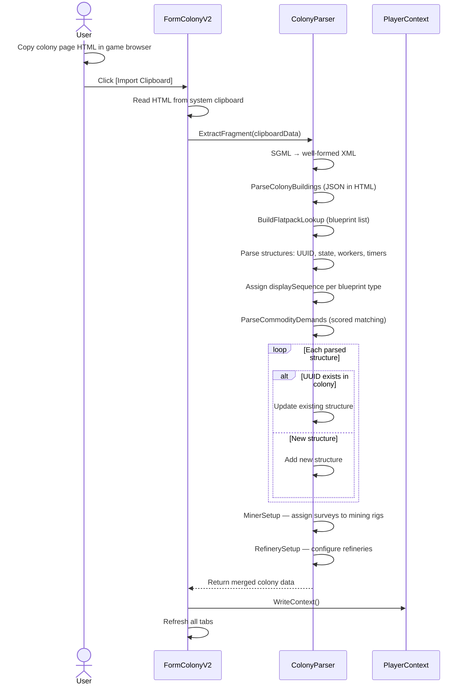
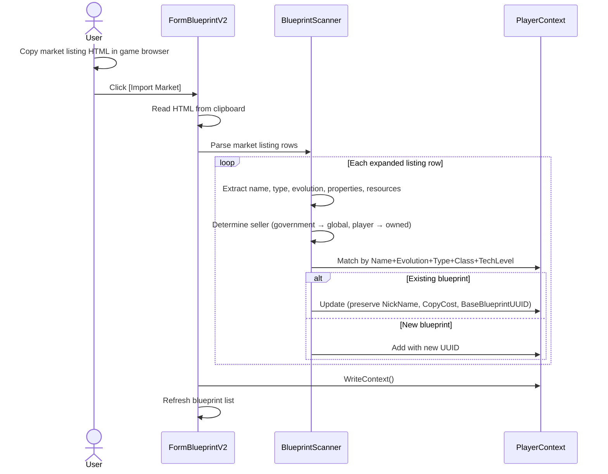
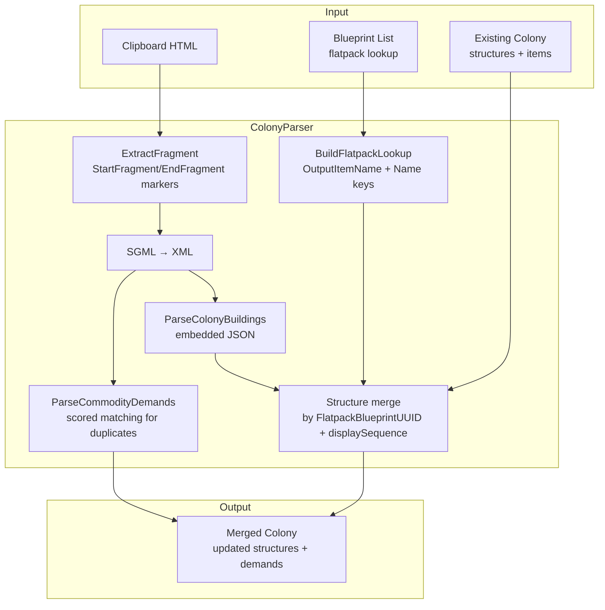

# Colony Import Requirements

## User Goal

The user wants to import colony data from the game by copying HTML from the browser and pasting into the tracker, avoiding manual re-entry of structure lists, worker assignments, and resource inventories.

## Out of Scope

- Direct game API integration (import is clipboard-based only)
- Automatic periodic re-import (user must manually paste each time)
- Partial import (the entire colony page is imported as a unit)

## Import Flow

## HTML Clipboard Import

**REQ-CI-001** The colony form SHALL provide an "Import Clipboard" button that reads HTML from the system clipboard and parses it into the selected colony.
**REQ-CI-002** The colony form SHALL provide an "Import Colony" button that reads an HTML file from disk and parses it into the selected colony.
**REQ-CI-003** The parser SHALL use SGML reader to convert game HTML into well-formed XML for processing.

## Parsed Data

**REQ-CI-010** The parser SHALL extract PlanetName and SystemName from the colony overview section.
**REQ-CI-011** The parser SHALL extract colony structures from embedded JSON data in the HTML, including:
- Structure UUID and flatpack blueprint UUID
- Game sequence number
- Build state (Built, Staged, Online)
- Worker assignments
- Process timers (mining, refining, manufacturing, research)
**REQ-CI-012** The parser SHALL extract commodity demands (CommodityRequested entries) from the HTML.
**REQ-CI-013** The parser SHALL match flatpack blueprint UUIDs against the known blueprint list to resolve blueprint types.

## Merge Semantics

**REQ-CI-020** When importing into an existing colony, structures SHALL be merged by compound key (FlatpackBlueprintUUID + per-type displaySequence). Existing structures with a matching compound key are updated; new structures are added. For CommodityManufactory types, positional matching within each sub-type is used instead of displaySequence.
**REQ-CI-021** The parser SHALL preserve any locally-set data (nicknames, manual overrides) that is not present in the game HTML.
**REQ-CI-022** SystemName SHALL be extracted from the location bar data when available.

## Flatpack Lookup

**REQ-CI-030** ColonyParser.BuildFlatpackLookup SHALL use Blueprint.OutputItemName as the design name key when building the lookup dictionary, rather than inline suffix stripping.
**REQ-CI-031** The lookup SHALL register both OutputItemName and the original Blueprint.Name as keys mapping to the blueprint UUID, so both "Mining Rig" and "Mining Rig Flatpack" resolve to the same blueprint.

## Market Blueprint Import

**REQ-CI-040** The blueprint form SHALL provide an "Import Market" button that reads HTML from the system clipboard and parses market listing rows into blueprints.
**REQ-CI-041** The parser SHALL extract blueprint name, type, evolution, properties, resources, seller name, and TechLevel from each expanded market listing row.
**REQ-CI-042** Government-seller blueprints SHALL be imported as global blueprints (empty OwnerUUID). Player-seller blueprints SHALL be imported as player-specific blueprints.
**REQ-CI-043** Import SHALL be idempotent — re-importing the same market data SHALL update existing blueprints (matched by Name+Evolution+Type+Class+TechLevel) without creating duplicates.
**REQ-CI-044** Import SHALL preserve protected fields (NickName, CopyCost, BaseBlueprintUUID) on existing blueprints.
**REQ-CI-045** HTML fragment extraction SHALL use StartFragment/EndFragment markers when present in clipboard data, falling back to byte offset headers when markers are absent.

## User Interaction Flows

### Clipboard Import

### Market Blueprint Import

## Data Flow Diagram

### Colony Import Merge Pipeline

