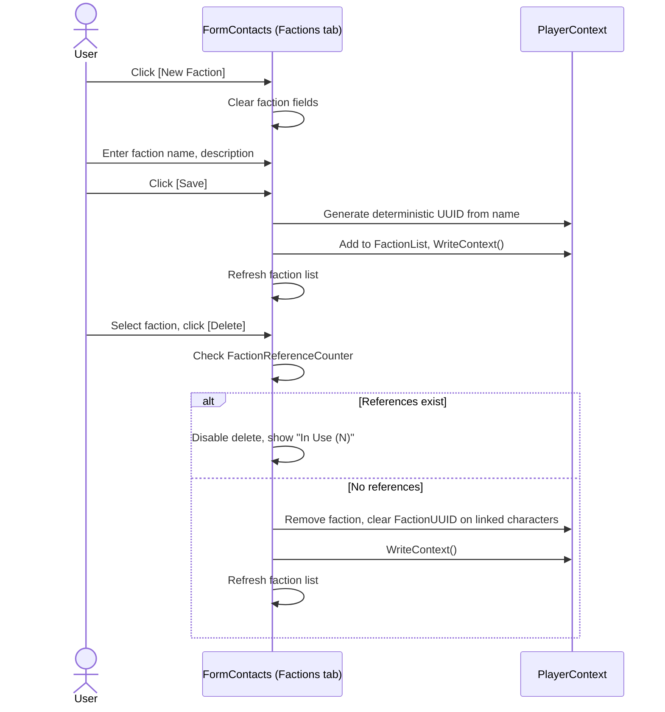
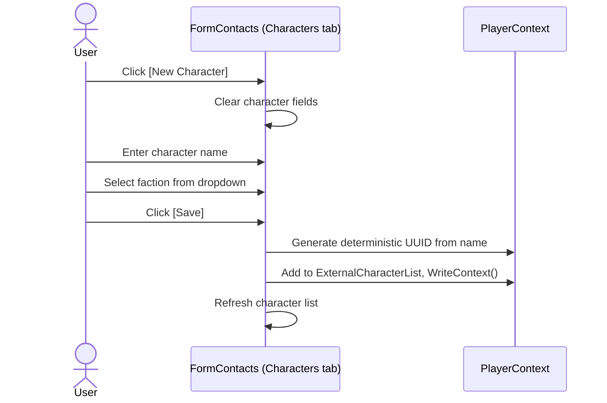

# Contacts Requirements

## User Goal

The user wants to track factions and external characters (other players, NPCs) they interact with in the game, so they can reference them in market transactions, delivery counterparties, and diplomatic context.

## Out of Scope

- Messaging or communication with other players
- Faction reputation tracking or diplomacy mechanics
- Automatic discovery of contacts from game data
- Contact notes or relationship history

## Factions

**REQ-CON-001** A Faction SHALL have UUID, Name, and Description.  
**REQ-CON-002** Faction UUID SHALL be deterministic from the faction name using DeterministicUUID with a faction-specific namespace.  
**REQ-CON-003** Factions SHALL be shared entities (no OwnerUUID). Any player can create and manage factions.  
**REQ-CON-004** PlayerProfile SHALL have a FactionUUID field linking the player to a faction.  

## External Characters

**REQ-CON-010** An ExternalCharacter SHALL have UUID, Name, and FactionUUID.  
**REQ-CON-011** ExternalCharacter UUID SHALL be deterministic from the character name using DeterministicUUID with a character-specific namespace.  
**REQ-CON-012** External characters SHALL be shared entities (no OwnerUUID) representing non-tracked game characters.  
**REQ-CON-013** Combo box lookups for recipients and counterparties SHALL merge PlayerProfiles and ExternalCharacters, sorted by name, with a free-text fallback.  

## Contacts Form

**REQ-CON-020** FormContacts SHALL provide a Factions tab for creating and editing factions.  
**REQ-CON-021** FormContacts SHALL provide an External Characters tab for creating and editing external characters with faction assignment.  
**REQ-CON-022** Deleting a faction SHALL NOT cascade-delete characters; their FactionUUID SHALL be cleared.

## User Interaction Flows

### Manage Factions

### Manage External Characters

