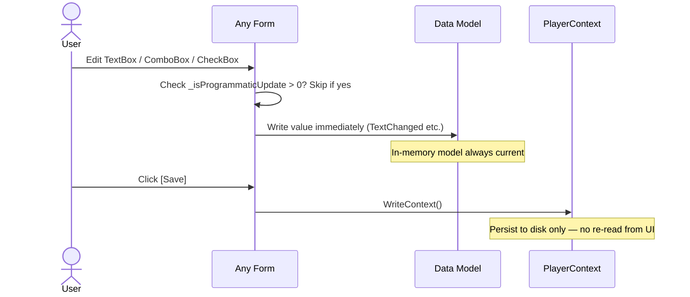

# Data Change Events Requirements

## User Goal

The user expects that when data changes (via background processing, import, or another form), all open forms automatically refresh to show current state — no manual refresh needed.

## Event Types

**REQ-DCE-001** PlayerContext SHALL expose the following events:
- `CurrentPlayerChanged` — fired when the selected player changes
- `ColonyDataChanged(ColonyUUID)` — fired when colony data is modified
- `BlueprintDataChanged(BlueprintUUID)` — fired when blueprint data is modified
- `SurveyDataChanged(SurveyUUID)` — fired when survey data is modified
- `DeliveryDataChanged` — fired when delivery route or plan data is modified
- `PlayerProfileDataChanged(PlayerUUID)` — fired when player profile data is modified
- `PlayerProfilesChanged` — fired when the profile list changes (add/remove)
- `PricingDataChanged` — fired when pricing plan data is modified (resource prices, plan settings)
- `BuildPlanDataChanged(BuildPlanUUID)` — fired when build plan data is modified
- `MarketDataChanged` — fired when market listing or transaction data is modified
- `StationDataChanged` — fired when station data is modified
- `AsteroidDataChanged(AsteroidUUID)` — fired when asteroid data is modified (created, updated, deleted)
- `ShipTemplateDataChanged(ShipTemplateUUID)` — fired when ship template data is modified
- `ShipDataChanged(ShipUUID)` — fired when ship instance data is modified
- `StockDataChanged(StockPlanUUID)` — fired when stock plan or profile data is modified
- `SupplyChainDataChanged(SupplyChainUUID)` — fired when supply chain data is modified
- `ContactDataChanged(CharacterUUID)` — fired when external character (contact) data is modified

## Event Args

**REQ-DCE-010** ColonyDataChanged SHALL use `ColonyDataChangedEventArgs` containing the colony UUID.
**REQ-DCE-011** BlueprintDataChanged SHALL use `BlueprintDataChangedEventArgs` containing the blueprint UUID.
**REQ-DCE-012** SurveyDataChanged SHALL use `SurveyDataChangedEventArgs` containing the survey UUID.
**REQ-DCE-013** PlayerProfileDataChanged SHALL use `PlayerProfileDataChangedEventArgs` containing the player UUID.
**REQ-DCE-014** DeliveryDataChanged, MarketDataChanged, StationDataChanged, and CurrentPlayerChanged SHALL use plain `EventArgs`.

**REQ-DCE-015** ColonyStructureDataChanged SHALL use `ColonyStructureDataChangedEventArgs` containing the colony UUID and structure UUID, fired when an individual colony structure is modified.

**REQ-DCE-016** BuildPlanDataChanged SHALL use `BuildPlanDataChangedEventArgs` containing the build plan UUID.
**REQ-DCE-017** AsteroidDataChanged SHALL use `AsteroidDataChangedEventArgs` containing the asteroid UUID.
**REQ-DCE-018** ShipTemplateDataChanged SHALL use `ShipTemplateDataChangedEventArgs` containing the ship template UUID.
**REQ-DCE-019** ShipDataChanged SHALL use `ShipDataChangedEventArgs` containing the ship UUID.
**REQ-DCE-01A** StockDataChanged SHALL use `StockDataChangedEventArgs` containing the stock plan UUID.
**REQ-DCE-01B** SupplyChainDataChanged SHALL use `SupplyChainDataChangedEventArgs` containing the supply chain UUID.
**REQ-DCE-01C** ContactDataChanged SHALL use `ContactDataChangedEventArgs` containing the character UUID.

## Form Subscriptions

**REQ-DCE-020** All MDI child forms SHALL subscribe to relevant data change events in their constructor or load handler.
**REQ-DCE-021** All MDI child forms SHALL unsubscribe from events in OnFormClosed.
**REQ-DCE-022** Event handlers SHALL check `IsDisposed` before accessing form controls to prevent ObjectDisposedException.
**REQ-DCE-023** When a data change event fires, the form SHALL refresh its display if the changed entity is currently selected or visible.

## Form-to-Event Subscription Matrix

**REQ-DCE-024** Each form SHALL subscribe to the events listed below. This matrix is the authoritative reference for which forms respond to which data changes.

| Form | CurrentPlayerChanged | Domain Events |
|------|---------------------|---------------|
| FormColonyV2 | Yes | ColonyDataChanged |
| FormColonyActivity | Yes | ColonyDataChanged |
| FormColonyDailyBuild | Yes | ColonyDataChanged |
| FormBlueprintV2 | Yes | BlueprintDataChanged, PricingDataChanged |
| FormSurvey | Yes | SurveyDataChanged, ColonyDataChanged |
| FormPlayerProfile | Yes | PlayerProfileDataChanged |
| FormDeliveryRoute | Yes | DeliveryDataChanged |
| FormDeliveryExecution | Yes | DeliveryDataChanged |
| FormBuildPlanner | Yes | BuildPlanDataChanged, ColonyDataChanged |
| FormMarket | Yes | MarketDataChanged |
| FormStation | Yes | (CurrentPlayerChanged only) |
| FormAsteroid | Yes | AsteroidDataChanged |
| FormShipTemplate | Yes | (CurrentPlayerChanged only) |
| FormShipInstance | Yes | (CurrentPlayerChanged only) |
| FormStockTargets | Yes | (CurrentPlayerChanged only) |
| FormSupplyChain | Yes | (CurrentPlayerChanged only) |
| FormContacts | Yes | (CurrentPlayerChanged only) |
| FormPricingPlan | Yes | (CurrentPlayerChanged only) |
| MainWindow | — | PlayerProfilesChanged |

## Cross-Form Interaction Rules

**REQ-DCE-030a** When FormDeliveryExecution marks a commodity as delivered, it SHALL fire ColonyDataChanged for the destination colony. This causes FormColonyV2, FormColonyActivity, FormColonyDailyBuild, FormBuildPlanner, and FormSurvey to refresh if open.
**REQ-DCE-030b** When FormDeliveryExecution marks a flatpack as delivered, it SHALL fire ColonyDataChanged for the destination colony. This causes colony forms to show the newly staged structure.
**REQ-DCE-030c** When BackgroundProcessor processes a colony (mining, refining, manufacturing, research, building), it SHALL fire ColonyDataChanged for that colony. All colony-subscribed forms refresh automatically.
**REQ-DCE-030d** When BackgroundProcessor advances build plan item statuses, it SHALL fire BuildPlanDataChanged for each modified plan. FormBuildPlanner refreshes automatically.
**REQ-DCE-030e** When FormBlueprintV2 modifies a blueprint used in colony structures (manufacturing, research, flatpack), the colony forms SHALL NOT be notified directly — the blueprint change takes effect on the next background processing cycle.
**REQ-DCE-030f** When FormPlayerProfile modifies skill levels, colony production rates change on the next background processing cycle. No immediate cross-form notification is required.

## Event Sources

**REQ-DCE-031** The following operations SHALL fire the specified events:

| Operation | Event Fired | Source |
|-----------|-------------|--------|
| Colony save (FormColonyV2) | ColonyDataChanged | ColonyViewModel.Save() |
| Colony import (clipboard) | ColonyDataChanged | ColonyParser import path |
| Background processing (timer) | ColonyDataChanged (per colony) | BackgroundProcessor |
| Background processing (build plans) | BuildPlanDataChanged (per plan) | BackgroundProcessor |
| Delivery execution (commodity/flatpack/worker/resource) | ColonyDataChanged | FormDeliveryExecution |
| Blueprint save | BlueprintDataChanged | BlueprintViewModel.Save() |
| Blueprint import (scanner) | BlueprintDataChanged | BlueprintScanner |
| Survey save | SurveyDataChanged | SurveyViewModel.Save() |
| Survey import (clipboard) | SurveyDataChanged | SurveyParser import path |
| Route/plan save | DeliveryDataChanged | DeliveryRouteViewModel.Save() |
| Player profile save | PlayerProfileDataChanged | PlayerProfileViewModel.Save() |
| Player profile import | PlayerProfileDataChanged | PlayerProfileParser |
| Player add/remove | PlayerProfilesChanged | MainWindow |
| Pricing plan save | PricingDataChanged | PricingPlanViewModel.Save() |
| Build plan save | BuildPlanDataChanged | BuildPlanViewModel.Save() |
| Market listing/transaction save | MarketDataChanged | MarketViewModel.Save() |
| Station save | StationDataChanged | StationViewModel.Save() |
| Asteroid save | AsteroidDataChanged | AsteroidViewModel.Save() |
| Ship template save | ShipTemplateDataChanged | ShipTemplateViewModel.Save() |
| Ship instance save | ShipDataChanged | ShipInstanceViewModel.Save() |
| Stock plan save | StockDataChanged | StockTargetsViewModel.Save() |
| Supply chain save | SupplyChainDataChanged | SupplyChainViewModel.Save() |
| Contact save | ContactDataChanged | ContactsViewModel.Save() |
| Player switch (dropdown) | CurrentPlayerChanged | MainWindow |

## Write-Through Pattern

**REQ-DCE-030** All editable form controls SHALL write to the data model immediately on change (TextChanged, SelectedIndexChanged, CheckedChanged).
**REQ-DCE-031** Save buttons SHALL only call `WriteContext()` — they SHALL NOT re-read form fields into the model.

## Data Flow Diagram

### Event Propagation

```mermaid
flowchart TD
    subgraph Sources["Event Sources"]
        UI[Form saves<br/>user edits]
        BG[BackgroundProcessor<br/>timer-driven processing]
        IMP[Import operations<br/>clipboard/file]
    end

    subgraph PC["PlayerContext Events"]
        CPC[CurrentPlayerChanged]
        CDC[ColonyDataChanged<br/>colonyUUID]
        BDC[BlueprintDataChanged<br/>blueprintUUID]
        SDC[SurveyDataChanged<br/>surveyUUID]
        DDC[DeliveryDataChanged]
        PDC[PlayerProfileDataChanged<br/>playerUUID]
        PPC[PlayerProfilesChanged]
        PRDC[PricingDataChanged]
        BPDC[BuildPlanDataChanged<br/>buildPlanUUID]
        MDC[MarketDataChanged]
        STDC[StationDataChanged]
        ADC[AsteroidDataChanged<br/>asteroidUUID]
        STPDC[ShipTemplateDataChanged<br/>shipTemplateUUID]
        SHDC[ShipDataChanged<br/>shipUUID]
        SKDC[StockDataChanged<br/>stockPlanUUID]
        SCDC[SupplyChainDataChanged<br/>supplyChainUUID]
        CTDC[ContactDataChanged<br/>characterUUID]
    end

    subgraph Subscribers["Form Subscribers"]
        FC[FormColonyV2]
        FB[FormBlueprintV2]
        FS[FormSurvey]
        FCA[FormColonyActivity]
        FDB[FormColonyDailyBuild]
        FDR[FormDeliveryRoute]
        FDE[FormDeliveryExecution]
        FPP[FormPlayerProfile]
        FPR[FormPricingPlan]
        FBP[FormBuildPlanner]
        FMK[FormMarket]
        FST[FormStation]
        FA[FormAsteroid]
        FSH[FormShipTemplate]
        FSI[FormShipInstance]
        FTG[FormStockTargets]
        FSC[FormSupplyChain]
        FCT[FormContacts]
    end

    UI --> PC
    BG --> CDC
    IMP --> PC

    CPC --> FC & FB & FS & FCA & FDB & FDR & FDE & FPP & FPR & FBP & FMK & FST & FA & FSH & FSI & FTG & FSC & FCT
    CDC --> FC & FCA & FDB & FDE
    BDC --> FB
    SDC --> FS
    DDC --> FDR & FDE
    PDC --> FPP
    PRDC --> FPR
    BPDC --> FBP
    MDC --> FMK
    STDC --> FST
    ADC --> FA
```

### Write-Through Pattern

