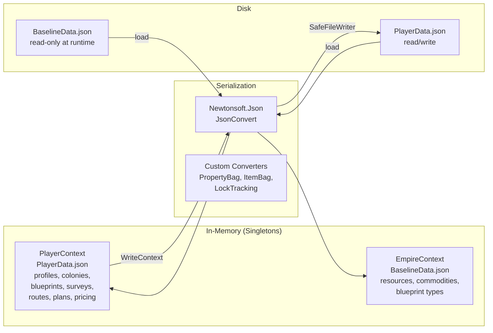
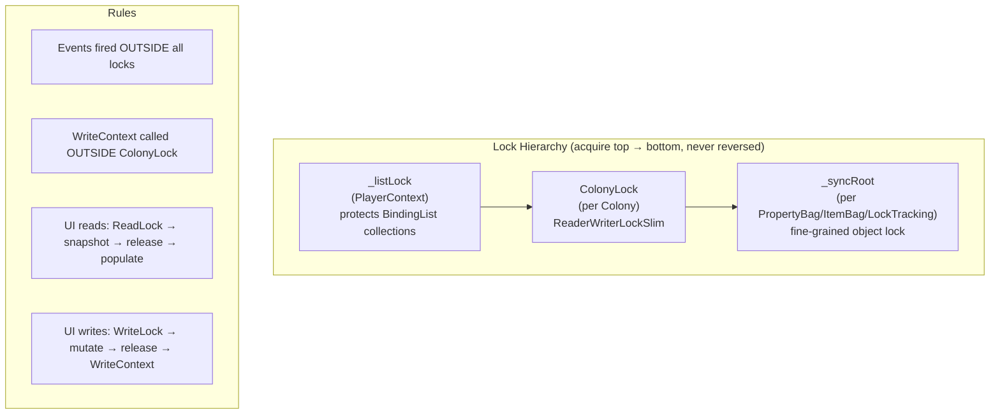
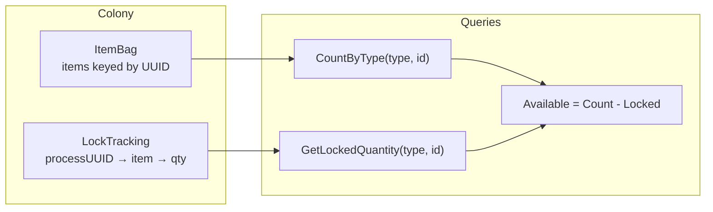

# Data Model Requirements

## User Goal

The data model provides the foundation for all persistence and computation. It must serialize cleanly to JSON, support multiple player profiles, and enable efficient lookup and cross-referencing between entities.

## PropertyBag

**REQ-DM-001** PropertyBag SHALL store string, decimal, long, and bool values under string keys.  
**REQ-DM-002** Setting a key that already exists SHALL overwrite the previous value without error.  
**REQ-DM-003** Getting a missing key SHALL return false and the supplied default value unchanged.  
**REQ-DM-004** Getting a key whose stored string cannot be parsed to the requested type SHALL return false.  
**REQ-DM-005** PropertyBag SHALL serialize to a flat JSON object `{ "key": "value" }` with no type wrappers.  
**REQ-DM-006** PropertyBag SHALL deserialize from the same flat JSON format, restoring all key/value pairs.  
**REQ-DM-007** Clear() SHALL remove all entries, leaving an empty dictionary.  
**REQ-DM-008** Remove() SHALL return true and remove the entry when the key exists, false when it does not.

## ItemBag

**REQ-DM-010** ItemBag SHALL store Item instances keyed by their UUID.  
**REQ-DM-011** AddItem() SHALL throw when an item with the same UUID already exists.  
**REQ-DM-012** CountByType(itemType, baseItemTypeID) SHALL return the sum of Quantity across all items matching both fields, using ordinal string comparison.  
**REQ-DM-013** CountByType SHALL return 0 when no items match.  
**REQ-DM-014** FindResource(resource, purity) SHALL return all items of type Resource whose BaseItemTypeID and ResourcePurity match, using ordinal comparison.  
**REQ-DM-015** ItemBag SHALL serialize to a JSON object keyed by UUID and deserialize back to the same state.

## Item and ExtendedName

**REQ-DM-020** Item.ExtendedName for ItemType=Resource SHALL append `(Purity)` when ResourcePurity is non-empty.  
**REQ-DM-021** Item.ExtendedName for ItemType=Commodity SHALL return the Commodity's own ExtendedName looked up by BaseItemTypeID; if not found, return Name.  
**REQ-DM-022** Item.ExtendedName for ItemType=Survey SHALL return `PlanetName (SurveyID)` with `[NickName]` appended when NickName is non-empty, looked up via PlayerContext.FindSurvey(BaseItemTypeID); if PlayerContext is null or survey not found, return Name.  
**REQ-DM-023** Item.ExtendedName for ItemType=Blueprint SHALL return `C{Class} Ev({Evolution}) Name (TechLevel) [NickName]` with each segment omitted when its value is zero/null/empty, looked up via PlayerContext.FindBlueprint(BaseItemTypeID); if not found, return Name.  
**REQ-DM-024** Item.ExtendedName SHALL be decorated with [JsonIgnore] and not appear in serialized JSON.  
**REQ-DM-025** Item.Volume (decimal) represents the cargo volume of a single unit. It SHALL be set when the item is added to the warehouse according to these rules:
- Blueprint: 0
- Survey: 0
- Resource: 1
- Commodity: 10
- WorkDetail: 50
- Manufactured items (Flatpack, ShipHull, ShipPart, Munition, SpaceBuildPackage, Share): from the blueprint's CargoVolumeSize property (parsed as decimal, default 0 if absent)

**REQ-DM-026** Item.ItemType SHALL serialize as the enum name string (e.g. `"Resource"`, `"Commodity"`) not as an integer. This SHALL be achieved via `[JsonConverter(typeof(StringEnumConverter))]` on the ItemType property.  
**REQ-DM-027** BlueprintType SHALL have an OutputItemType string field recording what ItemType is produced when a blueprint of this type is manufactured. The value SHALL be the ItemType.ItemTypeEnum name (e.g. `"ShipHull"`, `"Flatpack"`). This field SHALL be populated in BaselineData.json for all BlueprintTypes.

## Blueprint

**REQ-DM-030** Blueprint.ExtendedName SHALL return empty string when UUID is null.  
**REQ-DM-031** Blueprint.ExtendedName SHALL include `C{Class}` prefix only when Class > 0.  
**REQ-DM-032** Blueprint.ExtendedName SHALL include `Ev({Evolution})` only when Evolution > 0.  
**REQ-DM-033** Blueprint.ExtendedName SHALL include `(TechLevel)` only when TechLevel is non-null and non-empty.  
**REQ-DM-034** Blueprint.ExtendedName SHALL include `[NickName]` only when NickName is non-empty.  
**REQ-DM-035** Blueprint.ExtendedName SHALL be trimmed — no leading or trailing whitespace.  
**REQ-DM-036** Blueprint.ExtendedName SHALL be decorated with [JsonIgnore].  
**REQ-DM-037** Blueprint SHALL expose an `OutputItemName` computed property. For flatpack blueprints (BluePrintType.IsFlatpack() is true) whose Name ends with " Flatpack" (case-insensitive), OutputItemName SHALL return the Name with the " Flatpack" suffix removed. For all other blueprints, OutputItemName SHALL return Name unchanged. For null or empty Name, OutputItemName SHALL return empty string.  
**REQ-DM-038** Blueprint.OutputItemName SHALL be decorated with [JsonIgnore] and SHALL NOT appear in serialized JSON.  
**REQ-DM-039** Blueprint.ExtendedName SHALL use OutputItemName (not Name) when building the display string. This means flatpack blueprints display their structure name (e.g. "Mining Rig") rather than their market name (e.g. "Mining Rig Flatpack") in all UI locations that use ExtendedName.

## Survey and SurveyResource

**REQ-DM-040** Survey.ExtendedName SHALL return `PlanetName (SurveyID)` with `[NickName]` appended when NickName is non-empty. PlanetName is always present on a valid survey.  
**REQ-DM-040a** A Survey SHALL always have a non-empty PlanetName. A survey without a PlanetName is invalid and SHALL NOT be saved or used in any colony operation.  
**REQ-DM-041** Survey.ExtendedName SHALL return empty string when PlanetName, SurveyID, and NickName are all null or empty.  
**REQ-DM-042** SurveyResource SHALL have Resource, Purity, and Amount string properties.  
**REQ-DM-043** SurveyResource.ExtendedName SHALL return `Resource (Purity) (Amount)/h` omitting segments that are null or empty.

## CountDownTime

**REQ-DM-050** CountDownTime.TimeRemaining getter SHALL return the number of seconds until EndTime from now.  
**REQ-DM-051** CountDownTime.TimeRemaining setter SHALL set EndTime to now + the given seconds.  
**REQ-DM-052** CountDownTime.TimeRemainingString getter SHALL format as `Xd Yh Zm Ws`. Leading zero-value segments (before the first non-zero segment) SHALL be omitted. Once the first non-zero segment has been included, all subsequent lower segments SHALL be shown even if their value is zero (e.g. `1h 0m 30s`, not `1h 30s`). When TimeRemaining <= 0 it SHALL return `"0s"`.  
**REQ-DM-053** CountDownTime.TimeRemainingString setter SHALL parse `Xd Yh Zm Ws` (all segments optional) and set TimeRemaining to the total seconds.  
**REQ-DM-054** CountDownTime.TimeRemaining and IntervalsPassed SHALL be decorated with [JsonIgnore] as they are computed from persisted fields. StartTime, EndTime, and RepeatIntervalSeconds SHALL be serialized to JSON so that active countdowns survive app restarts.  
**REQ-DM-055** CountDownTime in repeating mode SHALL track IntervalsPassed as the number of complete intervals elapsed since StartTime.  
**REQ-DM-056** ConsumeIntervals(n) SHALL advance StartTime by n * RepeatIntervalSeconds, reducing IntervalsPassed by n.  
**REQ-DM-057** StartRepeating(intervalSeconds) SHALL set RepeatIntervalSeconds, StartTime=now, EndTime=now+interval.

## LockTracking

**REQ-DM-060** LockItem(processUUID, itemType, baseID, qty) SHALL add qty to the existing lock for that process+item, creating the entry if absent.  
**REQ-DM-061** LockItem SHALL throw ArgumentNullException when processUUID is null or empty.  
**REQ-DM-062** LockItems SHALL call LockItem for each entry in the supplied collection.  
**REQ-DM-063** GetLockedQuantity(itemType, baseID) SHALL return the sum of locked quantities across all processes for that item.  
**REQ-DM-064** GetLocksForProcess(processUUID) SHALL return all ItemLock entries for that process, or an empty list if none exist.  
**REQ-DM-065** ClearLocksForProcess(processUUID) SHALL remove all locks for that process; calling it for an unknown UUID SHALL not throw.  
**REQ-DM-066** LockTracking SHALL serialize to `{ "processUUID": { "ItemType:BaseID": quantity } }` and deserialize back to the same state.

## Static Reference Data (Commodity, ResourceGroup, ResourcePurity, ResourceClass, ItemType, WorkerDetail)

**REQ-DM-070** Each static reference list SHALL have a None/blank entry as the first element.  
**REQ-DM-071** All non-None entries SHALL have a non-empty Name.  
**REQ-DM-072** No two entries in the same list SHALL share the same ID or Name.  
**REQ-DM-073** Non-None entries SHALL be sorted alphabetically by Name.  
**REQ-DM-074** Each list SHALL contain an entry for every value in its corresponding enum.  
**REQ-DM-075** MapByEnum and MapByString SHALL be consistent: for every entry, enum→Name→enum SHALL return the original enum value.  
**REQ-DM-076** ResourceGroup.Synthetic entry SHALL have Synthetic=true; all other entries SHALL have Synthetic=false.  
**REQ-DM-077** ResourcePurity.Refined entry SHALL have Refined=true; all other entries SHALL have Refined=false.  
**REQ-DM-078** WorkerDetail SHALL contain exactly three named entries: BlueCollarDetail, WhiteCollarDetail, SpecialistDetail.  
**REQ-DM-079** WorkerDetail IDs (e.g. `BlueCollarDetail`, `WhiteCollarDetail`, `SpecialistDetail`) SHALL be used as `BaseItemTypeID` for WorkDetail items in the colony warehouse and as lock process keys. Blueprint property keys for worker counts SHALL use the spaced form (e.g. `"Blue Collar Detail"`, `"White Collar Detail"`, `"Specialist Detail"`) matching the game data. These are distinct key types: `WorkerTypeInfo.DetailKey` holds the item type ID (no spaces); `WorkerTypeInfo.PropertyKey` holds the blueprint property key (with spaces).

## PlayerProfile and Skills

**REQ-DM-080** PlayerProfile.GetSkill(name) SHALL create and return a new PlayerSkill when the key is absent, and return the existing instance on subsequent calls.  
**REQ-DM-081** PlayerProfile.GetSkill(SkillName enum) SHALL use the enum's Description attribute as the dictionary key.  
**REQ-DM-082** PlayerProfile.GetSkillGroup(name) SHALL return false when the key is absent.  
**REQ-DM-083** PlayerProfile.SetSkillGroup(name, value) followed by GetSkillGroup(name) SHALL return value.  
**REQ-DM-084** SkillName and SkillGroupName enum values SHALL each have a non-empty Description attribute.  
**REQ-DM-085** PlayerRank SHALL default Rank, CurrentXP, and NextXP to 0.

## ReferenceReport

**REQ-DM-090** ReferenceReport SHALL be an immutable value object in the `OE2EmpireTracker.Models` namespace. All properties SHALL be read-only, set via the constructor.  
**REQ-DM-091** ReferenceReport SHALL expose seven integer read-only properties: FlatpackCount, ResearchingCount, ManufacturingCount, BaseBlueprintCount, ScannerCount, BuildItemCount, and ShipComponentCount.  
**REQ-DM-092** ReferenceReport SHALL expose a computed TotalCount property equal to the sum of all seven count properties.  
**REQ-DM-093** ReferenceReport SHALL provide a constructor accepting seven int parameters (flatpackCount, researchingCount, manufacturingCount, baseBlueprintCount, scannerCount, buildItemCount, shipComponentCount). BuildItemCount and ShipComponentCount SHALL default to 0 for backward compatibility.  
**REQ-DM-094** ReferenceReport SHALL expose a static readonly field `Empty` that returns a ReferenceReport with all seven counts set to zero.

## Thread Safety

**REQ-DM-100** ItemBag SHALL use a private `object _syncRoot` to synchronize all public method access. Write operations (AddItem, Remove, Clear) and read operations (FindByType, FindResource, CountByType, ContainsKey, Count) SHALL acquire the lock. FindByType and FindResource SHALL return defensive copies.  
**REQ-DM-101** PropertyBag SHALL use a private `object _syncRoot` to synchronize all public method access. Write operations (setProperty, Remove, Clear) and read operations (getDecimal, getLong, getBoolean, getString, ContainsKey, Count) SHALL acquire the lock.  
**REQ-DM-102** LockTracking SHALL use a private `object _syncRoot` to synchronize all public method access. GetLocksForProcess SHALL return a read-only copy.  
**REQ-DM-103** Colony SHALL expose a `[JsonIgnore] ReaderWriterLockSlim ColonyLock` property (NoRecursion policy) replacing the former ProcessingLock. Constants: ReadLockTimeoutMs=1000, WriteLockTimeoutMs=5000.  
**REQ-DM-104** PlayerContext SHALL use a private `object _listLock` to synchronize access to entity list backing fields and lookup caches. WriteContext SHALL snapshot lists under _listLock then serialize outside it. SnapshotColonyList() SHALL return a copy under _listLock.  
**REQ-DM-105** Lock ordering SHALL be: _listLock → ColonyLock → _syncRoot (never reversed). Events SHALL be fired outside all locks. WriteContext SHALL be called outside ColonyLock.  
**REQ-DM-106** BackgroundProcessor SHALL acquire ColonyLock.TryEnterWriteLock before ProcessColony. On timeout, skip the colony and continue. Fire OnColonyDataChanged outside the lock.  
**REQ-DM-107** UI forms reading colony data SHALL acquire ColonyLock.TryEnterReadLock, snapshot collections, release lock, then populate controls. On timeout, display stale data.  
**REQ-DM-108** UI forms mutating colony data SHALL acquire ColonyLock.TryEnterWriteLock, mutate, release lock, then call WriteContext and fire events.

## Data Flow Diagrams

### Persistence Pipeline

### Thread Safety Lock Ordering

### ItemBag / LockTracking Interaction

## Empire Systems Entity Types (Iteration 1-8)

The following 13 entity types were added as part of the empire-systems spec. All follow the existing POCO pattern: public properties with defaults, Newtonsoft.Json serialization, UUID + OwnerUUID ownership, persisted as top-level arrays in PlayerRoot.

**REQ-DM-110** BuildPlan SHALL have UUID, Name, OwnerUUID, Description, DeliveryPlanUUID, IsActive (default true), and a nested `List<BuildItem>`.  
**REQ-DM-111** BuildItem SHALL have UUID, ItemType (enum: Manufactory/Commodity/ShipTemplate/Mining/Refining/Research), Status (enum: Staged/Delivering/Ready/InProgress/Completed), BlueprintUUID, ItemName, CommodityName, ShipTemplateUUID, Quantity, BuildLocationType (DestinationType), BuildLocationUUID, StructureUUID, AssemblyLocationType, AssemblyLocationUUID, ParentBuildItemUUID, Recipient, Notes, SequenceInStructure, DependsOnUUID, and mining/refining fields.  
**REQ-DM-112** ShipTemplate SHALL have UUID, Name, OwnerUUID, HullBlueprintUUID, and `List<ShipComponentSlot>`. ShipComponentSlot SHALL have SlotType (string), SlotIndex (int), BlueprintUUID, and damage fields (CurrentHP, MaxHP, MaxRepairPercent).  
**REQ-DM-113** Ship SHALL have UUID, Name, OwnerUUID, TemplateUUID, HullBlueprintUUID, Components list, LocationType/LocationUUID, Cargo (ItemBag), Hopper (ItemBag), and hull damage fields.  
**REQ-DM-114** Station SHALL have UUID, Name, StationType (enum: Outpost/Station/Starbase), Ownership (enum: Government/PlayerOwned), OwnerUUID, Holds (Dictionary<string, ItemBag>), Components list, StationBlueprintUUID, MunitionsHold (ItemBag), and hull damage fields.  
**REQ-DM-115** MarketListing SHALL have UUID, OwnerUUID, StationUUID, ItemType, ItemReferenceID, ItemName, Quantity, PricePerUnit, and condition fields (CurrentHP, MaxHP, MaxRepairPercent).  
**REQ-DM-116** MarketTransaction SHALL have UUID, OwnerUUID, TransactionType (enum: Buy/Sell), ItemType, ItemReferenceID, ItemName, Quantity, PricePerUnit, TotalPrice, Counterparty, CounterpartyFaction, StationUUID, Timestamp, Notes, ListingUUID, and condition fields.  
**REQ-DM-117** StockPlan SHALL have UUID, Name, OwnerUUID, ReplenishmentBuildPlanUUID, IsActive (default true), and `List<StockTarget>`. StockTarget SHALL have UUID, ItemType, ItemReferenceID, ItemName, ShipTemplateUUID, TargetQuantity, CriticalThreshold, Scope (enum: EmpireWide/Colony/Station), and LocationUUID.  
**REQ-DM-118** StockProfile SHALL have UUID, Name, OwnerUUID, IsActive (default true), and `List<StockProfileEntry>`. StockProfileEntry SHALL have GroupID and StockPlanUUID.  
**REQ-DM-119** SupplyChain SHALL have UUID, Name, OwnerUUID, IsActive (default true), and `List<SupplyChainStage>`. SupplyChainStage SHALL have Sequence, StageType (enum), LocationType, LocationUUID, ResourceName, ResourcePurity, AccumulationThreshold, ProductionRatePerHour, and DeliveryRouteUUID.  
**REQ-DM-120** WarehouseOverflowRule SHALL have UUID, OwnerUUID, IsActive (default true), ColonyUUID, ResourceName, ResourcePurity, TriggerThreshold, DestinationType, DestinationUUID, and DeliveryRouteUUID.  
**REQ-DM-121** Faction SHALL have UUID (deterministic from name), Name, and Description. No OwnerUUID — factions are shared entities.  
**REQ-DM-122** ExternalCharacter SHALL have UUID (deterministic from name), Name, and FactionUUID. No OwnerUUID — external characters are shared entities.  
**REQ-DM-123** Asteroid SHALL have UUID (deterministic from SystemName:Name), Name, SystemName, and `List<AsteroidReserve>`. AsteroidReserve SHALL have ResourceName, Purity, MaxReserve, CurrentReserve, and ResetTimestamp.  
**REQ-DM-124** DestinationType enum SHALL have values: Colony, Station, Asteroid, Ship.  
**REQ-DM-125** All entities with IsActive fields SHALL default to true. `DefaultValueHandling.Ignore` SHALL omit IsActive from JSON when true.  
**REQ-DM-126** PlayerRoot SHALL include arrays for all 13 new entity types. PlayerContext SHALL maintain private `List<T>` backing fields exposed as `IReadOnlyList<T>` properties, Init methods, WriteContext serialization, snapshot methods, UUID caches, and dedicated `Add{Entity}`/`Remove{Entity}` mutation methods for each. EmpireContext SHALL follow the same pattern for its 9 entity lists.  
**REQ-DM-127** Item SHALL support Crate ItemType with a Contents ItemBag (null for non-crate items). No nesting — crates SHALL NOT contain other crates.  
**REQ-DM-128** Item SHALL have damage fields (CurrentHP, MaxHP, MaxRepairPercent) for physical components (ShipPart, ShipHull, Munition). All default to 0 (undamaged, omitted from JSON).  
**REQ-DM-129** Survey SHALL have SurveyType (enum: Planet/Asteroid, default Planet) and AsteroidUUID fields. DefaultValueHandling.Ignore SHALL omit SurveyType from JSON for planet surveys.  
**REQ-DM-130** PlayerProfile SHALL have a FactionUUID field linking the player to a Faction.

## Read-Only List Encapsulation

**REQ-DM-140** Every entity list on PlayerContext and EmpireContext SHALL be stored as a private `List<T>` backing field and exposed as a public `IReadOnlyList<T>` property. External code SHALL NOT be able to call `.Add()`, `.Remove()`, `.Clear()`, or any other mutating method on the public property.  
**REQ-DM-141** PlayerContext and EmpireContext SHALL provide dedicated `Add{Entity}({Entity} item)` and `Remove{Entity}({Entity} item)` mutation methods for each entity list. All list mutations by external code SHALL go through these methods.  
**REQ-DM-142** Mutation methods on PlayerContext SHALL acquire `_listLock` before modifying the backing list. The lock scope SHALL cover the list mutation, inline UUID cache update, and derived cache invalidation.  
**REQ-DM-143** When an entity with a non-null UUID is added via a mutation method, the method SHALL insert the entity into the corresponding UUID cache dictionary inline (O(1)). When removed, the method SHALL remove it from the cache inline (O(1)). If the cache is null (not yet built), the inline update SHALL be skipped.  
**REQ-DM-144** Mutation methods for entity types with an associated BindingSource SHALL call `BindingSource?.ResetBindings(false)` outside the lock to notify bound UI controls.  
**REQ-DM-145** Mutation methods for Blueprint SHALL additionally invalidate `_allBlueprintsCache` and `_blueprintTypeCountCache`. Mutation methods for BuildPlan SHALL additionally invalidate `_blueprintBuildItemIndex` and `_buildLocationBuildItemIndex`. These derived cache invalidations SHALL occur within the same lock scope as the list mutation.  
**REQ-DM-146** Find methods (FindBlueprint, FindSurvey, FindColony, etc.) SHALL return results from the UUID cache dictionary lookup only, without fallback linear scans. FindBlueprint SHALL fall back to `EmpireContext.FindGlobalBlueprint` when the local cache misses.  
**REQ-DM-147** Invalidate methods (InvalidateBlueprintCache, etc.) SHALL remain available for bulk operations during Init and CascadeDeletePlayer. During normal operation, inline cache maintenance via mutation methods SHALL be the primary cache update path.  
**REQ-DM-148** Any new entity list added to PlayerContext or EmpireContext in the future SHALL follow this same pattern: private backing field, IReadOnlyList property, Add/Remove mutation methods with inline cache maintenance, and a Find method with lazy-init UUID cache.
