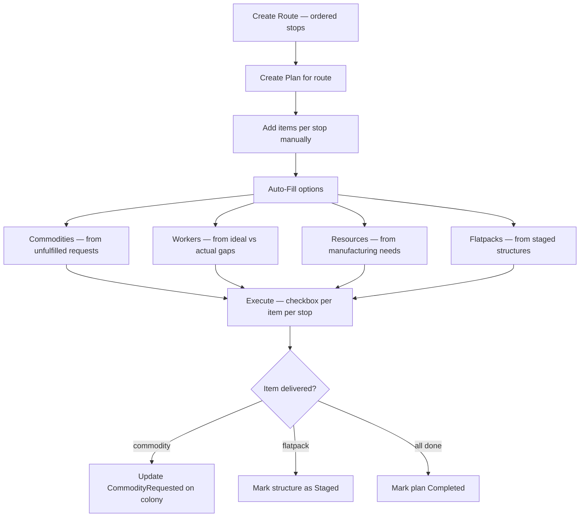
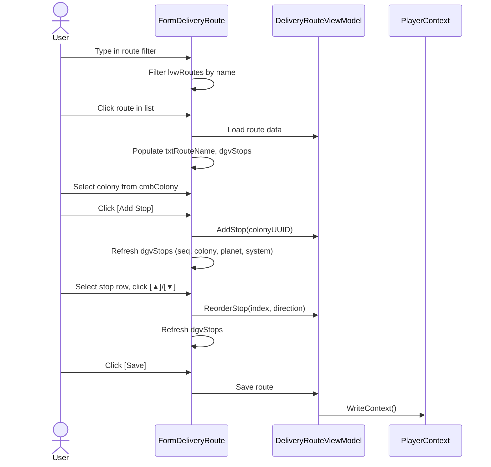
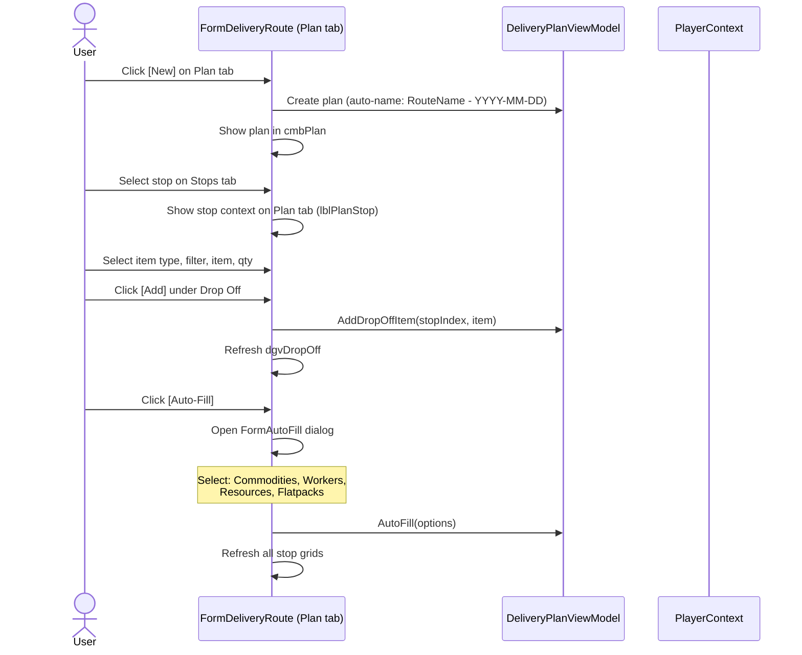
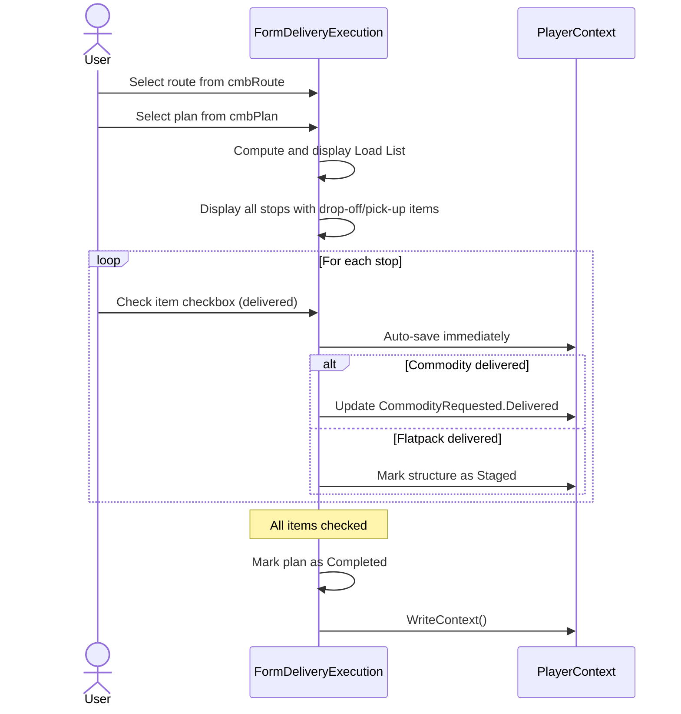
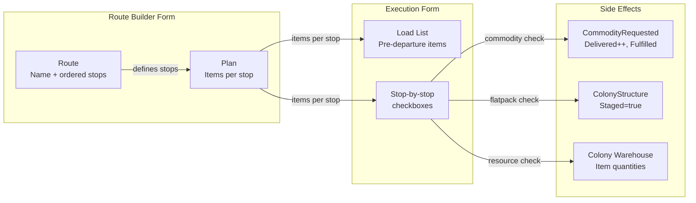
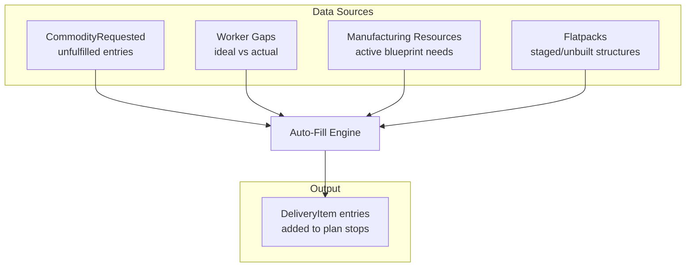

# Delivery & Route Requirements

## Delivery Planning Flow



## Background

Deliveries move items between colonies and a central hub (space station, deferred). Types of deliveries:
- Commodities requested by colonies
- Workers needed to meet ideal build plans
- Resources for manufacturing items and commodities
- Pickup of mined/refined resources to prevent warehouse overflow

Colonies are on planets. Planets are in systems. Travel between systems costs time and fuel. Travel between planets within a system costs time. Delivery routes define an ordered sequence of stops to minimize travel.

## Phase 1: System Name Tracking

**REQ-DEL-001** Colony SHALL have a `SystemName` string property, serialized to JSON, defaulting to empty string.
**REQ-DEL-002** Survey SHALL have a `SystemName` string property, serialized to JSON, defaulting to empty string.
**REQ-DEL-003** SurveyParser SHALL extract SystemName from the survey title (format: "PlanetName, SystemName (SurveyID)"). The SystemName is the text between the comma and the opening parenthesis.
**REQ-DEL-004** When a colony is created or edited, the user SHALL be able to enter or edit the SystemName.
**REQ-DEL-005** When a survey is imported, the SystemName SHALL be auto-populated from the parsed survey data.

## Phase 2: Route Builder — Data Model

**REQ-DEL-010** A `DeliveryRoute` SHALL have: UUID, Name, OwnerUUID, and an ordered list of `RouteStop` entries.
**REQ-DEL-011** A `RouteStop` SHALL have: ColonyUUID and a sequence number (int, 0-based).
**REQ-DEL-012** DeliveryRoute SHALL be serialized to JSON as part of PlayerData.json (new `DeliveryRoute[]` array on PlayerRoot).
**REQ-DEL-013** DeliveryRoute.OwnerUUID SHALL match the owning player's UUID. Routes are per-player.
**REQ-DEL-014** PlayerContext SHALL maintain a `DeliveryRouteList` (BindingList) loaded/saved alongside other player data.
**REQ-DEL-015** RouteStop.ColonyUUID SHALL reference a colony owned by the same player.

## Phase 3: Route Builder — UI

**REQ-DEL-020** A Route Builder form SHALL be accessible from the MainWindow Edit menu.
**REQ-DEL-021** The form SHALL have a left panel with a filtered list of saved routes (Name column).
**REQ-DEL-022** The form SHALL have a right panel with:
  - Route name text field
  - Ordered grid of stops showing: sequence #, colony name, planet name, system name
  - Up/Down/Delete buttons to reorder or remove stops
  - "Add Stop" section with a colony picker (combo box filtered by current player's colonies)
**REQ-DEL-023** Save SHALL persist the route. Delete SHALL remove it. New SHALL clear the form.
**REQ-DEL-024** The route list SHALL filter by current player and refresh on CurrentPlayerChanged.
**REQ-DEL-025** The colony picker SHALL show colonies as "PlanetName - ColonyName (SystemName)".

## Phase 4: Delivery Planning — Data Model

**REQ-DEL-030** A `DeliveryPlan` SHALL have: UUID, Name, OwnerUUID, RouteUUID, and an ordered list of `DeliveryPlanStop` entries.
**REQ-DEL-031** A `DeliveryPlanStop` SHALL have: ColonyUUID, Sequence, a list of `DeliveryItem` for drop-off, and a list of `DeliveryItem` for pick-up.
**REQ-DEL-032** A `DeliveryItem` SHALL have: ItemType (same enum as colony warehouse), BaseItemTypeID, Name, Quantity, and a Delivered boolean (default false).
**REQ-DEL-033** DeliveryPlan SHALL be persisted to JSON as part of PlayerData.json (new `DeliveryPlan[]` array on PlayerRoot).
**REQ-DEL-034** DeliveryPlan.OwnerUUID SHALL match the owning player's UUID. Plans are per-player.
**REQ-DEL-035** A delivery item can be any item type that can be placed in a colony warehouse: Resource, Commodity, WorkDetail, Blueprint, Survey, ShipPart, ShipHull, Munition, Flatpack, SpaceBuildPackage, Share.

## Phase 5: Delivery Planning — UI

**REQ-DEL-040** The Route Builder form SHALL have a second tab "Plan" for delivery planning.
**REQ-DEL-041** The Plan tab SHALL show a plan selector (list with filter, "Show Completed" checkbox, New/Delete buttons) allowing multiple plans per route.
**REQ-DEL-041a** New plans SHALL auto-suggest a name of "RouteName - YYYY-MM-DD". The user can edit the name.
**REQ-DEL-041b** Completed plans SHALL be hidden by default. The "Show Completed" checkbox reveals them.
**REQ-DEL-041c** Plans SHALL be deletable from the plan list.
**REQ-DEL-042** The Plan tab SHALL show the selected stop's drop-off and pick-up item lists for the selected plan.
**REQ-DEL-043** The user SHALL be able to add items to drop-off or pick-up lists using the same item type → filter → item picker → quantity pattern as the colony warehouse.
**REQ-DEL-044** The user SHALL be able to remove items from the lists.
**REQ-DEL-045** DeliveryPlan SHALL have a `Completed` boolean property (default false) and a `Name` string property.

## Phase 6: Delivery Execution — Form

**REQ-DEL-050** A separate Delivery Execution form SHALL display a delivery plan in stop-by-stop sequence.
**REQ-DEL-050a** The form SHALL be launchable from the Route Builder (with route+plan pre-selected) or from the Edit menu (user selects route then plan).
**REQ-DEL-050b** The form left panel SHALL have route selector and plan selector dropdowns.
**REQ-DEL-051** The form SHALL show a consolidated "load list" at the top — items that need to be loaded before departure. An item needs pre-loading if it is dropped off at a stop but not picked up at any earlier stop in sufficient quantity.
**REQ-DEL-052** Below the load list, all stops SHALL be visible at once in a scrollable layout, each showing drop-off and pick-up items.
**REQ-DEL-053** Each item SHALL have a checkbox to mark it as delivered/picked up. Checking SHALL auto-save immediately.
**REQ-DEL-054** When a commodity is marked as delivered, the corresponding CommodityRequested on the colony SHALL be updated (Delivered count incremented, Fulfilled set if complete).
**REQ-DEL-055** When a flatpack is marked as delivered, the corresponding planned structure on the colony SHALL be marked as Staged.
**REQ-DEL-056** When all items on all stops are marked delivered/picked up, the plan SHALL be marked as Completed.
**REQ-DEL-057** The execution form SHALL be accessible from the Route Builder via an "Execute" button, or from the Edit menu as "Delivery Execution".

## Phase 7: Auto-Fill Delivery Plans

**REQ-DEL-060** The planning tab SHALL offer auto-fill options by request type:
  - Commodity requests: fill from unfulfilled CommodityRequested entries
  - Workers: fill from ideal vs actual worker gaps
  - Manufacturing resources: fill from active manufacturing resource needs
  - Flatpacks: fill from planned/unbuilt structures
**REQ-DEL-061** Flatpack auto-fill SHALL support a time horizon parameter (e.g. "next N days of building"). The time horizon value SHALL be persisted as a user preference so it survives application restarts.  
**REQ-DEL-062** Auto-fill SHALL be additive — it adds to existing plan items, not replaces them.

## Phase 8: Ship Assignment

**REQ-DEL-070** DeliveryPlan SHALL have a ShipUUID field referencing the assigned ship for the delivery.  
**REQ-DEL-071** When a ship is assigned, delivery plans SHALL respect the ship's cargo capacity. Items exceeding capacity SHALL be split across multiple trips.  
**REQ-DEL-072** Cargo volume for a delivery plan SHALL be computed by summing Item.Volume × Quantity for all items across all stops.  
**REQ-DEL-073** The delivery planning UI SHALL display the assigned ship and cargo volume utilization.  

## Phase 9: Station, Asteroid, and Ship Stops

**REQ-DEL-080** RouteStop SHALL support DestinationType (Colony/Station/Asteroid/Ship) and a Purpose enum (Cargo/Refuel/CargoAndRefuel).  
**REQ-DEL-081** DeliveryPlanStop SHALL support DestinationType to match the route stop's destination type.  
**REQ-DEL-082** Stations SHALL be valid route stops for cargo pickup and dropoff.  
**REQ-DEL-083** Asteroids SHALL be valid route stops for resource pickup (ship mining operations).  
**REQ-DEL-084** Delivery execution at station and asteroid stops SHALL follow the same checkbox-per-item pattern as colony stops.

## User Interaction Flows

### Route Builder — Create and Edit Route



### Delivery Plan — Create and Populate



### Delivery Execution



## Data Flow Diagrams

### Route → Plan → Execution Pipeline



### Auto-Fill Data Sources



## Form Mockups

### FormDeliveryRoute — Stops Tab

```
┌─────────────────────────────────────────────────────────────────────────────┐
│ #1 - Delivery Routes                                                    [_][□][X] │
├──────────────────┬──────────────────────────────────────────────────────────┤
│ Filter [________]│  Route Name [______________________________]            │
│                  │  ┌────────────────────────────────────────────────────┐  │
│ ┌──────────────┐ │  │ Stops │ Plan │                                    │  │
│ │ Route List   │ │  ├────────────────────────────────────────────────────┤  │
│ │              │ │  │ ┌───┬──────────────┬──────────────┬─────────────┐ │  │
│ │ Alpha Run    │ │  │ │ # │ Colony       │ Planet       │ System      │ │  │
│ │ Beta Circuit │ │  │ ├───┼──────────────┼──────────────┼─────────────┤ │  │
│ │ Gamma Loop   │ │  │ │ 0 │ Helorix M1   │ Helorix-Zeta │ Zeta Sys   │ │  │
│ │              │ │  │ │ 1 │ Proxima M2   │ Proxima-B    │ Alpha Sys  │ │  │
│ │              │ │  │ │ 2 │ Zeh Vaz M1   │ Zeh Vazoran  │ Delta Sys  │ │  │
│ │              │ │  │ └───┴──────────────┴──────────────┴─────────────┘ │  │
│ │              │ │  │                                                    │  │
│ │              │ │  │ Add Stop [▼ Helorix M1 - Helorix-Zeta (Zeta) ]   │  │
│ │              │ │  │ [Add] [▲] [▼] [Remove] ☐ Prevent Duplicates      │  │
│ └──────────────┘ │  └────────────────────────────────────────────────────┘  │
│                  │  [New] [Save] [Delete]                                   │
└──────────────────┴──────────────────────────────────────────────────────────┘
```

### FormDeliveryRoute — Plan Tab

```
┌──────────────────────────────────────────────────────────────────────────────┐
│ Plan tab                                                                     │
│ ☐Show Completed [filter] [▼ Alpha Run - 2026-04-18] [New][Delete][Execute][Auto-Fill] │
│ Plan Name [Alpha Run - 2026-04-18_________________________]                  │
│                                                                              │
│ Stop #0: Helorix M1 (Helorix-Zeta, Zeta Sys)                               │
│                                                                              │
│ Drop Off:                                                                    │
│ ┌──────────┬──────────────────────────────┬──────┐                           │
│ │ Type     │ Item                         │ Qty  │                           │
│ ├──────────┼──────────────────────────────┼──────┤                           │
│ │ Commodity│ Health Scanners              │ 35   │                           │
│ │ WorkDetail│ Blue Collar Detail          │ 3    │                           │
│ └──────────┴──────────────────────────────┴──────┘                           │
│ [▼ Commodity] [filter] [▼ Health Scanners] [▼ purity] [35] [Add] [Remove]   │
│                                                                              │
│ Pick Up:                                                                     │
│ ┌──────────┬──────────────────────────────┬──────┐                           │
│ │ Type     │ Item                         │ Qty  │                           │
│ ├──────────┼──────────────────────────────┼──────┤                           │
│ │ Resource │ Alkali Metals (Refined)      │ 500  │                           │
│ └──────────┴──────────────────────────────┴──────┘                           │
│ [▼ Resource] [filter] [▼ Alkali Metals] [▼ Refined] [500] [Add] [Remove]    │
└──────────────────────────────────────────────────────────────────────────────┘
```

### FormDeliveryExecution

```
┌─────────────────────────────────────────────────────────────────────────────┐
│ #1 - Delivery Execution                                                 [_][□][X] │
├──────────────────┬──────────────────────────────────────────────────────────┤
│ Route            │  LOAD LIST (items to load before departure)             │
│ [filter________] │  ┌──────────┬──────────────────────────┬──────┐         │
│ [▼ Alpha Run   ] │  │ Type     │ Item                     │ Qty  │         │
│                  │  ├──────────┼──────────────────────────┼──────┤         │
│ Plan             │  │ Commodity│ Health Scanners           │ 35   │         │
│ [filter________] │  │ WorkDetail│ Blue Collar Detail       │ 3    │         │
│ [▼ 2026-04-18  ] │  └──────────┴──────────────────────────┴──────┘         │
│                  │                                                          │
│ [Complete Plan]  │  ── Stop #0: Helorix M1 ──────────────────────          │
│ [Delete Plan]    │  Drop Off:                                               │
│                  │    ☑ Commodity  Health Scanners         x35              │
│                  │    ☐ WorkDetail Blue Collar Detail      x3               │
│                  │  Pick Up:                                                │
│                  │    ☐ Resource   Alkali Metals (Refined) x500             │
│                  │                                                          │
│                  │  ── Stop #1: Proxima M2 ──────────────────────           │
│                  │  Drop Off:                                               │
│                  │    ☐ Flatpack  Mining Rig Flatpack      x1               │
│                  │  Pick Up:                                                │
│                  │    (none)                                                │
└──────────────────┴──────────────────────────────────────────────────────────┘
```
