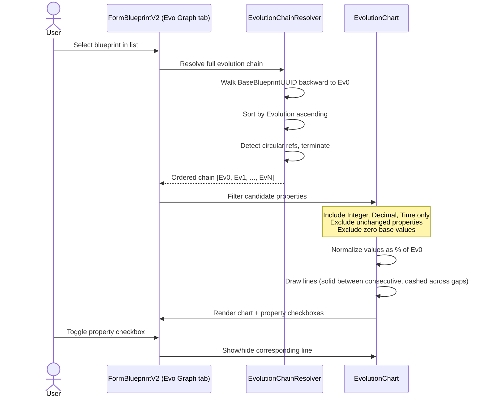
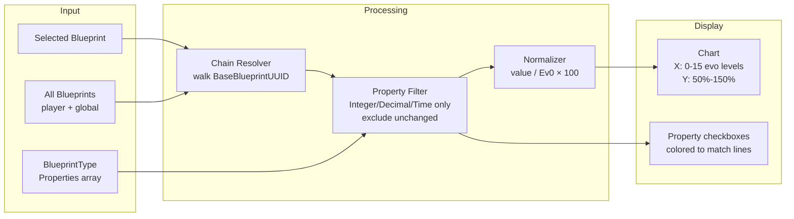

# Evolution Graph Requirements

## Overview

The Evolution Graph adds a chart tab to the Blueprint form showing how blueprint properties change across evolution levels, plotted as percentages of the Ev0 base value.

## Evolution Chain

**REQ-EVO-001** The system SHALL resolve the full evolution chain by walking BaseBlueprintUUID links backward to the Ev0 ancestor, producing an ordered list sorted by Evolution ascending.  
**REQ-EVO-002** IF a BaseBlueprintUUID references a nonexistent blueprint, the chain SHALL terminate at the last resolved blueprint.  
**REQ-EVO-003** The resolver SHALL detect circular references and terminate traversal when a previously visited UUID is encountered.  
**REQ-EVO-004** A single Ev0 blueprint with no BaseBlueprintUUID SHALL be treated as a complete chain of length one.

## Property Filtering

**REQ-EVO-010** Candidate properties SHALL come from the BlueprintType's Properties array.  
**REQ-EVO-011** Only Integer, Decimal, and Time property types SHALL be included. CheckBox, ComboBox, Boolean, and Unknown types SHALL be excluded.  
**REQ-EVO-012** Properties whose value is identical across all blueprints in the chain SHALL be excluded.  
**REQ-EVO-013** IF no property values changed, the tab SHALL display a "no changes found" message.

## Chart Display

**REQ-EVO-020** Values SHALL be normalized as (value / Ev0 base value) x 100. Ev0 displays at 100%.  
**REQ-EVO-021** Properties with a zero base value SHALL be excluded (division by zero).  
**REQ-EVO-022** X-axis: 0 to 15 (evolution levels), labeled "Evolution Level".  
**REQ-EVO-023** Y-axis: 50% to 150%, gridlines at 10% intervals, labeled "% Change from Evolution 0 Value".  
**REQ-EVO-024** Solid lines between consecutive evolution levels; dashed lines across gaps.  
**REQ-EVO-025** Each property line SHALL use a distinct color from a colorblind-friendly palette.

## Property Checkboxes

**REQ-EVO-030** One checkbox per graphed property, all checked by default.  
**REQ-EVO-031** Unchecking hides the line; checking shows it.  
**REQ-EVO-032** Checkbox labels SHALL match the color of their chart line.

## Tab Integration

**REQ-EVO-040** The tab SHALL appear after Statistics and Resources in the Blueprint form's tabDetailedData control, with text "Evolution Graph".  
**REQ-EVO-041** The chart SHALL refresh when a different blueprint is selected or when BlueprintDataChanged fires for a blueprint in the current chain.  
**REQ-EVO-042** When no blueprint is selected, the chart and checkboxes SHALL be cleared.

## User Interaction Flow

### Evolution Graph Display



## Data Flow Diagram



## Form Mockup

### Evolution Graph Tab (within FormBlueprintV2)

```
┌─────────────────────────────────────────────────────────────────────────────┐
│ Statistics │ Resources │ Evolution Graph │                                   │
├─────────────────────────────────────────────────────────────────────────────┤
│                                                                             │
│  150% ┤                                                                     │
│       │                                    ●───● Health                     │
│  140% ┤                               ●──╱                                  │
│       │                          ●───╱                                      │
│  130% ┤                     ●──╱          ●───● Power Generated             │
│       │                ●──╱          ●──╱                                   │
│  120% ┤           ●──╱          ●──╱                                        │
│       │      ●──╱          ●──╱                                             │
│  110% ┤ ●──╱          ●──╱                                                  │
│       │          ●──╱                                                       │
│  100% ●─────●──╱─────────────────────────────────────────                   │
│       │                                                                     │
│   90% ┤                                                                     │
│       │                                                                     │
│   80% ┤                                                                     │
│       └──┬──┬──┬──┬──┬──┬──┬──┬──┬──┬──┬──┬──┬──┬──┬──                    │
│          0  1  2  3  4  5  6  7  8  9  10 11 12 13 14 15                   │
│                        Evolution Level                                      │
│                                                                             │
│  ☑ Health (red)  ☑ Power Generated (blue)  ☐ Cargo Capacity (green)        │
└─────────────────────────────────────────────────────────────────────────────┘
```
