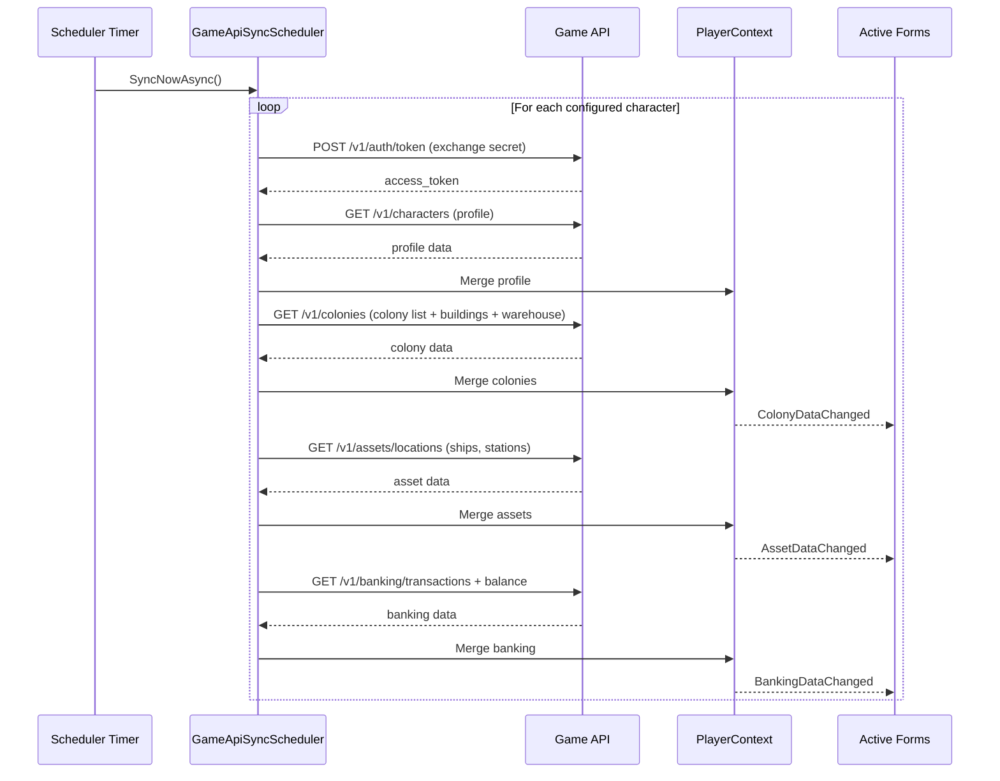

# Game API Integration

## API Reference

- **Swagger JSON:** https://oe2-pub-api-dev.azure-api.net/swagger.json
- **Swagger UI:** https://oe2-pub-api-dev.azure-api.net/swagger/ui#/
- **Base URL:** https://oe2-pub-api-dev.azure-api.net

## Authentication

OAuth2 client_credentials flow. The client exchanges appId + clientId + secret for an access token via the token endpoint.

## Response Envelope

All responses are wrapped in a `ServiceResponse<T>` envelope:

```json
{
  "success": true,
  "returnCode": 0,
  "returnString": "",
  "data": { ... }
}
```

## Endpoints Used

| Endpoint | Scope | Description |
|----------|-------|-------------|
| `GET /v1/characters` | character.read | Player profile (name, UUID, skills) |
| `GET /v1/characters/skills` | character.read | Player skill list |
| `GET /v1/colonies` | colony.list.read | Colony list for the authenticated character |
| `GET /v1/colonies/{colonyId}/buildings` | colony.buildings.read | Buildings and structures for a colony |
| `GET /v1/colonies/{colonyId}/warehouse` | colony.warehouse.read | Warehouse contents for a colony |
| `GET /v1/colonies/{colonyId}/workers` | colony.workers.read | Workforce, commodity demands, wages for a colony |

## HTTP Status Codes

| Code | Meaning | Client Handling |
|------|---------|-----------------|
| 200 | Success | Deserialize response body |
| 401 | Unauthorized | Token expired or invalid — re-authenticate |
| 403 | Forbidden | Scope not granted or colony lacks Remote Operations Array |
| 404 | Not Found | Colony not found or not owned by this character |
| 429 | Rate Limited | Back off per Retry-After header |
| 500/502/503/504 | Server Error | Polly retry with exponential backoff |

## Rate Limiting

The API returns rate limit headers:
- `X-RateLimit-Remaining` — requests remaining in current window
- `Retry-After` — seconds to wait when rate limited (HTTP 429)

The client uses a SemaphoreSlim-based sliding window to stay within limits proactively.

## Implementation

- **Client:** `OE2EmpireTracker.Common/Client/GameApiClient.cs`
- **Scheduler:** `OE2EmpireTracker.Common/Services/GameApiSyncScheduler.cs`
- **Production wiring:** `OE2EmpireTracker.Common/Services/ProductionSyncScheduler.cs`
- **Merge logic:** `OE2EmpireTracker.Common/Services/ColonyMergeService.cs`
- **Context:** `OE2EmpireTracker.Common/Client/GameApiContext.cs`
- **Credentials:** `OE2EmpireTracker.Common/Client/GameApiCredentialManager.cs`
- **Connection monitor:** `OE2EmpireTracker.Common/Client/GameApiConnectionMonitor.cs`

## User Flow: Scheduled Sync Cycle




## Sync Pipeline Requirements

### Token Management

**REQ-GAI-001** TokenRefreshHandler SHALL serialize token refresh attempts using a semaphore so only one 401 → refresh exchange occurs at a time.
**REQ-GAI-002** Concurrent 401 responses SHALL wait for the in-progress refresh and reuse the updated token (stale-check optimization).
**REQ-GAI-003** TokenRefreshHandler SHALL increment an internal token version on each successful refresh so callers can detect stale tokens.
**REQ-GAI-004** TokenRefreshHandler SHALL call GameApiCredentialManager to retrieve the character secret for token exchange.

### Sync Orchestration (QueueSyncService)

**REQ-GAI-010** QueueSyncService SHALL provide a RunSyncAsync method that runs a single sync cycle for all configured characters.
**REQ-GAI-011** QueueSyncService SHALL return immediately without error if a sync cycle is already in progress (re-entrancy guard via _isSyncRunning flag).
**REQ-GAI-012** QueueSyncService SHALL iterate each configured character UUID and sync their data independently; failure of one character SHALL NOT abort remaining characters.
**REQ-GAI-013** QueueSyncService SHALL support cancellation via CancellationToken for cooperative cancellation.
**REQ-GAI-014** QueueSyncService SHALL return a QueueSyncResult with success/failure counts, elapsed time, and per-character details.
**REQ-GAI-015** QueueSyncService SHALL provide a RunMarketSyncAsync method that syncs market data for all configured characters and removes stale orders after sync.
**REQ-GAI-016** QueueSyncService SHALL detect blueprint entries in crate cargo responses and extract them for dual-tracking via BlueprintLinkageService.

### Asset Merge (AssetMergeService)

**REQ-GAI-020** AssetMergeService.MapAssetTypeC SHALL map API TypeC codes to the local ItemTypeEnum, using case-insensitive matching with exact-case disambiguation for ambiguous codes (SH vs Sh).
**REQ-GAI-021** Unknown TypeC codes SHALL map to ItemTypeEnum.None with a warning logged.
**REQ-GAI-022** AssetMergeService.ExtractResourcePurity SHALL parse resource names with purity suffixes (e.g. "Heavy Post-Trans Metals (Unrefined, Med Purity)") into separate baseName and normalized purity strings.
**REQ-GAI-023** AssetMergeService.MergeColonyAssets SHALL merge API cargo items into a colony's ItemBag, creating new items or updating existing items matched by GameItemId.
**REQ-GAI-024** MergeColonyAssets SHALL remove items not present in the API response (game API is authoritative), except items with active warehouse locks which are zeroed instead.
**REQ-GAI-025** AssetMergeService.MergeStationAssets SHALL merge API cargo items into a station's target hold, removing stale items not in the response.
**REQ-GAI-026** AssetMergeService.MergeShipAssets SHALL merge API cargo items into a ship's cargo hold, removing stale items not in the response.
**REQ-GAI-027** All merge methods SHALL return a boolean indicating whether any changes were made.
**REQ-GAI-028** All merge methods SHALL handle null inputs gracefully (return false, log warning).

### Crate Content Import (CrateContentImporter)

**REQ-GAI-030** CrateContentImporter SHALL parse typed AssetCrateContents DTOs from the game API and populate the parent crate Item's Contents bag.
**REQ-GAI-031** CrateContentImporter SHALL map each cargo item's TypeC code via AssetMergeService.MapAssetTypeC to determine the local ItemType.
**REQ-GAI-032** CrateContentImporter SHALL detect nested crates and return their GameItemIds in the result for cascade processing.
**REQ-GAI-033** CrateContentImporter SHALL detect cycles (crate A contains crate B contains crate A) using a visited set and terminate recursion on cycle detection.
**REQ-GAI-034** CrateContentImporter SHALL dual-track blueprint items found in crates via BlueprintLinkageService.
**REQ-GAI-035** CrateContentImporter SHALL return a CrateContentImportResult with total items, imported count, failed count, blueprints linked, nested crate IDs, per-type counts, errors list, and overall success flag.

### Production Sync Scheduler (ProductionSyncScheduler)

**REQ-GAI-040** ProductionSyncScheduler SHALL be a production subclass of GameApiSyncScheduler that delegates virtual method calls to PlayerContext for real data access and persistence.
**REQ-GAI-041** ProductionSyncScheduler SHALL provide access to mutable player profiles, colonies, stations, and ships for the sync pipeline to merge into.
**REQ-GAI-042** ProductionSyncScheduler SHALL call PlayerContext.WriteContext() to persist merged data after sync operations complete.
**REQ-GAI-043** ProductionSyncScheduler SHALL raise ColonyDataChanged, StationDataChanged, ShipDataChanged, and BankingDataChanged events after successful merges.
