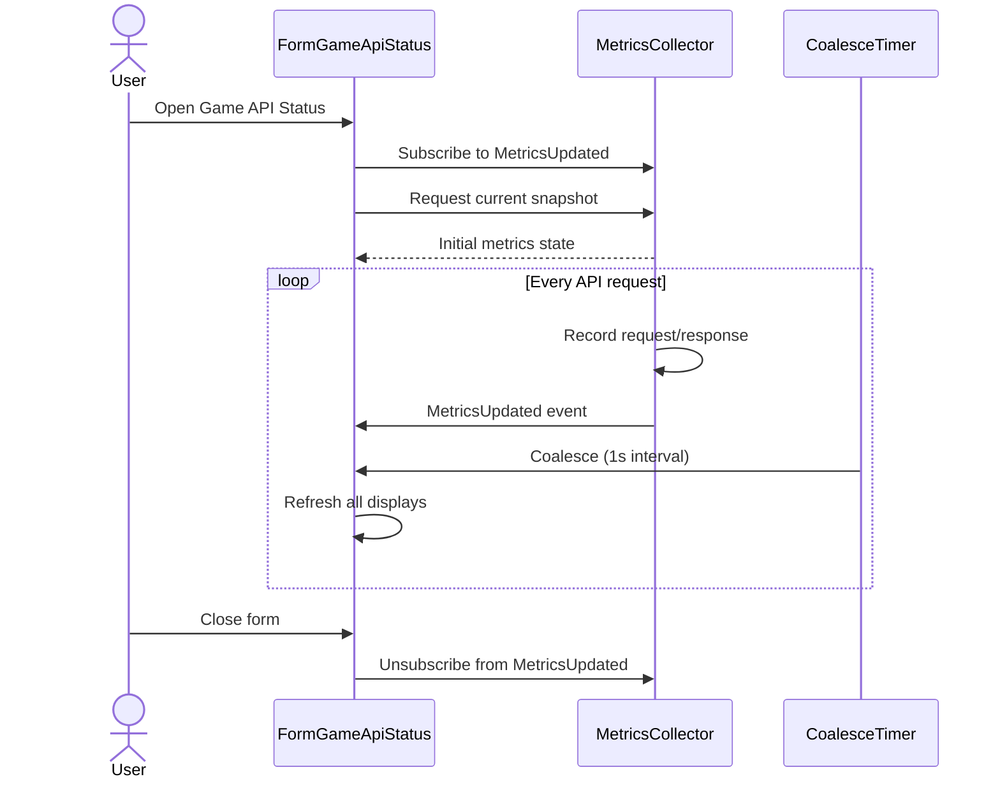

# Game API Status Requirements

## User Goal

The user wants detailed visibility into game API request metrics — throughput, latency, error rates, and rate limiter state — to understand request pacing, diagnose connectivity issues, and monitor sync progress.

## Out of Scope

- Modifying API rate limits or circuit breaker configuration from the form
- Historical metrics persistence across application restarts
- Exporting metrics to external monitoring systems
- Alerting or notifications based on metric thresholds

## Metrics Collection

**REQ-GAS-001** The MetricsCollector SHALL record start time, endpoint URL, and HTTP method for each request, incrementing Outstanding_Requests.
**REQ-GAS-002** On response, the MetricsCollector SHALL record HTTP status code, duration (ms), bytes received, and decrement Outstanding_Requests.
**REQ-GAS-003** On exception (timeout, network error, circuit breaker rejection), the MetricsCollector SHALL record failure category and decrement Outstanding_Requests.
**REQ-GAS-004** MetricsCollector SHALL store up to 500 Request_Records, discarding oldest when exceeded.
**REQ-GAS-005** MetricsCollector SHALL raise a MetricsUpdated event after each request completion or failure.

## TPS Calculation

**REQ-GAS-010** MetricsCollector SHALL compute TPS as completed requests in the last 60 seconds divided by 60.
**REQ-GAS-011** MetricsCollector SHALL maintain a rolling series of 300 TPS samples (5 minutes) at 1-second intervals.
**REQ-GAS-012** The TPS graph SHALL auto-scale with a minimum vertical axis of 1.00.

## Request Counters

**REQ-GAS-020** MetricsCollector SHALL maintain cumulative counts: total, 2xx, 4xx, 5xx, exceptions, and 429 (sub-counter of 4xx).
**REQ-GAS-021** Total requests SHALL equal sum of 2xx + 4xx + 5xx + exceptions at all times.
**REQ-GAS-022** Counter reset SHALL clear all counters, Request_History, and TPS samples.

## Data Transfer

**REQ-GAS-030** MetricsCollector SHALL track cumulative bytes received (response body) and bytes sent (request body).
**REQ-GAS-031** Display SHALL use automatic unit selection: B, KB (2dp), or MB (2dp).

## Outstanding Requests

**REQ-GAS-040** MetricsCollector SHALL track in-flight request count (never below zero).
**REQ-GAS-041** MetricsCollector SHALL track peak Outstanding_Requests since last reset.

## Status Form Display

**REQ-GAS-050** FormGameApiStatus SHALL be an MDI child form accessible from Tools menu as "Game API Status".
**REQ-GAS-051** The summary panel SHALL display: current TPS, total requests, outstanding, peak outstanding, connection state, last sync time.
**REQ-GAS-052** The breakdown panel SHALL display: 2xx, 4xx, 5xx, 429, and exception counts.
**REQ-GAS-053** The transfer panel SHALL display: bytes sent and bytes received totals.
**REQ-GAS-054** The state panel SHALL display: circuit breaker state, rate limit config, and rate limiter state.
**REQ-GAS-055** A scrollable DataGridView SHALL display Request_History (up to 500) with columns: Time, Method, Endpoint, Status, Duration, Bytes.
**REQ-GAS-056** FormGameApiStatus SHALL update all metrics within 1 second via timer-based coalescing.

## Form Controls and Lifecycle

**REQ-GAS-060** FormGameApiStatus SHALL provide a "Reset Counters" button and display the reset timestamp.
**REQ-GAS-061** FormGameApiStatus SHALL provide a "Copy to Clipboard" button with visual confirmation.
**REQ-GAS-062** FormGameApiStatus SHALL subscribe to MetricsUpdated on open and unsubscribe on close.
**REQ-GAS-063** MetricsCollector SHALL continue collecting metrics independently of form lifecycle.
**REQ-GAS-064** If already open, activating the menu item SHALL bring the existing instance to front.

## Circuit Breaker and Rate Limiter Visibility

**REQ-GAS-070** The form SHALL display circuit breaker state: Closed, Open (with countdown), or Half-Open.
**REQ-GAS-071** While rate-limited (HTTP 429), the form SHALL display "Rate Limited" and pause-until time.
**REQ-GAS-072** The form SHALL display configured rate limit and server-communicated limit when they differ.

## Test API Panel

**REQ-GAS-080** FormGameApiStatus SHALL provide a test panel with Location ID input, Location Type dropdown (Co/St/Sh/Cr), and Fetch button.
**REQ-GAS-081** The test panel SHALL display raw API response in a read-only multiline text box.

## User Interaction Flows

### Monitor API Activity

