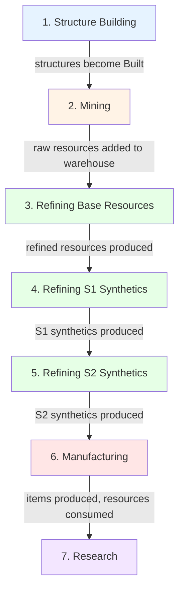
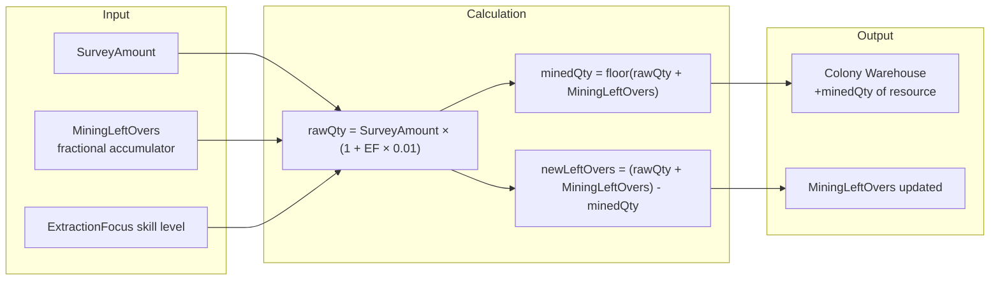
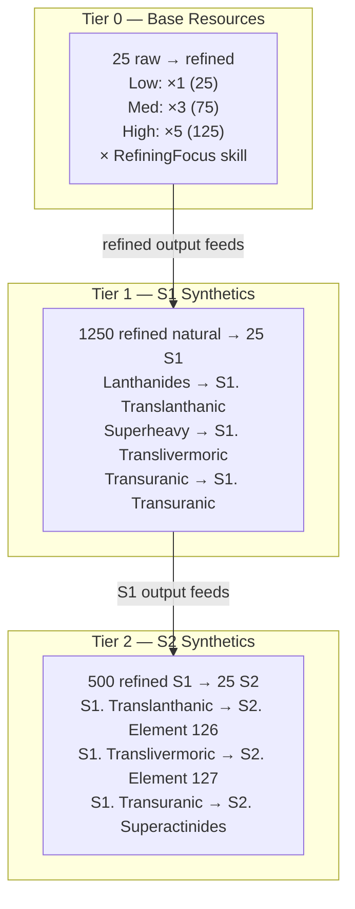
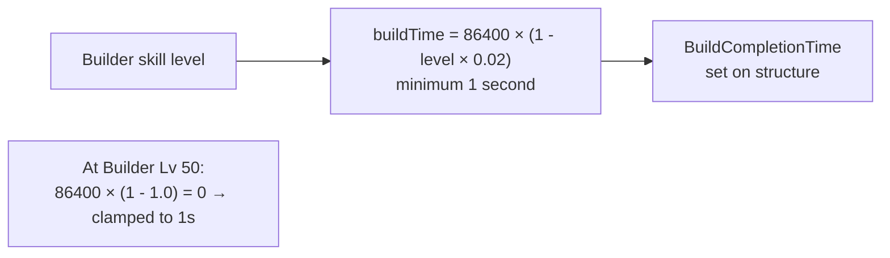

# Game Mechanics Requirements

## User Goal

This file documents the game's production formulas and timing rules so the tracker can accurately simulate colony processing (mining rates, refining yields, manufacturing times, research durations, build times).

## Colony Processing Order

Each step's output feeds the next step's input within the same cycle.

## Mining

**REQ-GM-001** Mining rigs produce resources once per hour (3600-second repeating timer).
**REQ-GM-002** Mined quantity per interval = `floor(SurveyAmount + MiningLeftOvers)`. The fractional remainder is accumulated in `MiningLeftOvers` for the next cycle.
**REQ-GM-003** ExtractionFocus skill multiplier: mined quantity × `(1 + level × 0.01)`.
**REQ-GM-004** MiningLeftOvers SHALL be reset to 0 when MiningSurvey or MiningSurveyResource changes.

## Refining — Normal Resources

**REQ-GM-010** Refineries consume raw resources and produce refined resources once per hour.
**REQ-GM-011** Base refining consume rate: 25 units per cycle (`GameConstants.RefiningBaseRate`).
**REQ-GM-012** Refining output rate depends on input purity:
- Low: 1× base rate (25 consumed → 25 produced)
- Medium: 3× base rate (25 consumed → 75 produced)
- High: 5× base rate (25 consumed → 125 produced)
**REQ-GM-013** RefiningFocus skill multiplier: output rate × `(1 + level × 0.02)`.

## Refining — Synthetic Resources

**REQ-GM-020** Synthetic resources are produced via fixed recipes, not purity-based rates.
**REQ-GM-021** S1 Synthetic recipes (Tier 1, consume 1250 refined natural → produce 25 S1):
- Lanthanides (Refined) → S1. Translanthanic Exotics
- Superheavy Exotics (Refined) → S1. Translivermoric Exotics
- Transuranic Volatiles (Refined) → S1. Transuranic Exotics
**REQ-GM-022** S2 Synthetic recipes (Tier 2, consume 500 refined S1 → produce 25 S2):
- S1. Translanthanic Exotics (Refined) → S2. Element 126
- S1. Translivermoric Exotics (Refined) → S2. Element 127
- S1. Transuranic Exotics (Refined) → S2. Superactinides
**REQ-GM-023** Processing order within a cycle: normal refining (Tier 0) before S1 (Tier 1) before S2 (Tier 2).

## Manufacturing

**REQ-GM-030** Manufactories produce items from blueprints. Each cycle consumes resources defined by the blueprint's resource list.
**REQ-GM-031** Manufacturing display shows 1-based progress: `(completed+1)/(total)` so the user sees "1/3" instead of "0/3" when starting.
**REQ-GM-032** ProductionFocus skill multiplier: manufacture time × `(1 - level × 0.03)`, minimum 1 second.

### Data Model Difference: Manufacturing Quantity

The game and the tracker model manufacturing batch progress differently:

| Aspect | Game (JSON) | Tracker |
|--------|-------------|---------|
| Field | `manufactureNumber` | `ManufacturingQuantity` + `ManufacturingCompleted` |
| Semantics | Remaining runs (decreases as items complete) | Total runs + completed count |
| Example: 5 total, 2 done | `manufactureNumber: 3` | `Quantity: 5, Completed: 2` |

The tracker's model is richer: it preserves the user's original intent (total queued) and tracks progress separately. The game only exposes remaining. On colony reimport, the parser reconciles these two models (see REQ-CI-025 in ColonyImport.md).

## Commodity Manufacturing

**REQ-GM-040** Commodity factories produce 10 commodities per cycle (`GameConstants.CommoditiesPerCycle`).
**REQ-GM-041** Commodity manufacturing cycle time: 600 seconds (10 minutes, `GameConstants.CommodityCycleSeconds`).
**REQ-GM-042** Each cycle consumes resources defined by the commodity's `ConstructionResources` list.
**REQ-GM-043** Commodity display shows 1-based progress, same as manufacturing (REQ-GM-031).

## Research

**REQ-GM-050** Research labs evolve blueprints from one evolution level to the next.
**REQ-GM-051** Research time by current evolution level (in days):
- Evo 0→1: 2d, 1→2: 4d, 2→3: 6d, 3→4: 8d, 4→5: 10d, 5→6: 12d, 6→7: 14d
- Evo 7→8: 16d, 8→9: 18d, 9→10: 20d, 10→11: 22d, 11→12: 24d, 12→13: 26d, 13→14: 28d, 14→15: 30d
**REQ-GM-052** Maximum evolution level is 15. Evolution 15 cannot be researched further.
**REQ-GM-053** ResearchFocus skill multiplier: research time × `(1 - level × 0.03)`, minimum 1 second.

## Structure Building

**REQ-GM-060** Base build time: 86400 seconds (1 day).
**REQ-GM-061** Builder skill multiplier: build time = `86400 × (1 - level × 0.02)`, minimum 1 second.
**REQ-GM-062** At Builder level 50, build time reaches the minimum of 1 second.
**REQ-GM-063** When BuildCompletionTime expires, the structure is marked Built=true and the timer is cleared.

## Colony Build Eligibility

**REQ-GM-070** A structure is "staged" when IsStaged=true AND IsBuilt=false.
**REQ-GM-071** A structure is "building" when IsStaged=false AND IsBuilt=false AND BuildCompletionTime has time remaining > 0.
**REQ-GM-072** A colony is eligible for building when it has at least one staged structure AND no currently building structure.
**REQ-GM-073** GetFirstStagedStructure returns the first staged structure in list order.

## Data Flow Diagrams

### Mining Calculation

### Refining Tiers

### Build Time Calculation

