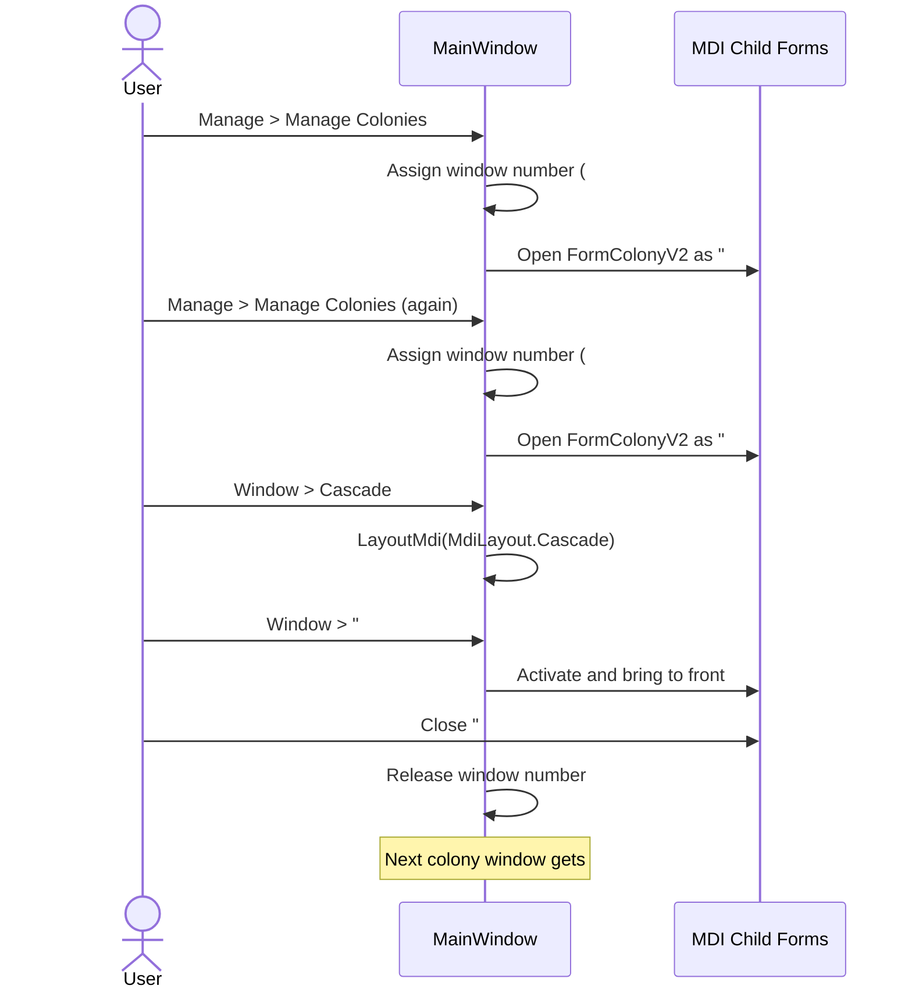

# MDI Window Menu Requirements

## Overview

A standard MDI Window menu on MainWindow provides layout commands and an auto-populated list of open child forms.

## Window Menu

**REQ-MDI-001** A "Window" menu SHALL appear between Manage and Help in the menu bar.  
**REQ-MDI-002** The menu SHALL contain Cascade, Tile Horizontal, and Tile Vertical commands that rearrange open MDI child windows using standard WinForms LayoutMdi behavior.  
**REQ-MDI-003** Open MDI child forms SHALL be automatically listed below a separator in the Window menu. Clicking a form name SHALL activate it and bring it to front.

## Window Numbering

**REQ-MDI-010** Each MDI child form type SHALL maintain a per-type window number counter.  
**REQ-MDI-011** Window titles SHALL display as "#N - FormTitle".  
**REQ-MDI-012** When a window is closed, its number SHALL become available for reuse. The next window of that type SHALL receive the lowest unused positive integer.

## User Interaction Flow

### Window Management



## Form Mockup

### Window Menu (expanded)

```
┌─ Window ─────────────────┐
│ Cascade                   │
│ Tile Horizontal           │
│ Tile Vertical             │
│ ──────────────────────    │
│ #1 - Manage Colonies      │
│ #2 - Manage Blueprints    │
│ #3 - Colony Activity      │
│ #1 - Delivery Routes      │
└───────────────────────────┘
```
