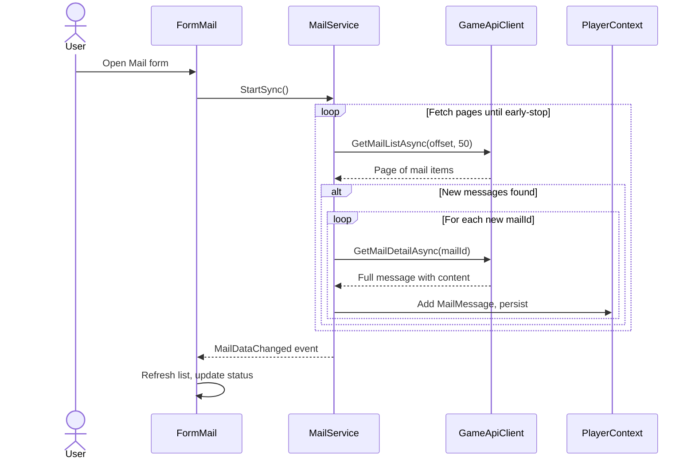
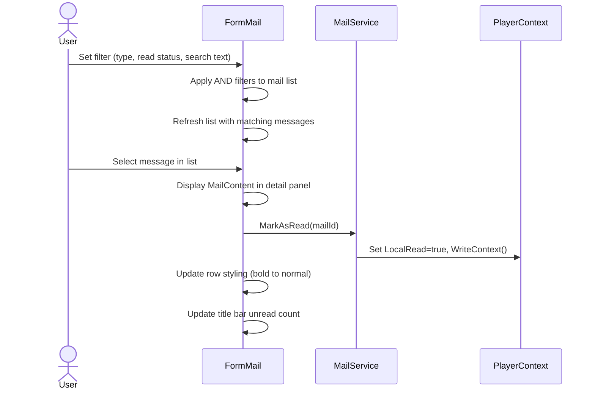

# Mail Requirements

## User Goal

The user wants to view, search, and filter in-game mail messages within the tracker, with automatic background synchronization from the game API and local read-status tracking.

## Out of Scope

- Sending or replying to mail (read-only view of received messages)
- Deleting mail messages (neither locally nor via the API)
- Real-time push notifications (timer-based polling only)
- Multi-character mail aggregation (each player profile tracks its own mail)
- Attachment handling (the API does not expose attachments)

## Mail Message Data Model

**REQ-MAIL-001** A MailMessage SHALL have fields: MailId (int), CharacterIdFrom (int), FromName (string), CharacterIdTo (int), ToName (string), SentTime (string, ISO 8601), Subject (string), MailRead (bool), MailType (string, nullable), and MailContent (string).
**REQ-MAIL-002** MailMessage SHALL include a LocalRead (bool) field for tracker-local read tracking, independent of the API MailRead field.
**REQ-MAIL-003** MailMessage SHALL use nullable string for MailType to distinguish null (general) from typed notifications ("C", "R", "S").

## Mail Persistence

**REQ-MAIL-010** PlayerContext SHALL persist MailMessage records as a "MailMessage" array within PlayerRoot.
**REQ-MAIL-011** PlayerContext SHALL expose a MailMessageList property typed as IReadOnlyList for read access.
**REQ-MAIL-012** PlayerContext SHALL deduplicate MailMessage records by MailId on load, logging errors for duplicates.
**REQ-MAIL-013** Adding a MailMessage with a duplicate MailId SHALL skip without throwing, logging a warning.

## Incremental Background Sync

**REQ-MAIL-020** When FormMail opens, MailService SHALL perform an initial incremental sync immediately.
**REQ-MAIL-021** While FormMail is open, a BackgroundSyncTimer SHALL trigger incremental sync at a configurable interval (default 5 minutes).
**REQ-MAIL-022** MailService SHALL fetch pages from GET /v1/mail (page size 50) until all returned mailIds are at or below the local high-water mark.
**REQ-MAIL-023** For each new mailId, MailService SHALL call GET /v1/mail/{mailId} to fetch full MailContent.
**REQ-MAIL-024** MailService SHALL fire a MailDataChanged event when new messages are synced.
**REQ-MAIL-025** When FormMail closes, the BackgroundSyncTimer SHALL be stopped and disposed.
**REQ-MAIL-026** On API error (401, 403, 429, network failure), MailService SHALL log the error and retry on next interval.

## Mail Form Display

**REQ-MAIL-030** FormMail SHALL be an MDI child form with a split layout: mail list panel (left) and detail panel (right).
**REQ-MAIL-031** The mail list SHALL display columns: From, Subject, Date (local time), with a read/unread visual indicator (bold for unread).
**REQ-MAIL-032** Messages SHALL be sorted by SentTime descending (newest first) by default.
**REQ-MAIL-033** Selecting a message SHALL display its full MailContent in the detail panel.
**REQ-MAIL-034** Selecting an unread message SHALL set LocalRead to true and persist the change.
**REQ-MAIL-035** FormMail SHALL display a message count label showing filtered count.
**REQ-MAIL-036** The form title SHALL show unread count: "Mail (N unread)" when N > 0, or "Mail" otherwise.

## Mail Filtering and Search

**REQ-MAIL-040** FormMail SHALL provide a read-status filter: "All", "Unread", "Read" (default: "All").
**REQ-MAIL-041** FormMail SHALL provide a mail-type filter: "All", "Player/System", "Colony", "Research", "Skill" (default: "All").
**REQ-MAIL-042** FormMail SHALL provide a search text box filtering by FromName, Subject, or MailContent (case-insensitive substring, OR across fields).
**REQ-MAIL-043** Filters SHALL combine with AND logic, displaying only messages matching all active conditions.

## Sync Status

**REQ-MAIL-050** FormMail SHALL display a status strip showing last sync time and sync progress indicator.
**REQ-MAIL-051** During sync, the status SHALL show "Syncing..."; on completion, it SHALL show the result (e.g., "Synced: 5 new messages").

## User Interaction Flows

### Background Mail Sync

### Filter and Read Mail

