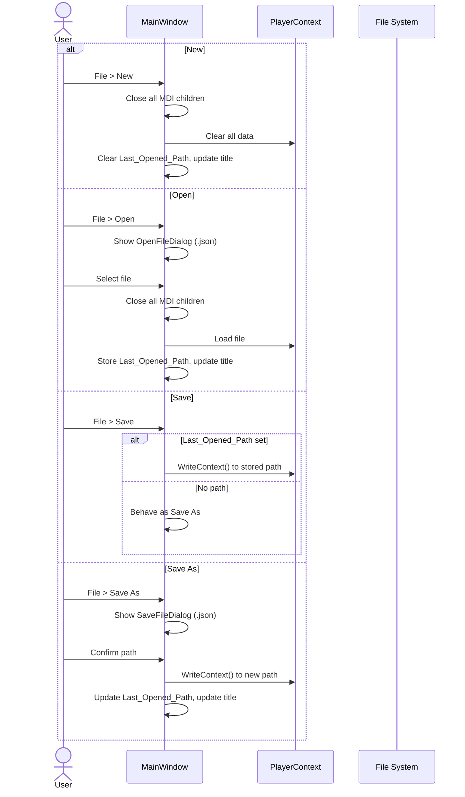
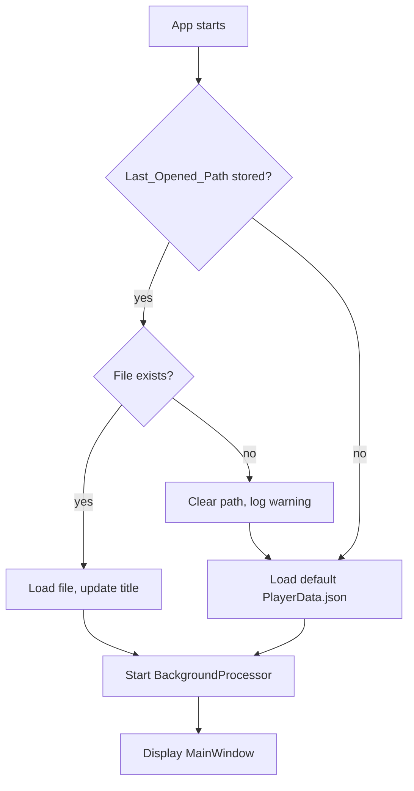

# Main Menu Requirements

## User Goal

The user wants standard file operations (new, open, save) and quick access to all feature forms from a familiar menu structure.

## Overview

The MainWindow menu provides File lifecycle operations (New/Open/Save/Save As/Exit), a Manage menu for feature forms, and Help with About dialog.

## File Menu

**REQ-MM-001** File menu items SHALL appear in order: New, Open, Save, Save As, Preferences..., separator, Exit.  
**REQ-MM-002** File > New SHALL close all MDI children, clear all PlayerContext data, reset current player, clear Last_Opened_Path, and update the title bar.  
**REQ-MM-003** File > Open SHALL display an OpenFileDialog for JSON files. On selection, close all MDI children, load the file into PlayerContext, store the path as Last_Opened_Path, and update the title bar.  
**REQ-MM-004** File > Save SHALL write to Last_Opened_Path if set, otherwise behave as Save As.  
**REQ-MM-005** File > Save As SHALL display a SaveFileDialog for JSON files. On confirmation, write data, update Last_Opened_Path, and update the title bar.  
**REQ-MM-006** File > Exit SHALL prompt "Are you sure you want to exit?" with Yes/No. Yes closes the application; No cancels.  
**REQ-MM-007** File > Preferences... SHALL open the Preferences form as a modal dialog.

## Auto-Open on Launch

**REQ-MM-010** On startup, if Last_Opened_Path is stored and the file exists, the application SHALL load it automatically and update the title bar.  
**REQ-MM-011** If the stored path does not exist or cannot be parsed, the application SHALL clear Last_Opened_Path, log a warning, and start with empty data.  
**REQ-MM-012** If no Last_Opened_Path is stored, the application SHALL load from the default PlayerData.json path.

## Manage Menu

**REQ-MM-020** The menu currently labeled "Edit" SHALL be renamed to "Manage".  
**REQ-MM-021** Items SHALL be labeled "Manage Colonies", "Manage Blueprints", "Manage Surveys", etc.  
**REQ-MM-022** Items SHALL be sorted alphabetically.

## Help Menu

**REQ-MM-030** Help > About SHALL display a modal dialog with application name, version, and copyright from assembly metadata.  
**REQ-MM-031** Help > Contents (Ctrl+F1) SHALL open the help system. F1 SHALL open context-sensitive help for the active form.

## Help System

**REQ-MM-040** HelpTopicRegistry SHALL map form type names to documentation file paths in docs/.  
**REQ-MM-041** HelpRenderer SHALL convert markdown files to HTML using Markdig with embedded CSS styling.  
**REQ-MM-042** FormHelp SHALL display a TreeView navigation panel and a WebBrowser content panel.  
**REQ-MM-043** F1 SHALL open context-sensitive help for the active MDI child form via HelpTopicRegistry lookup.  
**REQ-MM-044** Help → Contents (Ctrl+F1) SHALL open the help table of contents (docs/README.md).  
**REQ-MM-045** Internal links between help pages SHALL be intercepted and navigated within the help form.

## User Interaction Flows

### File Menu Operations



### Application Startup



## Form Mockup

### MainWindow Menu Bar

```
┌─────────────────────────────────────────────────────────────────────────────┐
│ OE2 Empire Tracker — PlayerData.json                                    [_][□][X] │
├─────────────────────────────────────────────────────────────────────────────┤
│ File │ Manage │ Window │ Help │  Player: [▼ Alice              ]           │
├──────┴────────┴────────┴──────┴─────────────────────────────────────────────┤
│                                                                             │
│  ┌─ File ──────────┐  ┌─ Manage ──────────────────┐  ┌─ Window ─────────┐ │
│  │ New              │  │ Manage Blueprints          │  │ Cascade           │ │
│  │ Open...          │  │ Manage Colonies            │  │ Tile Horizontal   │ │
│  │ Save             │  │ Manage Colony Activity     │  │ Tile Vertical     │ │
│  │ Save As...       │  │ Manage Colony Daily Build  │  │ ─────────────     │ │
│  │ Preferences...   │  │ Manage Delivery Execution  │  │ #1 - Colonies     │ │
│  │ ─────────────    │  │ Manage Delivery Routes     │  │ #2 - Blueprints   │ │
│  │ Exit             │  │ Manage Player Profiles     │  └───────────────────┘ │
│  └──────────────────┘  │ Manage Pricing Plans       │                       │
│                        │ Manage Surveys             │                       │
│                        └───────────────────────────┘                        │
│                                                                             │
│  (MDI child windows displayed here)                                         │
│                                                                             │
├─────────────────────────────────────────────────────────────────────────────┤
│ Next Process: 45s │ Memory: 128 MB │ CPU: 2.1%                             │
└─────────────────────────────────────────────────────────────────────────────┘
```
