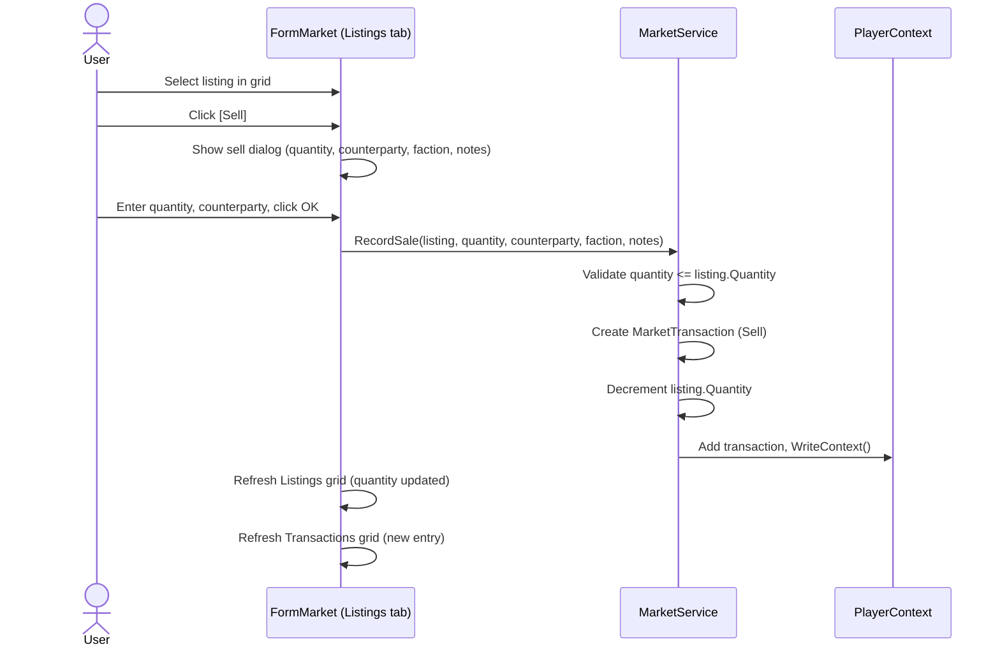
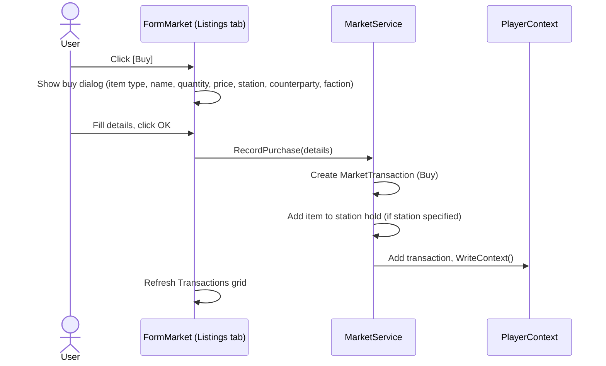
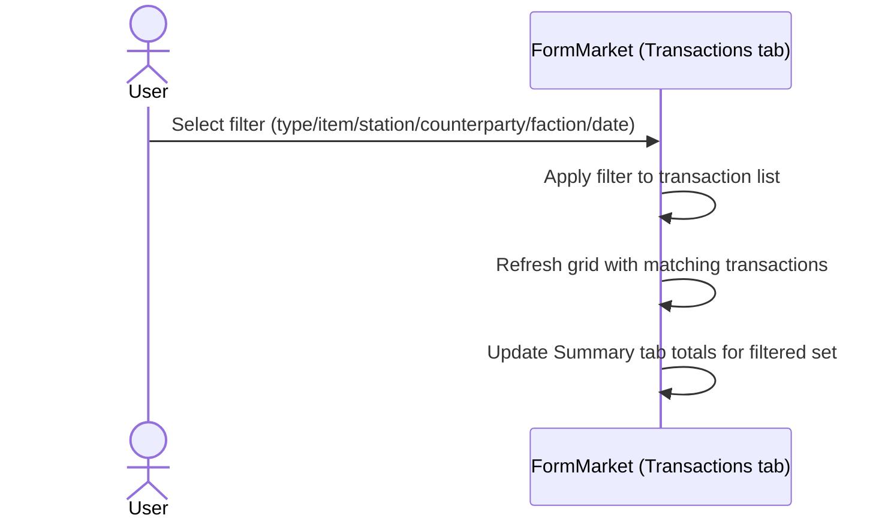

# Market Requirements

## User Goal

The user wants to track market listings (items for sale) and transaction history (buys and sells) across stations, enabling profit/loss analysis and informed pricing decisions.

## Out of Scope

- Automated trading or buy/sell bots
- Price history charts or trend analysis
- Multi-currency support (all prices are in-game credits)
- Tax or fee calculations on transactions

> **Note:** Real-time price feeds and API integration with the game are covered by the `.kiro/specs/market-integration/` spec.

## Market Listings

**REQ-MKT-001** A MarketListing SHALL have UUID, OwnerUUID, StationUUID, ItemType, ItemReferenceID, ItemName, Quantity, and PricePerUnit.  
**REQ-MKT-002** MarketListing SHALL include condition fields (CurrentHP, MaxHP, MaxRepairPercent) for damaged component listings, defaulting to 0 (undamaged/not applicable).  
**REQ-MKT-003** ItemReferenceID SHALL be Blueprint UUID for blueprint-based items and commodity name for commodities.  

## Market Transactions

**REQ-MKT-010** A MarketTransaction SHALL have UUID, OwnerUUID, TransactionType (Buy/Sell), ItemType, ItemReferenceID, ItemName, Quantity, PricePerUnit, TotalPrice, Counterparty, CounterpartyFaction, StationUUID, Timestamp, Notes, and ListingUUID.  
**REQ-MKT-011** MarketTransaction SHALL include condition fields as a snapshot of the item's state at transaction time, preserved even if the listing is deleted.  
**REQ-MKT-012** CounterpartyFaction SHALL be a snapshot of the counterparty's faction at transaction time. Faction filter on the Transactions tab SHALL match against this snapshot, not the counterparty's current faction.  
**REQ-MKT-013** ListingUUID SHALL link a sell transaction to its source listing for automatic quantity decrement.  

## Market Service

**REQ-MKT-020** MarketService.RecordSale SHALL create a Sell transaction, decrement the listing quantity, and copy condition fields from the listing to the transaction.  
**REQ-MKT-021** MarketService.RecordPurchase SHALL create a Buy transaction with the specified details.  
**REQ-MKT-022** MarketService.ComputeProfitLoss SHALL calculate profit/loss across transactions, groupable by item, station, counterparty, or time period.  

## Market Form

**REQ-MKT-030** FormMarket SHALL be an MDI child form with Listings, Transactions, and Summary tabs.  
**REQ-MKT-031** The Listings tab SHALL display active listings with item name, quantity, price, station, and condition.  
**REQ-MKT-032** The Transactions tab SHALL display transaction history filterable by type, item, counterparty, faction, station, and date range.  
**REQ-MKT-033** The Summary tab SHALL display profit/loss aggregations.

## Empty & Error States

**REQ-MKT-040** When no listings exist, the Listings tab SHALL display an empty grid with column headers visible. No placeholder message required.  
**REQ-MKT-041** When no transactions exist, the Transactions tab SHALL display an empty grid with column headers visible.  
**REQ-MKT-042** When no transactions match the current filters, the grid SHALL be empty and the Summary tab SHALL show zero totals.  
**REQ-MKT-043** When a listing references a station that no longer exists, the Station column SHALL display "(unknown)".  
**REQ-MKT-044** When RecordSale is called with a quantity exceeding the listing quantity, it SHALL return null and not modify the listing.  
**REQ-MKT-045** When RecordSale is called with zero or negative quantity, it SHALL return null.  

## User Interaction Flows

### Record a Sale

### Record a Purchase

### Filter Transactions

