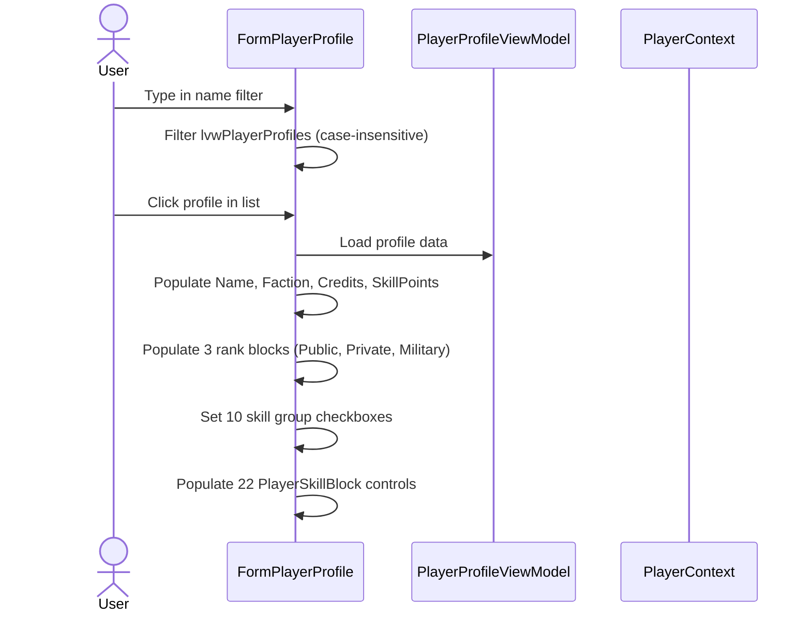
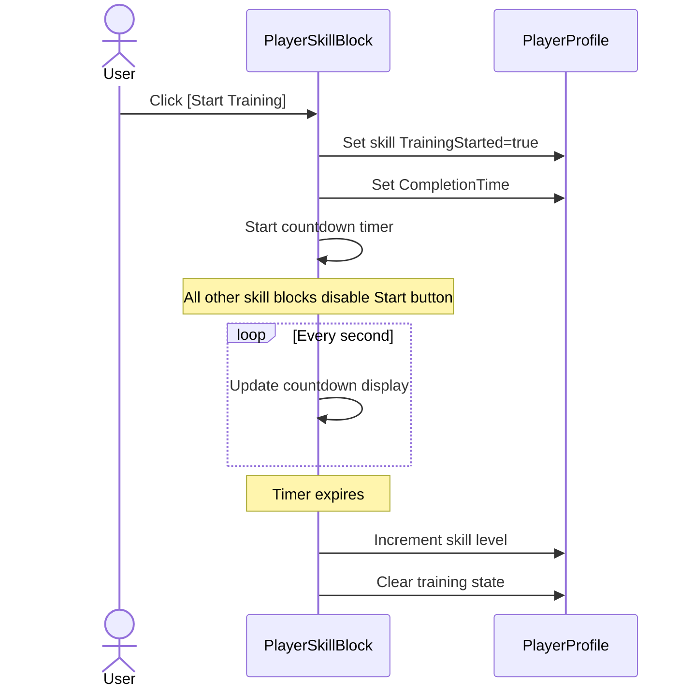
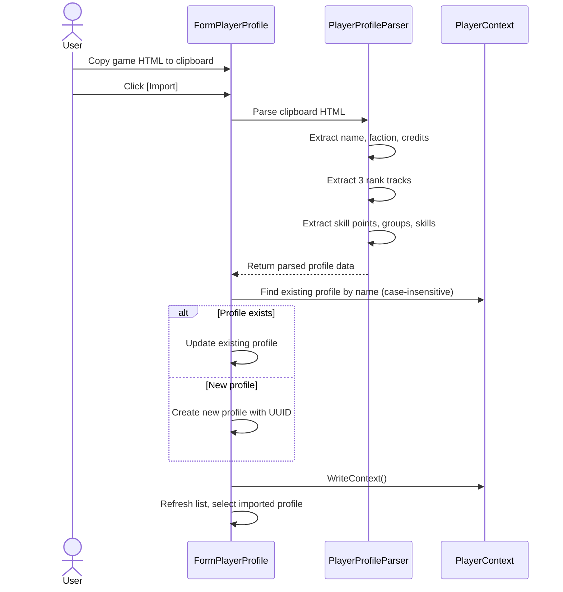

# Player Profile Requirements

## Profile Data

**REQ-PP-001** A PlayerProfile SHALL have UUID, Name, Faction, TotalCredits (decimal), SkillPoints (int), three PlayerRank objects (Public, Private, Military), a Skills dictionary, and a SkillGroups dictionary.  
**REQ-PP-002** PlayerProfile SHALL serialize to and deserialize from JSON, preserving all fields.  
**REQ-PP-003** PlayerRank SHALL have Rank (int), CurrentXP (long), and NextXP (long), all defaulting to 0.

## Profile List

**REQ-PP-010** The player profile form SHALL display a list of all saved profiles with Name and Faction columns.  
**REQ-PP-011** The profile list SHALL be filterable by Name using a text filter field; filtering SHALL be case-insensitive substring match.  
**REQ-PP-012** Selecting a profile from the list SHALL populate all form fields with that profile's data.  
**REQ-PP-013** After saving a profile, the list SHALL re-select the saved profile and reflect any name or faction changes.

## Profile Form Fields

**REQ-PP-020** The form SHALL display and allow editing of: Name, Faction, TotalCredits, SkillPoints, Public Rank/CurrentXP/NextXP, Private Rank/CurrentXP/NextXP, Military Rank/CurrentXP/NextXP.  
**REQ-PP-021** All numeric fields SHALL use TryParse with a fallback of 0 — invalid or empty input SHALL not throw.  
**REQ-PP-022** Faction SHALL be editable via a combo box.

## Skill Groups

**REQ-PP-030** The form SHALL display a checkbox for each of the 10 skill groups: Colony Director, Colony Founder, Colony Operations, Commander, Engineer, Entrepeneur, Job Management, Researcher, Surveyor, Trader.  
**REQ-PP-031** When a profile is selected, each skill group checkbox SHALL reflect the profile's stored skill group state.  
**REQ-PP-032** Checking or unchecking a skill group checkbox SHALL immediately update the profile's SkillGroups dictionary.

## Skills

**REQ-PP-040** The form SHALL display a PlayerSkillBlock control for each of the 22 skills.  
**REQ-PP-041** Each PlayerSkillBlock SHALL show the skill name, current level, and training countdown.  
**REQ-PP-042** When a profile is selected, each skill block SHALL reflect the profile's stored skill data.  
**REQ-PP-043** If any skill is currently training, all skill blocks SHALL disable the Start Training button.

## Save / Delete / Cancel

**REQ-PP-050** Clicking Save SHALL write all form fields to the profile, assign a UUID if absent, add to PlayerProfileList if new, and call PlayerContext.WriteContext().  
**REQ-PP-051** Clicking Delete SHALL remove the profile from PlayerProfileList, call WriteContext(), reset the form to a blank profile, and refresh the list. Delete SHALL only be enabled when a saved profile is selected.  
**REQ-PP-052** Clicking Cancel SHALL revert the form to the last saved state of the selected profile, or reset to blank if the profile was unsaved.

## Skill Name Enums

**REQ-PP-060** All skill names used in the form SHALL reference the SkillName enum, not hardcoded strings.  
**REQ-PP-061** All skill group names used in the form SHALL reference the SkillGroupName enum, not hardcoded strings.  
**REQ-PP-062** SkillName and SkillGroupName enum values SHALL use Description attributes to provide display names; the display name SHALL be used as the dictionary key for JSON compatibility.

## Skill Tree Reference

The game's skill tree organizes 22 skills under 10 skill groups:

- Colony Director: Human Resources, Foreman
- Colony Founder: Founder, Energy Efficiency, Builder
- Colony Operations: Refining Focus, Production Focus, Extraction Focus
- Commander: Damage Control
- Engineer: Engineering Capacity
- Entrepreneur: Sound As A Pound, Self-made Millionaire, AAA Healthcare
- Job Management: Job Opportunities, Contract Management
- Researcher: Research Review, Research Methods, Research Focus
- Surveyor: Surveying Methods, Scanning Methods, Quartermaster
- Trader: Broker

Additional profile fields from the game (not yet tracked):
- Citizen ID
- Registration Date
- Active Timer
- Ship License Information (list of ship types based on ranks)

## User Interaction Flows

### Profile Selection and Editing



### Skill Training



### Profile Import



## Form Mockup

### FormPlayerProfile — Main Layout

```
┌─────────────────────────────────────────────────────────────────────────────┐
│ #1 - Manage Player Profiles                                             [_][□][X] │
├──────────────────┬──────────────────────────────────────────────────────────┤
│ Filter [________]│  Name          [____________________]                    │
│                  │  Faction       [____] [▼ UNE       ]                     │
│ ┌──────────────┐ │  Total Credits [____________________]                    │
│ │ Profile List │ │                                                          │
│ │              │ │  Public Rank [3]  CurXP [12500]  NextXP [25000]         │
│ │ Alice        │ │  Private Rank [5] CurXP [45000]  NextXP [60000]        │
│ │ Bob          │ │  Military Rank [2] CurXP [5000]  NextXP [10000]        │
│ │              │ │  Skill Points [15]                                       │
│ │              │ │                                                          │
│ │              │ │  ── Colony Director ──────────────────────────────       │
│ │              │ │  ☑ Colony Director                                       │
│ │              │ │  ┌─────────────────────────────────────────────┐         │
│ │              │ │  │ Human Resources    Lv 12    (not training)  │         │
│ │              │ │  │ Foreman            Lv 8     2d 14h 32m 10s │         │
│ │              │ │  └─────────────────────────────────────────────┘         │
│ │              │ │                                                          │
│ │              │ │  ── Colony Founder ───────────────────────────────       │
│ │              │ │  ☑ Colony Founder                                        │
│ │              │ │  ┌─────────────────────────────────────────────┐         │
│ │              │ │  │ Founder            Lv 5     (not training)  │         │
│ │              │ │  │ Energy Efficiency  Lv 3     (not training)  │         │
│ │              │ │  │ Builder            Lv 20    (not training)  │         │
│ │              │ │  └─────────────────────────────────────────────┘         │
│ │              │ │  ... (8 more skill groups with 22 total skills) ...      │
│ └──────────────┘ │                                                          │
│                  │  [New] [Save] [Delete] [Import]                          │
└──────────────────┴──────────────────────────────────────────────────────────┘
```
