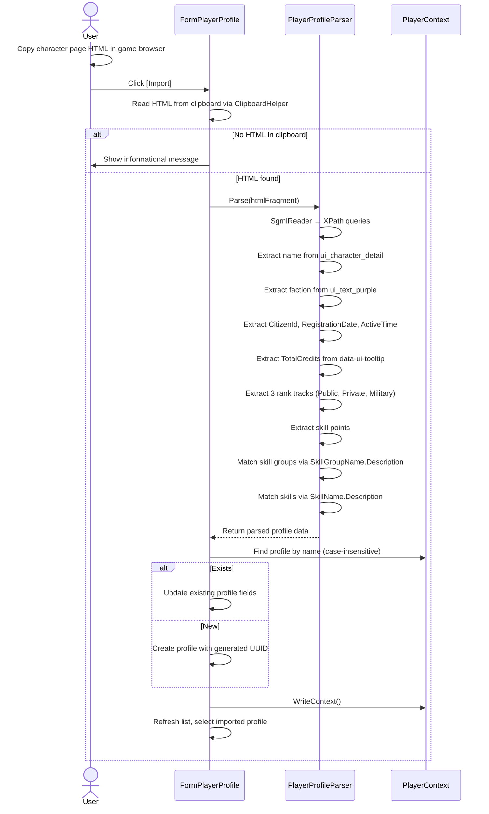
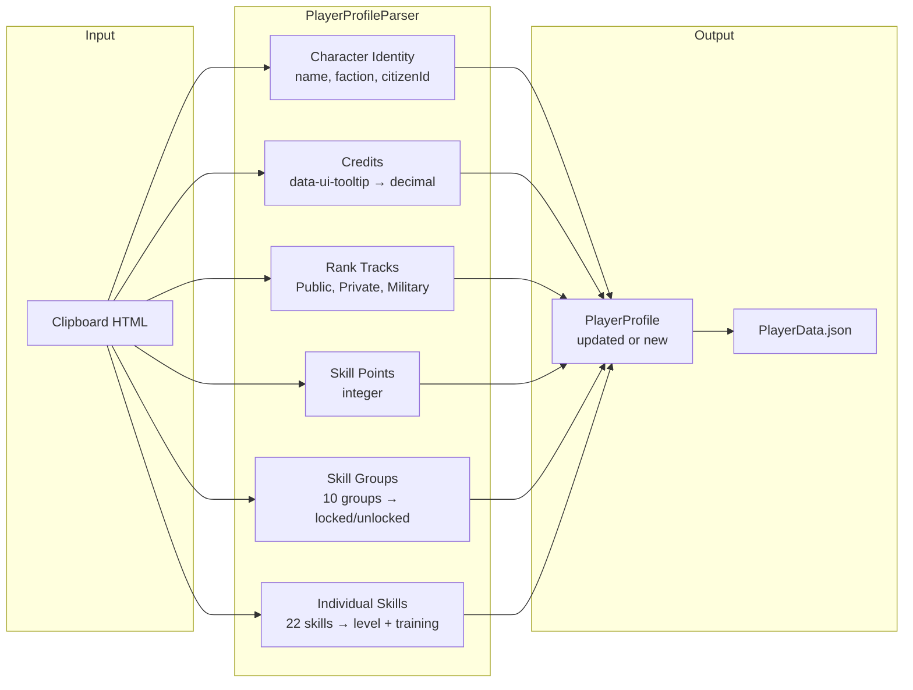

# Player Profile Import Requirements

## Overview

Import player profile data from the game's clipboard HTML. Parses character identity, credits, ranks, skill points, skill groups, and individual skills. Creates or updates profiles by case-insensitive name match.

## Character Identity

**REQ-PPI-001** The parser SHALL extract character name from the `ui_character_detail` div's `ui_text_white` element.  
**REQ-PPI-002** The parser SHALL extract faction abbreviation from the `ui_text_purple` element, stripping brackets.  
**REQ-PPI-003** The parser SHALL extract CitizenId, RegistrationDate, and ActiveTime from the headline section.

## Credits

**REQ-PPI-010** The parser SHALL extract TotalCredits from the `ui_credit_detail` element's `data-ui-tooltip` attribute, parsing the formatted number into a decimal.

## Rank Tracks

**REQ-PPI-020** The parser SHALL extract rank level, title, current XP, and next-level XP for each of the three tracks (Public, Private, Military).  
**REQ-PPI-021** Missing rank sections SHALL be logged and left unchanged.

## Skill Points

**REQ-PPI-030** The parser SHALL extract available skill points as an integer.

## Skill Groups

**REQ-PPI-040** The parser SHALL identify each skill group by display name and set its locked/unlocked state on the profile.  
**REQ-PPI-041** Skill group names SHALL be matched to SkillGroupName enum values via Description attributes.

## Individual Skills

**REQ-PPI-050** The parser SHALL extract each skill's display name and current level.  
**REQ-PPI-051** Skills with training in progress SHALL have TrainingStarted set to true and CompletionTime populated.  
**REQ-PPI-052** Skill names SHALL be matched to SkillName enum values via Description attributes. Unrecognized skills SHALL be logged and skipped.

## Import Flow

**REQ-PPI-060** The Player Profile form SHALL have an Import button that reads clipboard HTML and invokes the parser.  
**REQ-PPI-061** If a profile with the same name exists (case-insensitive), it SHALL be updated. Otherwise a new profile SHALL be created with a generated UUID.  
**REQ-PPI-062** After import, the form SHALL refresh to show the imported data.  
**REQ-PPI-063** If the clipboard contains no HTML, an informational message SHALL be displayed.

## Model Extensions

**REQ-PPI-070** PlayerProfile SHALL include CitizenId, RegistrationDate, and ActiveTime string properties (default empty string).  
**REQ-PPI-071** PlayerRank SHALL include a Title string property (default empty string).

## Parsing Infrastructure

**REQ-PPI-080** The parser SHALL use SgmlReader and XPath queries, following the ColonyParser/SurveyParser pattern.  
**REQ-PPI-081** The parser SHALL use ClipboardHelper.ExtractHtmlFragment for clipboard data extraction.

## User Interaction Flow

### Profile Import from Clipboard

## Data Flow Diagram

