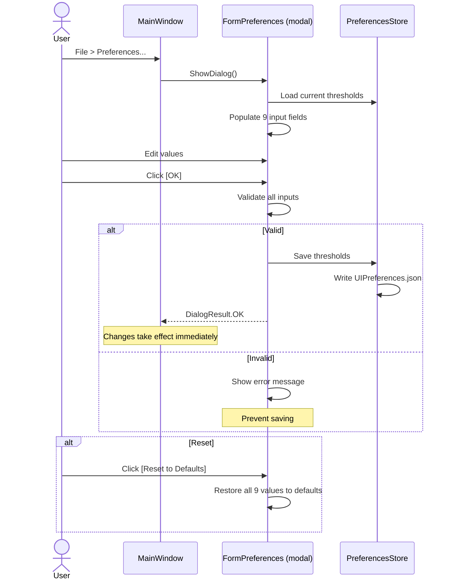

# Preferences Requirements

## Overview

A Preferences form (File > Preferences) exposes nine configurable values previously hardcoded: structure count warning thresholds, worker request due windows, colony import staleness thresholds, background processing interval, admin report refresh interval, and countdown display refresh rate.

## Threshold Model

**REQ-PRF-001** ThresholdPreferences SHALL contain: structure count yellow (default 60) and red (default 66) as integers; worker request due yellow (default 172800s/2d) and red (default 86400s/1d); colony import staleness yellow (default 432000s/5d) and red (default 518400s/6d); background processing interval (default 60s); admin report refresh (default 60s); countdown display refresh rate (default 1s) — all time values stored as seconds (long).  
**REQ-PRF-002** UIPreferences SHALL contain a Thresholds property. If null on deserialization, it SHALL be initialized with defaults.

## Preferences Form

**REQ-PRF-010** The form SHALL display nine labeled inputs grouped into six sections: Structure Count, Worker Request Due Window, Colony Import Staleness, Background Processing, Administration Report, Countdown Display.  
**REQ-PRF-011** Structure count thresholds SHALL be plain integer inputs. Time-based values SHALL display in countdown format (e.g. "2d 0h 0m 0s") and parse back to seconds.  
**REQ-PRF-012** OK saves and closes. Cancel discards and closes. Reset to Defaults restores all nine values.  
**REQ-PRF-013** The form SHALL be accessible from File > Preferences as a modal dialog.

## Validation

**REQ-PRF-020** All values SHALL be positive.  
**REQ-PRF-021** Structure yellow < red. Worker yellow > red (larger window triggers first). Staleness yellow < red.  
**REQ-PRF-022** Countdown refresh rate SHALL be at least 1 second.  
**REQ-PRF-023** Invalid input SHALL display a descriptive error and prevent saving.

## Consumer Integration

**REQ-PRF-030** TabWarningService SHALL read all six warning thresholds from PreferencesStore.  
**REQ-PRF-031** BackgroundProcessor SHALL read the processing interval from PreferencesStore (minimum 1 second).  
**REQ-PRF-032** FormColony admin report timer SHALL read the refresh interval from PreferencesStore.  
**REQ-PRF-033** ColonyStructure control, FormColonyActivity, PlayerSkillBlock, and MainWindow SHALL read the countdown refresh rate from PreferencesStore.  
**REQ-PRF-034** Changes SHALL take effect immediately without restart.

## Countdown Format Parsing

**REQ-PRF-040** The parser SHALL accept "Xd Yh Zm Ws" format with optional components and return total seconds.  
**REQ-PRF-041** Parsing the output of FormatSeconds SHALL produce the original value (round-trip).

## Backward Compatibility

**REQ-PRF-050** If UIPreferences.json has no Thresholds property, defaults matching the previously hardcoded constants SHALL be used.

## User Interaction Flow

### Preferences Editing



## Form Mockup

### FormPreferences (Modal Dialog)

```
┌─────────────────────────────────────────────────────────┐
│ Preferences                                          [X] │
├─────────────────────────────────────────────────────────┤
│                                                         │
│  Structure Count Thresholds                             │
│    Yellow Warning    [60_____]                           │
│    Red Warning       [66_____]                           │
│                                                         │
│  Worker Request Due Window                              │
│    Yellow Warning    [2d 0h 0m 0s____]                  │
│    Red Warning       [1d 0h 0m 0s____]                  │
│                                                         │
│  Colony Import Staleness                                │
│    Yellow Warning    [5d 0h 0m 0s____]                  │
│    Red Warning       [6d 0h 0m 0s____]                  │
│                                                         │
│  Background Processing                                  │
│    Interval          [0d 0h 1m 0s____]                  │
│                                                         │
│  Administration Report                                  │
│    Refresh Interval  [0d 0h 1m 0s____]                  │
│                                                         │
│  Countdown Display                                      │
│    Refresh Rate      [0d 0h 0m 1s____]                  │
│                                                         │
│  [OK]  [Cancel]  [Reset to Defaults]                    │
└─────────────────────────────────────────────────────────┘
```
