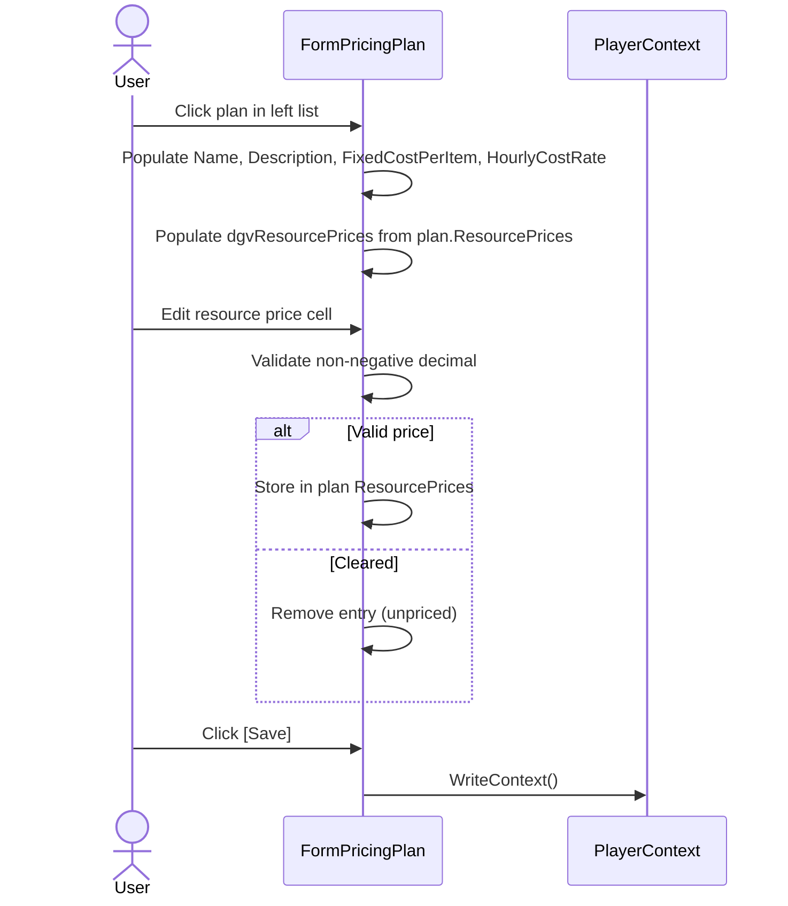
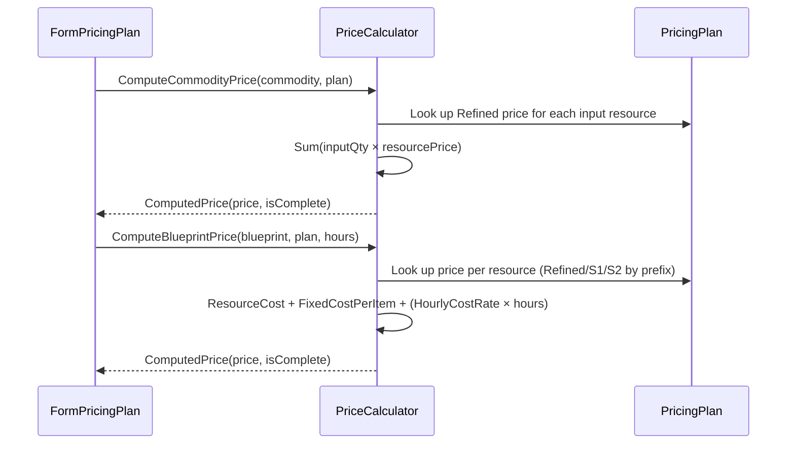

# Pricing Plan Requirements

## Overview

Pricing Plans assign monetary values (in credits) to resources, commodities, and manufactured items. Each plan is a named, per-player configuration containing base resource prices for Refined, S1, and S2 purity levels, plus optional time-cost parameters. The system rolls up base prices through bill-of-materials chains to compute item costs.

## Pricing Plan Data

**REQ-PRC-001** A PricingPlan SHALL have UUID, Name, OwnerUUID, Description (optional), FixedCostPerItem (decimal, default 0), HourlyCostRate (decimal, default 0), and a ResourcePrices dictionary.  
**REQ-PRC-002** PricingPlan.OwnerUUID SHALL match the owning player's UUID. Plans are per-player.  
**REQ-PRC-003** ResourcePrices SHALL be keyed by composite string `"{ResourceName}|{Purity}"` (e.g. `"Alkali Metals|Refined"`). Values are decimal prices in credits.  
**REQ-PRC-004** Multiple PricingPlans SHALL be allowed per player profile.  
**REQ-PRC-005** PricingPlan SHALL serialize to and deserialize from JSON as part of PlayerData.json. If the PricingPlan array is absent on load, an empty list SHALL be initialized without error.

## Pricing Plan Form

**REQ-PRC-010** A Pricing Plan form SHALL be accessible from the Manage menu as an MDI child window.  
**REQ-PRC-011** The form SHALL have a left panel with a list of pricing plans for the current player, with New/Delete buttons.  
**REQ-PRC-012** The form SHALL have a right panel with plan details (Name, Description, FixedCostPerItem, HourlyCostRate) and a DataGridView of resource prices.  
**REQ-PRC-013** The resource price grid SHALL display all known resources at Refined purity plus all S1 and S2 synthetic resources, with their current price in the plan (or blank if unset).  
**REQ-PRC-014** The user SHALL be able to enter, edit, and clear resource prices in the grid. Clearing a price SHALL remove the entry (distinct from setting it to zero).  
**REQ-PRC-015** IF a plan name is empty or whitespace, THEN save SHALL be rejected with a validation message.  
**REQ-PRC-016** FixedCostPerItem and HourlyCostRate SHALL accept non-negative decimal values only. Negative values SHALL be rejected.  
**REQ-PRC-017** Resource prices SHALL accept non-negative decimal values only. Negative values SHALL be rejected.

## Base Resource Prices

**REQ-PRC-020** Only Refined, S1, and S2 purity levels SHALL have base prices. Unrefined purities (High, Medium, Low) are excluded.  
**REQ-PRC-021** A zero price is a valid entry meaning "free." An absent entry means "unpriced/unknown." The system SHALL distinguish between these two states.  
**REQ-PRC-022** When the user clears a resource price, the entry SHALL be removed from ResourcePrices (not set to zero).

## Price Calculator — Commodities

**REQ-PRC-030** PriceCalculator.ComputeCommodityPrice SHALL compute the price of a Commodity by summing `(input quantity x input resource Refined price)` for all entries in the Commodity's ConstructionResources dictionary.  
**REQ-PRC-031** All commodity resource inputs SHALL use Refined purity for price lookup.  
**REQ-PRC-032** IF any input resource has no price entry in the plan, the ComputedPrice SHALL be flagged as incomplete (IsComplete = false). The price is still computed from available inputs.  
**REQ-PRC-033** IF all input resources have price entries (including zero), the ComputedPrice SHALL be flagged as complete (IsComplete = true).  
**REQ-PRC-034** A Commodity with empty ConstructionResources SHALL return price 0, IsComplete = true.

## Price Calculator — Manufactured Items

**REQ-PRC-040** PriceCalculator.ComputeBlueprintPrice SHALL compute the price using: Resource Cost + FixedCostPerItem + (HourlyCostRate x manufacturingHours).  
**REQ-PRC-041** Resource Cost SHALL be the sum of `(input quantity x input resource price)` for all entries in the Blueprint's Resources dictionary.  
**REQ-PRC-042** Purity for each resource SHALL be determined by name prefix: "S1. " -> S1, "S2. " -> S2, all others -> Refined.  
**REQ-PRC-043** IF any input resource has no price entry in the plan, the ComputedPrice SHALL be flagged as incomplete.  
**REQ-PRC-044** A Blueprint with empty Resources SHALL return price equal to FixedCostPerItem + (HourlyCostRate x hours), IsComplete = true.  
**REQ-PRC-045** All three cost components (resource cost, fixed per item, hourly rate) SHALL be additive.

## Incomplete Price Flagging

**REQ-PRC-050** ComputedPrice SHALL have Price (decimal) and IsComplete (bool) fields.  
**REQ-PRC-051** IsComplete SHALL be true if and only if every input resource has a corresponding entry in the plan's ResourcePrices (including zero entries).  
**REQ-PRC-052** The form SHALL display a visual indicator for incomplete computed prices so the user can identify gaps.

## Data Events

**REQ-PRC-060** PlayerContext SHALL fire PricingDataChanged when pricing plan data is modified.  
**REQ-PRC-061** The form SHALL subscribe to CurrentPlayerChanged and PricingDataChanged events.  
**REQ-PRC-062** The form SHALL unsubscribe from events in OnFormClosed.

## Cascade Operations

**REQ-PRC-070** When a player profile is deleted, all PricingPlans owned by that player SHALL be removed (cascade delete).  
**REQ-PRC-071** Orphaned PricingPlans (OwnerUUID not matching any player) SHALL be cleaned up on load.

## User Interaction Flows

### Pricing Plan Selection and Editing



### Price Calculation Flow



## Data Flow Diagram

```mermaid
flowchart LR
    subgraph Input
        RP[ResourcePrices dictionary<br/>ResourceName|Purity → price]
        FC[FixedCostPerItem]
        HR[HourlyCostRate]
    end

    subgraph Calculator
        CC[ComputeCommodityPrice<br/>Σ(inputQty × refinedPrice)]
        CB[ComputeBlueprintPrice<br/>resourceCost + fixed + hourly]
    end

    subgraph Output
        CP[ComputedPrice<br/>price + isComplete flag]
    end

    RP --> CC --> CP
    RP --> CB --> CP
    FC --> CB
    HR --> CB
```

## Form Mockup

### FormPricingPlan

```
┌─────────────────────────────────────────────────────────────────────────────┐
│ #1 - Pricing Plans                                                      [_][□][X] │
├──────────────────┬──────────────────────────────────────────────────────────┤
│ ┌──────────────┐ │  Name             [________________________]            │
│ │ Plan List    │ │  Description       [________________________]            │
│ │              │ │  Fixed Cost/Item   [0.00___]                             │
│ │ Standard     │ │  Hourly Cost Rate  [0.00___]                             │
│ │ Premium      │ │                                                          │
│ │              │ │  ┌──────────────────────────────┬──────────┐             │
│ │              │ │  │ Resource                     │ Price    │             │
│ │              │ │  ├──────────────────────────────┼──────────┤             │
│ │              │ │  │ Alkali Metals (Refined)      │ 12.50    │             │
│ │              │ │  │ Lanthanides (Refined)         │ 25.00    │             │
│ │              │ │  │ Noble Gases (Refined)          │          │             │
│ │              │ │  │ S1. Translanthanic Exotics    │ 150.00   │             │
│ │              │ │  │ S2. Element 126               │ 500.00   │             │
│ │              │ │  │ ...                           │          │             │
│ │              │ │  └──────────────────────────────┴──────────┘             │
│ │              │ │                                                          │
│ │ [New][Delete]│ │  [Save]                                                  │
│ └──────────────┘ │                                                          │
└──────────────────┴──────────────────────────────────────────────────────────┘
```
