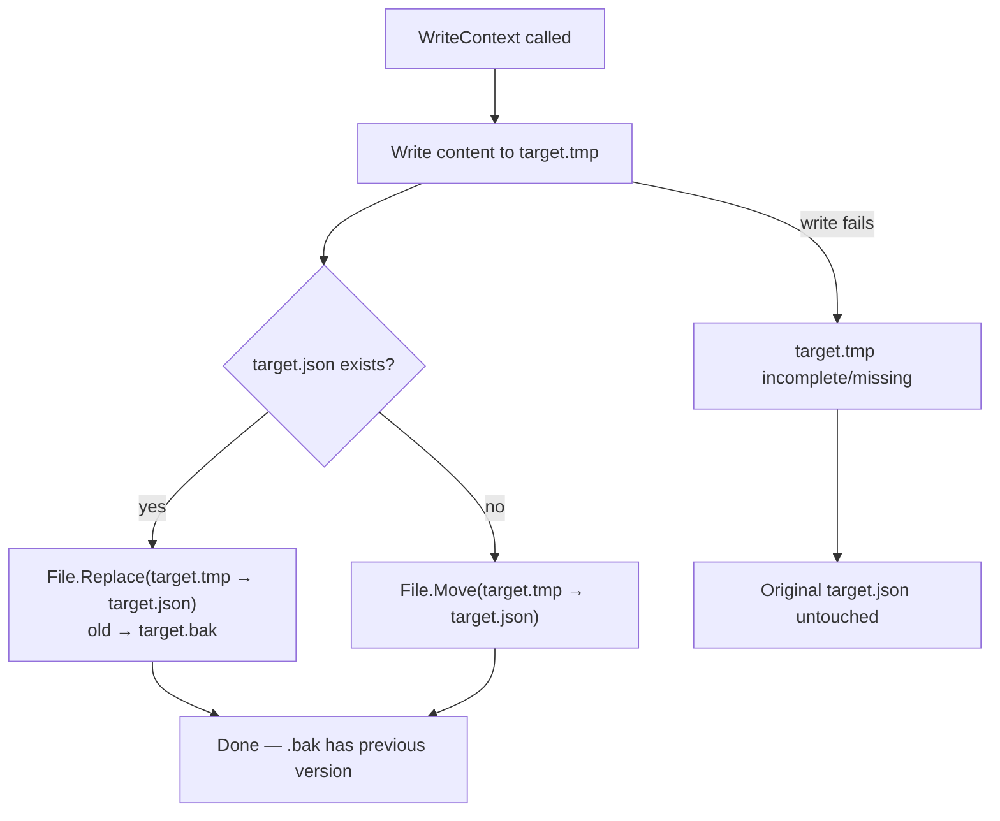

# Safe File Writer Requirements

## Atomic Write Strategy

**REQ-SFW-001** File writes SHALL use a temp-then-replace strategy: content is written to a `.tmp` file first, then swapped into place.
**REQ-SFW-002** If the target file already exists, `File.Replace` SHALL atomically swap the temp file into place and move the old file to a `.bak` backup.
**REQ-SFW-003** If the target file does not exist (first save), `File.Move` SHALL rename the temp file to the target path.
**REQ-SFW-004** The `.bak` file SHALL retain one-deep recovery — only the most recent previous version is kept.
**REQ-SFW-005** If the write to the temp file fails, the original file SHALL remain untouched.

## Data Flow Diagram

### Atomic Write Strategy

