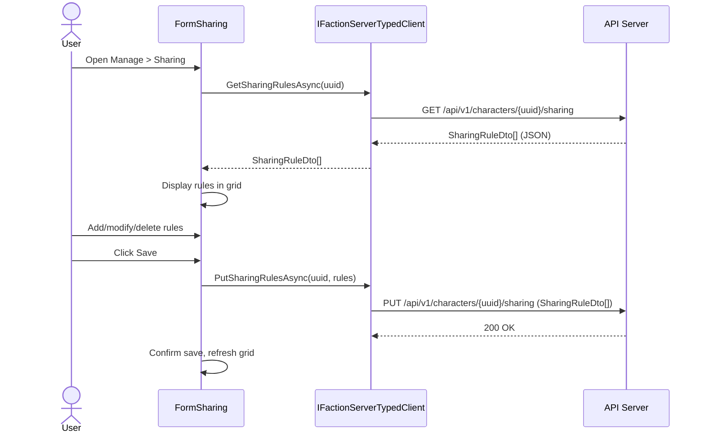

# Sharing Requirements

## User Goal

The user wants to control who can see their tracked data (blueprints, surveys, colonies) by configuring sharing rules — targeting specific characters, factions, or making data publicly visible.

## Out of Scope

- Granular per-entity sharing (sharing is at the data-type level, not individual items)
- Time-limited sharing rules (rules are permanent until deleted)
- Sharing notifications (recipients are not notified when data is shared with them)

## Sharing Rule Model

**REQ-SHR-001** A SharingRule SHALL have fields: Id (GUID), OwnerCharacterUUID, TargetType (Faction/Character/Public), TargetUUID, and DataType (nullable — null means all data types).
**REQ-SHR-002** TargetType SHALL support values: Faction (all members of a faction), Character (a specific character), and Public (unauthenticated visitors).
**REQ-SHR-003** DataType SHALL support values: Colonies, Blueprints, Surveys, and null (representing all data types).

## Sharing Configuration Form

**REQ-SHR-010** The Desktop_App SHALL provide FormSharing accessible from the main menu under "Manage > Sharing".
**REQ-SHR-011** FormSharing SHALL load sharing rules via GET /api/v1/characters/{uuid}/sharing on open.
**REQ-SHR-012** FormSharing SHALL display rules in a DataGridView with columns: Target Type, Target UUID, and Data Type.
**REQ-SHR-013** FormSharing SHALL allow adding rules with Target Type dropdown (Faction/Character/Public), Target UUID entry, and Data Type selection (Colonies/Blueprints/Surveys/All).
**REQ-SHR-014** FormSharing SHALL save rules via PUT /api/v1/characters/{uuid}/sharing with the complete rule list.
**REQ-SHR-015** FormSharing SHALL allow deleting selected rules from the grid.
**REQ-SHR-016** On save error, FormSharing SHALL display an error message and retain unsaved state for retry.
**REQ-SHR-017** When the current player changes, FormSharing SHALL reload rules for the new character.

## Sharing Rule Validation

**REQ-SHR-020** The Save button SHALL be disabled when any non-Public rule has an empty Target UUID.
**REQ-SHR-021** The server SHALL return 400 Bad Request for rules with empty TargetUUID or invalid TargetType.
**REQ-SHR-022** The server SHALL assign the authenticated character's UUID as OwnerCharacterUUID, ignoring client-provided values.

## Public Data Access

**REQ-SHR-030** Rules with TargetType=Public SHALL make data available through unauthenticated public endpoints.
**REQ-SHR-031** Public endpoints SHALL return blueprints, surveys, or colonies where a Public sharing rule with matching DataType (or null) exists.

## Cross-App Consistency

**REQ-SHR-040** Sharing rules created in the desktop app SHALL be visible in the web UI, and vice versa.
**REQ-SHR-041** Both apps SHALL use the same API endpoints (GET/PUT /api/v1/characters/{uuid}/sharing).
**REQ-SHR-042** Both apps SHALL present the same TargetType options (Faction/Character/Public) and DataType options (Colonies/Blueprints/Surveys/All).

## Server Connection

**REQ-SHR-050** If not connected to a server, FormSharing SHALL show an empty grid with Save disabled.
**REQ-SHR-051** If loading fails, FormSharing SHALL display an error message and leave the grid empty.

## User Interaction Flows

### Configure Sharing Rules

> **Note:** The typed client uses `SharingRuleDto` from `OE2EmpireTracker.Common.Client.FactionServer` namespace.
> Methods `GetSharingRulesAsync` and `PutSharingRulesAsync` replace the raw HTTP calls previously made through `RemoteFactionClient`.
