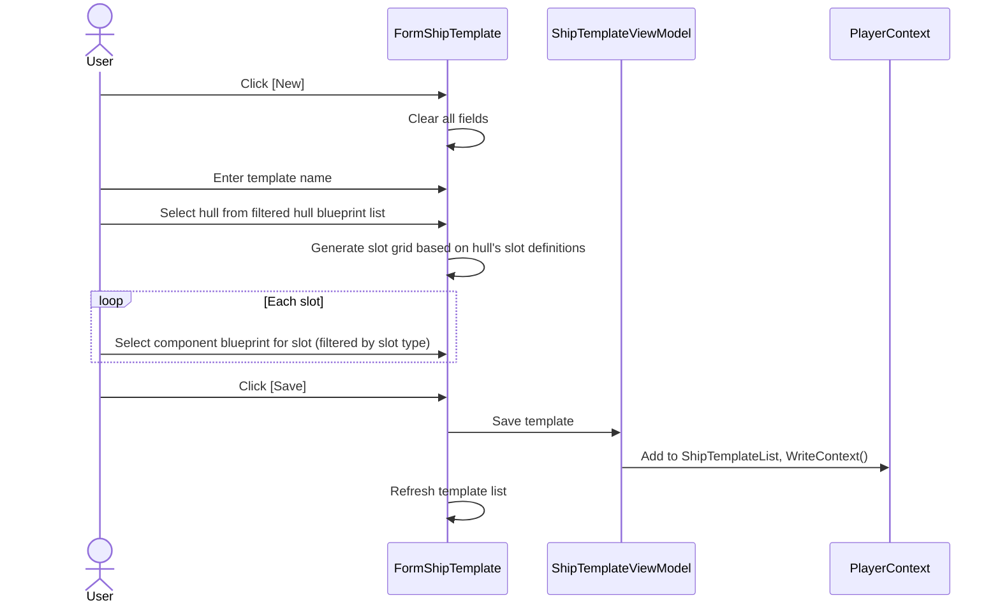
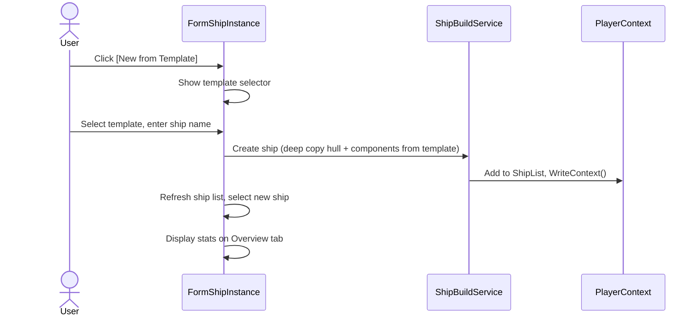
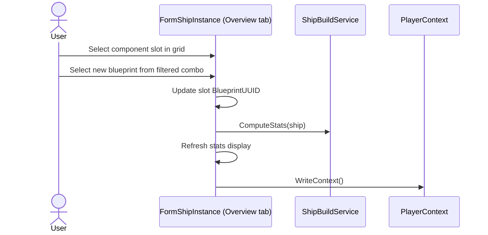

# Ship Requirements

## Out of Scope

- Combat simulation or damage calculation during fights
- Autopilot or route-following AI for ships
- Fuel consumption tracking or refueling mechanics
- Ship-to-ship trading or docking interactions
- Visual ship builder or 3D rendering

## Ship Templates

**REQ-SHP-001** A ShipTemplate SHALL have UUID, Name, OwnerUUID, HullBlueprintUUID, and a list of ShipComponentSlots.  
**REQ-SHP-002** ShipComponentSlot SHALL have SlotType (string), SlotIndex (int, 0-based), and BlueprintUUID.  
**REQ-SHP-003** ShipComponentSlot SHALL include damage fields (CurrentHP, MaxHP, MaxRepairPercent) defaulting to 0 (undamaged). These fields are unused on templates.  
**REQ-SHP-004** SlotType SHALL be a string (not enum) to accommodate future game slot types. Valid slot types and counts are defined by the hull blueprint's properties.  

## Ship Instances

**REQ-SHP-010** A Ship SHALL have UUID, Name, OwnerUUID, optional TemplateUUID, HullBlueprintUUID, Components list, LocationType/LocationUUID, Cargo (ItemBag), and Hopper (ItemBag).  
**REQ-SHP-011** Ship SHALL duplicate hull and components from the template at creation time. Modifying the template SHALL NOT affect existing ships.  
**REQ-SHP-012** Ship.Cargo SHALL be an ItemBag for general cargo. Volume enforcement is in the service layer.  
**REQ-SHP-013** Ship.Hopper SHALL be a separate ItemBag for unrefined resources (High/Medium/Low purity only). Refined and synthetic purities SHALL NOT be allowed.  
**REQ-SHP-014** Ship SHALL have hull damage fields (HullCurrentHP, HullMaxHP, HullMaxRepairPercent) defaulting to 0 (undamaged).  

## Ship Build Service

**REQ-SHP-020** ShipBuildService.GenerateShipBuildItems SHALL create build items for all components in a ship template that are not in stock, adding them to a specified build plan.  
**REQ-SHP-021** ShipBuildService.ComputeStats SHALL derive ship statistics (cargo capacity, hopper capacity, speed, firepower, etc.) from the hull blueprint and installed component blueprints.  
**REQ-SHP-022** ShipBuildService.ValidateAssemblyLocation SHALL verify the assembly station exists and is a valid destination.  

## Ship Template Form

**REQ-SHP-030** FormShipTemplate SHALL allow creating and editing ship templates with hull selection and component slot configuration.  
**REQ-SHP-031** Component slots SHALL be filtered to blueprints matching the slot type.  

## Ship Instance Form

**REQ-SHP-040** FormShipInstance SHALL display ship details with an Overview tab (stats, components, damage) and a Cargo tab (items in cargo and hopper).  
**REQ-SHP-041** The Cargo tab SHALL show used vs total cargo volume and warn when over capacity.  
**REQ-SHP-042** Components SHALL be swappable after creation. Swapping SHALL trigger stat recomputation.  

## Empty & Error States

**REQ-SHP-060** When no ship templates exist, the template list SHALL be empty with column headers visible.  
**REQ-SHP-061** When no hull blueprints are available (none imported), the hull selector SHALL be empty and the user SHALL not be able to create a template.  
**REQ-SHP-062** When a template references a hull blueprint that no longer exists, the hull name SHALL display "(unknown)" and stats SHALL show zero.  
**REQ-SHP-063** When a component slot references a blueprint that no longer exists, the slot SHALL display "(unknown)" and contribute zero to stats.  
**REQ-SHP-064** When no ships exist, the ship instance list SHALL be empty with column headers visible.  
**REQ-SHP-065** When a ship's cargo exceeds capacity, the volume display SHALL show in red (e.g. "1250/1000 m³") as a warning, not a blocking error.  

## User Interaction Flows

### Create Ship Template

### Create Ship from Template

### Swap Component

## Cargo Volume

**REQ-SHP-050** Cargo volume SHALL be computed by summing Item.Volume × Quantity for all items. Crate items contribute the sum of their contents' volumes (the crate itself has zero volume).  
**REQ-SHP-051** Cargo capacity SHALL be derived from the hull blueprint's cargo capacity property plus installed cargo pod components.  
**REQ-SHP-052** Hopper capacity SHALL be derived from the hull's Raw Material Capacity plus installed Ore Hopper components' Raw Material Capacity.
