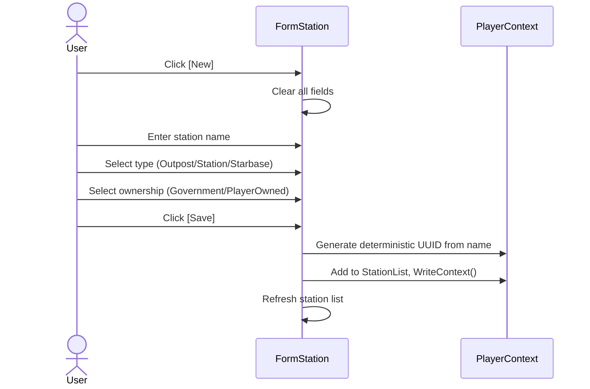
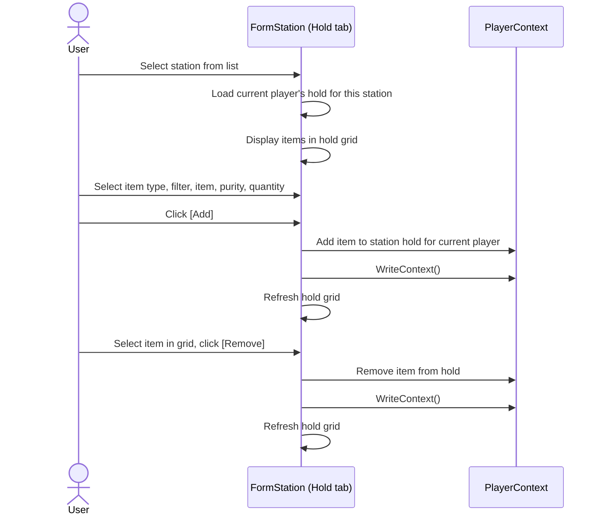

# Station Requirements

## Out of Scope

- Station construction or upgrade mechanics
- NPC interaction at stations (shops, missions)
- Station defense simulation or attack scenarios
- Docking fees or station services pricing
- Station discovery or exploration

## Station Model

**REQ-STN-001** A Station SHALL have UUID, Name, StationType (Outpost/Station/Starbase), Ownership (Government/PlayerOwned), and OwnerUUID.  
**REQ-STN-002** Station UUID SHALL be deterministic from the station name using DeterministicUUID with a station-specific namespace.  
**REQ-STN-003** Station.Holds SHALL be a Dictionary keyed by PlayerProfile UUID, where each value is an ItemBag representing that player's inventory at the station.  
**REQ-STN-004** Station holds SHALL have no capacity limit.  
**REQ-STN-005** A missing key in Holds SHALL be treated as an empty hold.  

## Station Components

**REQ-STN-010** Player-owned stations SHALL have a Components list using the same ShipComponentSlot model as ships.  
**REQ-STN-011** StationBlueprintUUID SHALL define available slot types and counts for player-owned stations.  
**REQ-STN-012** Station.MunitionsHold SHALL be a separate ItemBag for weapon ammunition on armed stations.  

## Station Damage

**REQ-STN-020** Station SHALL have hull damage fields (HullCurrentHP, HullMaxHP, HullMaxRepairPercent) defaulting to 0 (undamaged).  
**REQ-STN-021** Component damage SHALL be tracked per-slot via ShipComponentSlot damage fields.  

## Station Form

**REQ-STN-030** FormStation SHALL be an MDI child form for creating and managing stations.  
**REQ-STN-031** The form SHALL display station metadata (name, type, ownership) and a Hold tab showing the current player's inventory.  
**REQ-STN-032** The Hold tab SHALL support adding/removing items using the standard item picker pattern (type, filter, item, purity, quantity).  
**REQ-STN-033** Crate support SHALL allow creating crates and moving items into/out of crates within a hold.  

## Empty & Error States

**REQ-STN-060** When no stations exist, the station list SHALL be empty with column headers visible.  
**REQ-STN-061** When the current player has no items at the selected station, the Hold tab SHALL display an empty grid.  
**REQ-STN-062** When a station is referenced in delivery routes but deleted, route stops SHALL display "(unknown)" for the station name.  

## User Interaction Flows

### Create Station

### Manage Hold Items

## Station Reference Counter

**REQ-STN-040** StationReferenceCounter SHALL count references to a station from delivery route stops, delivery plan stops, market listings, warehouse overflow rule destinations, and supply chain stage locations.  

## Station as Route Destination

**REQ-STN-050** Stations SHALL be valid destinations in delivery routes alongside colonies and asteroids, using DestinationType.Station.  
**REQ-STN-051** Delivery execution at a station stop SHALL follow the same pickup/dropoff pattern as colony stops.
