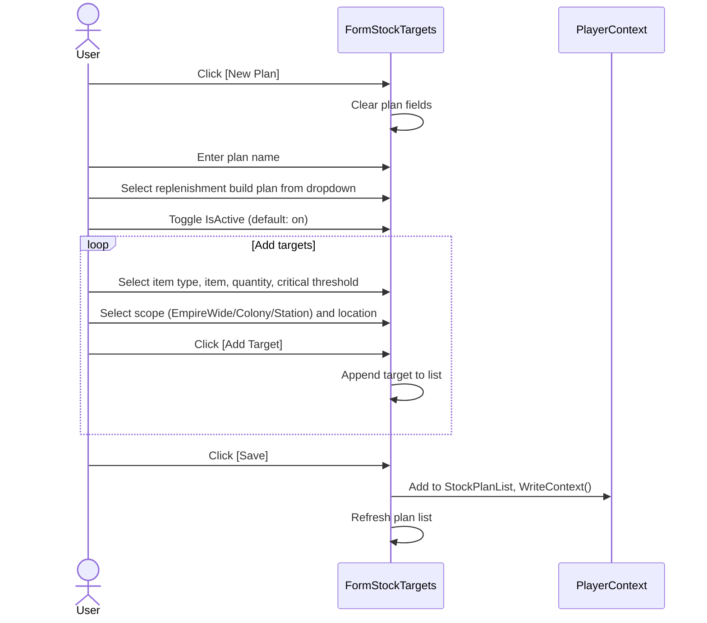
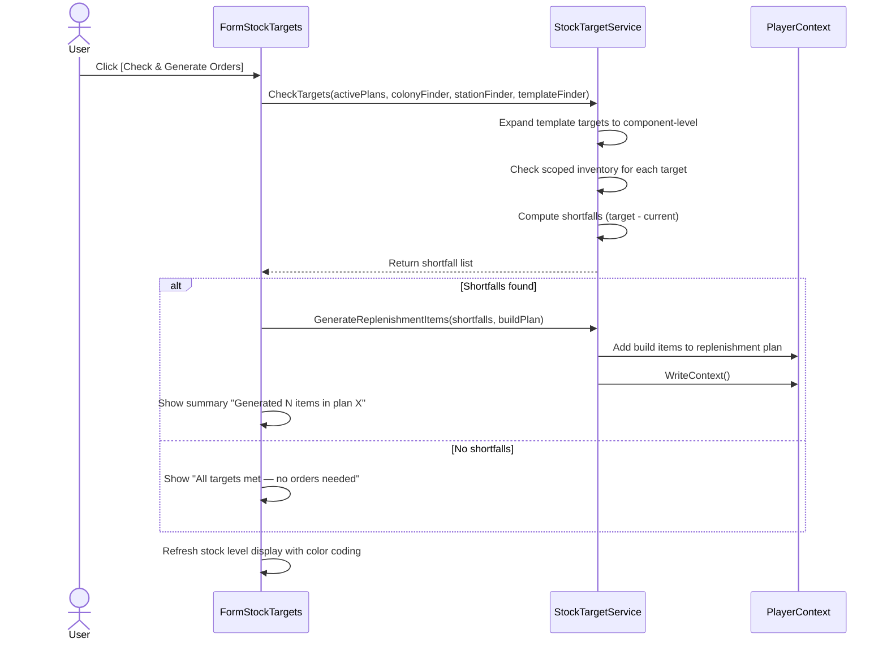

# Stock Target Requirements

## User Goal

The user wants to define inventory targets (minimum quantities of items to keep on hand) and automatically generate build orders when stock falls below those targets, ensuring they never run out of critical supplies.

## Out of Scope

- Automatic purchasing from market to fill shortfalls
- Price-aware replenishment (buy only if price is below threshold)
- Historical stock level tracking or trend graphs
- Alert notifications (email, sound) when stock is critical
- Cross-player stock sharing or pooling

## Stock Plans

**REQ-STK-001** A StockPlan SHALL have UUID, Name, OwnerUUID, ReplenishmentBuildPlanUUID, IsActive flag, and a list of StockTargets.  
**REQ-STK-002** StockPlan.IsActive SHALL default to true. Inactive plans SHALL skip shortfall evaluation and replenishment.  
**REQ-STK-003** ReplenishmentBuildPlanUUID SHALL link to the BuildPlan where replenishment build items are created.  

## Stock Targets

**REQ-STK-010** A StockTarget SHALL have UUID, ItemType, ItemReferenceID, ItemName, optional ShipTemplateUUID, TargetQuantity, CriticalThreshold, Scope (EmpireWide/Colony/Station), and LocationUUID.  
**REQ-STK-011** When ShipTemplateUUID is set, the target SHALL expand into component-level targets based on the live template definition.  
**REQ-STK-012** CriticalThreshold SHALL trigger a red warning when current stock falls below this level.  
**REQ-STK-013** Scope SHALL determine where inventory is counted: EmpireWide checks all colonies and stations, Colony/Station checks only the specified location.  

## Stock Profiles

**REQ-STK-020** A StockProfile SHALL have UUID, Name, OwnerUUID, IsActive flag, and a list of StockProfileEntries.  
**REQ-STK-021** StockProfileEntry SHALL have a GroupID and a StockPlanUUID reference.  
**REQ-STK-022** Entries with the same GroupID SHALL be ORed (max across overlapping components). Different GroupIDs SHALL be ANDed (summed).  
**REQ-STK-023** StockProfile.IsActive SHALL default to true. Inactive profiles SHALL be excluded from aggregation.  

## Stock Target Service

**REQ-STK-030** StockTargetService.CheckTargets SHALL evaluate all active stock plans, expand template targets, check scoped inventory, and return shortfalls.  
**REQ-STK-031** StockTargetService.GenerateReplenishmentItems SHALL create build items in the linked replenishment build plan for computed shortfalls.  
**REQ-STK-032** Template expansion SHALL use the live template definition so that template modifications cascade to stock targets on the next check.  

## Cascade Integration

**REQ-STK-040** PlayerContext.CascadeStockTargetsDirty SHALL be set when ship templates or other referenced entities change, triggering re-evaluation on the next background tick.  
**REQ-STK-041** The background processor SHALL check stock targets as part of its processing cycle when the cascade flag is set.  

## Stock Targets Form

**REQ-STK-050** FormStockTargets SHALL allow creating and editing stock plans with target lists.  
**REQ-STK-051** The form SHALL provide a "Check & Generate Orders" button that evaluates shortfalls and creates replenishment build items.  
**REQ-STK-052** The form SHALL display current stock levels vs targets with color coding (green = above target, yellow = below target, red = below critical threshold).  
**REQ-STK-053** The form SHALL provide an IsActive toggle for pausing/resuming plans and profiles.  

## Empty & Error States

**REQ-STK-060** When no stock plans exist, the plan list SHALL be empty with column headers visible.  
**REQ-STK-061** When a plan has no targets, the target grid SHALL be empty and "Check & Generate Orders" SHALL report "No targets defined."  
**REQ-STK-062** When a target references a ShipTemplate that no longer exists, the target SHALL display "(unknown template)" and be skipped during shortfall evaluation.  
**REQ-STK-063** When a plan's ReplenishmentBuildPlanUUID references a deleted build plan, "Check & Generate Orders" SHALL display an error message and not generate items.  
**REQ-STK-064** When a scoped target references a colony or station that no longer exists, the location SHALL display "(unknown)" and the target SHALL be skipped during evaluation.  

## User Interaction Flows

### Create Stock Plan with Targets

### Check & Generate Orders

