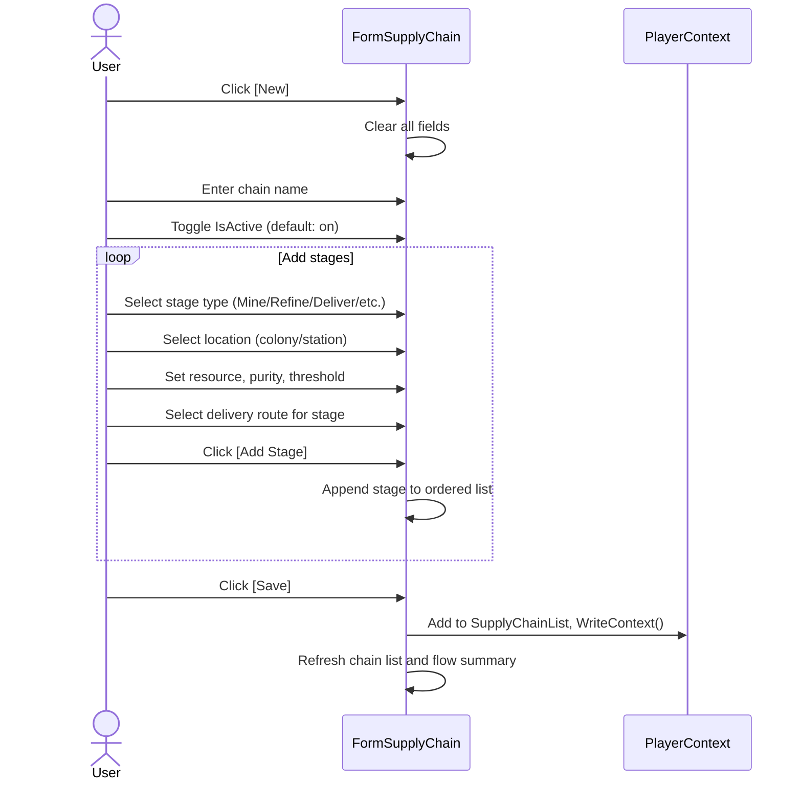
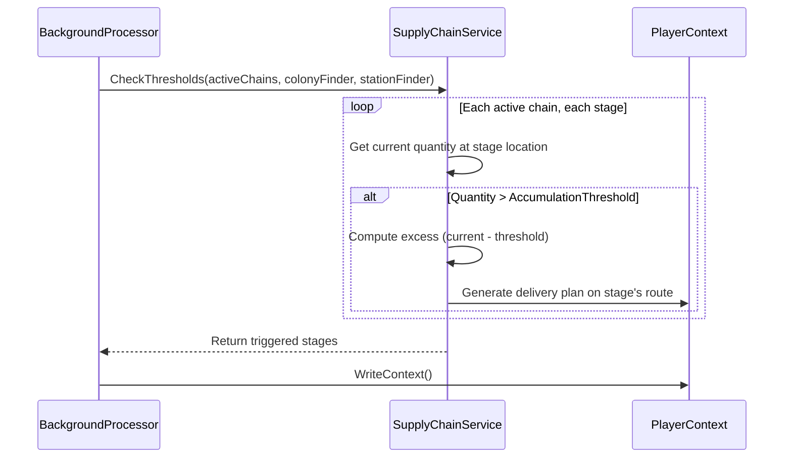

# Supply Chain Requirements

## User Goal

The user wants to define end-to-end production pipelines (mine → refine → deliver) with automatic threshold-based forwarding, so resources flow through the chain without manual intervention once configured.

## Out of Scope

- Automatic route optimization (shortest path, fuel efficiency)
- Real-time tracking of ships in transit
- Multi-player supply chain coordination
- Market price integration for profit/loss on chain outputs
- Visual pipeline editor (drag-and-drop stage connections)

## Supply Chain Model

**REQ-SCH-001** A SupplyChain SHALL have UUID, Name, OwnerUUID, IsActive flag, and an ordered list of SupplyChainStages.  
**REQ-SCH-002** SupplyChain.IsActive SHALL default to true. Inactive chains SHALL be skipped by the background processor.  
**REQ-SCH-003** A SupplyChainStage SHALL have Sequence, StageType (Mine/AsteroidMine/PickUp/Refine/Deliver/Research), LocationType, LocationUUID, ResourceName, ResourcePurity, AccumulationThreshold, ProductionRatePerHour, and DeliveryRouteUUID.  

## Stage Types

**REQ-SCH-010** Mine stages SHALL represent colony-based mining rig operations.  
**REQ-SCH-011** AsteroidMine stages SHALL represent ship-based asteroid mining (laser + grapple equipment).  
**REQ-SCH-012** PickUp stages SHALL represent accumulation points (typically stations) where resources collect before forwarding.  
**REQ-SCH-013** Refine stages SHALL represent colony-based refinery operations.  
**REQ-SCH-014** Deliver stages SHALL represent the final delivery of processed resources to a destination.  
**REQ-SCH-015** Research stages SHALL represent colony-based research lab operations.  

## Threshold Checks

**REQ-SCH-020** The background processor SHALL check accumulation at each stage against AccumulationThreshold on every tick for active chains.  
**REQ-SCH-021** When accumulated quantity exceeds the threshold, a delivery plan SHALL be generated on the stage's designated DeliveryRouteUUID to move the excess to the next stage.  
**REQ-SCH-022** The amount moved SHALL be the current quantity minus the threshold (leave the threshold amount behind, move the rest).  

## Supply Chain Service

**REQ-SCH-030** SupplyChainService SHALL evaluate all active supply chains and return stages that have exceeded their thresholds.  
**REQ-SCH-031** SupplyChainService SHALL integrate with DeliveryGenerationService to create delivery plans for threshold-triggered movements.  

## Supply Chain Form

**REQ-SCH-040** FormSupplyChain SHALL allow creating and editing supply chains with an ordered list of stages.  
**REQ-SCH-041** The form SHALL display a flow summary showing the pipeline from mining through delivery.  
**REQ-SCH-042** The form SHALL provide an IsActive toggle for pausing/resuming chains.  

## Empty & Error States

**REQ-SCH-050** When no supply chains exist, the chain list SHALL be empty with column headers visible.  
**REQ-SCH-051** When a chain has no stages, the stage grid SHALL be empty and the flow summary SHALL display "No stages defined."  
**REQ-SCH-052** When a stage references a colony or station that no longer exists, the location column SHALL display "(unknown)".  
**REQ-SCH-053** When a stage's DeliveryRouteUUID references a deleted route, the route column SHALL display "(unknown)" and threshold-triggered delivery generation SHALL be skipped for that stage with a warning logged.  

## User Interaction Flows

### Create Supply Chain

### Threshold Trigger (Background)

