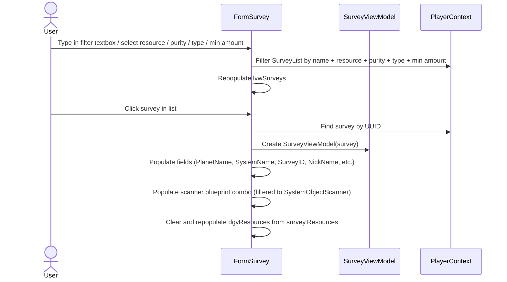
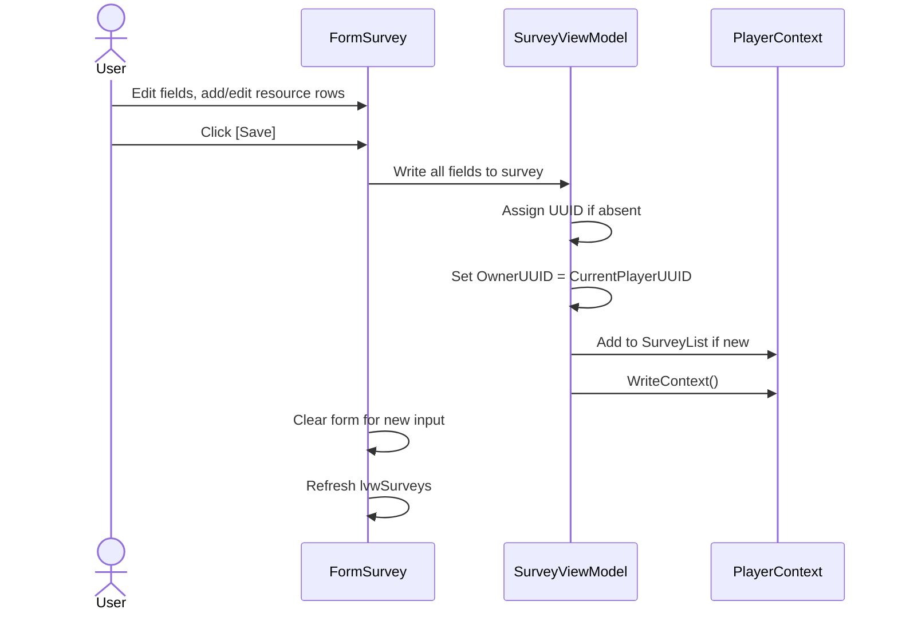
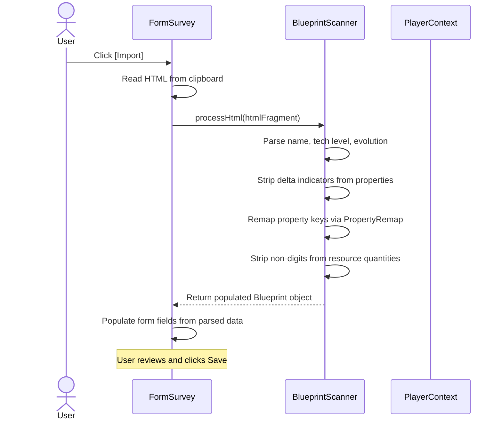
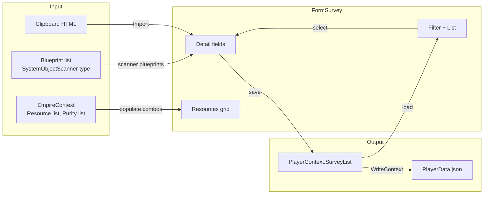

# Survey Requirements

## Survey Data

**REQ-SRV-001** A Survey SHALL have UUID, PlanetName, SurveyID, NickName, ScannedBy, DateTime, ScannerBlueprintUUID, a Properties dictionary, and a Resources dictionary keyed by resource name.  
**REQ-SRV-002** Each SurveyResource SHALL have Resource (name), Purity, and Amount string fields.  
**REQ-SRV-003** Survey SHALL serialize to and deserialize from JSON, preserving all fields including the Resources dictionary.  
**REQ-SRV-004** Survey.ExtendedName SHALL return `PlanetName (SurveyID)` with `[NickName]` appended when NickName is non-empty.

## Survey Form — List

**REQ-SRV-010** The survey form SHALL display a list of all saved surveys with UUID, SystemName, PlanetName, NickName, and DateTime columns.  
**REQ-SRV-011** The list SHALL be filterable by PlanetName or SystemName, by Resource type, by Purity, by SurveyType (Planet/Asteroid/All), and by minimum Amount per cycle/hour.  
**REQ-SRV-012** Selecting a survey from the list SHALL populate all form fields with that survey's data.

## Asteroid Survey Detection

**REQ-SRV-015** Survey SHALL have a SurveyType enum (Planet/Asteroid) defaulting to Planet for backward compatibility.  
**REQ-SRV-016** Survey SHALL have an AsteroidUUID field linking asteroid surveys to their Asteroid entity.  
**REQ-SRV-017** When importing an asteroid survey, if no Asteroid entity exists with the computed deterministic UUID (from SystemName:AsteroidName), one SHALL be auto-created with Name from PlanetName and SystemName from the survey's SystemName.  
**REQ-SRV-018** The SurveyType filter SHALL support Planet, Asteroid, and All options. The minimum Amount filter SHALL accept a numeric value and include surveys with at least one resource meeting the threshold.

### Asteroid Max Reserve Extraction

**REQ-SRV-060** When importing an asteroid survey whose HTML contains `ScanDetailOutputMaxReserve` nodes, the parser SHALL extract each resource's max reserve integer value (stripping commas and label prefixes) and store them in a transient `ParsedMaxReserves` dictionary keyed by resource name.  
**REQ-SRV-061** `SurveyImportHelper.CreateFromTemp` and `MergeData` SHALL copy `ParsedMaxReserves` from the source survey so the data survives through the import pipeline.  
**REQ-SRV-062** `SurveyImportHelper.LinkOrCreateAsteroid` SHALL populate the linked Asteroid's `Reserves` list from `survey.ParsedMaxReserves`, matching each resource to its purity from `survey.Resources`. On re-import, reserves SHALL be replaced with the latest parsed data.  
**REQ-SRV-063** `LinkOrCreateAsteroid` SHALL fire `PlayerContext.OnAsteroidDataChanged` after creating or updating an asteroid, so open asteroid forms refresh.

### Asteroid Max Reserve Display

**REQ-SRV-064** The survey form's resource grid SHALL include a read-only "Max Reserve" column.  
**REQ-SRV-065** When displaying an asteroid survey, `PopulateFormFromViewModel` SHALL look up the linked asteroid via `SurveyViewModel.FindLinkedAsteroid()` and populate the Max Reserve column by matching each resource row to an `AsteroidReserve` by resource name and purity. Values SHALL be formatted with thousands separators.  
**REQ-SRV-066** For planet surveys, the Max Reserve column SHALL remain empty.

## Survey Form — Fields

**REQ-SRV-020** The form SHALL display and allow editing of: PlanetName, SystemName, SurveyType (Planet/Asteroid dropdown), SurveyID, NickName, ScannedBy, DateTime, ScannerBlueprintUUID (via filtered combo), and scanner properties (SensorAbundanceFactor, PurityModifier, ScanLevel).  
**REQ-SRV-021** The scanner blueprint combo SHALL be filtered to SystemObjectScanner blueprint type only.  
**REQ-SRV-022** The scanner blueprint filter textbox SHALL re-filter the combo on every keystroke.

## Survey Form — Resources Grid

**REQ-SRV-030** The resources grid SHALL have four columns: Resource (combo), Purity (combo), Amount (text), Max Reserve (text, read-only).  
**REQ-SRV-031** The Resource combo SHALL be populated from the empire context resource list.  
**REQ-SRV-032** The Purity combo SHALL be populated from the resource purity list.  
**REQ-SRV-033** When a survey is selected, the grid SHALL be cleared and repopulated from the survey's Resources dictionary.

## Survey Form — Save / Delete / Cancel

**REQ-SRV-040** Clicking Save SHALL write all form fields to the survey, assign a UUID if absent, add to SurveyList if new, persist all resource rows from the grid to the survey's Resources dictionary, and call PlayerContext.WriteContext().  
**REQ-SRV-041** Clicking Delete SHALL remove the survey from SurveyList and call WriteContext().  
**REQ-SRV-042** Clicking Cancel SHALL reset the form to a blank state.  
**REQ-SRV-043** After a successful save, the form SHALL be cleared for new input.

## Blueprint Scanner

**REQ-SRV-050** BlueprintScanner.processHtml() SHALL parse a blueprint HTML fragment and populate a Blueprint object with Name, TechLevel, Evolution, Description, Properties, and Resources.  
**REQ-SRV-051** The evolution number SHALL be excluded from the Name by skipping the EvolutionNumber div during DOM traversal of the title node's children. The code SHALL NOT use string replacement to strip digits, as this corrupts names containing numeric characters (e.g. "X-M-S 612 Field Generator").  
**REQ-SRV-052** TechLevel SHALL be extracted from parentheses at the end of the title, e.g. `Name (TechLevel)`.  
**REQ-SRV-053** Property values SHALL have delta indicators (e.g. `(▲ 435)`) stripped before storage.  
**REQ-SRV-054** Property keys SHALL be remapped using the PropertyRemap dictionary to normalize game HTML labels to canonical spaced form (e.g. "Health (Hitpoints)" → "Health", "Eng. Capacity Required" → "Eng Capacity Required", "Blue Collar Detail(s)" → "Blue Collar Detail", "Warehousing Capacity" → "Warehouse Capacity"). Keys not in the remap table are used as-is.  
**REQ-SRV-055** Resource quantities SHALL have non-digit characters (commas, spaces) stripped, leaving only digits.  
**REQ-SRV-056** The Class property SHALL be extracted from the "Class" property key and stored as Blueprint.Class (int).  
**REQ-SRV-057** processHtml() SHALL not throw on malformed or empty HTML input.

## User Interaction Flows

### Survey Selection and Editing



### Survey Save Flow



### Survey Import (Clipboard)



## Data Flow Diagram



## Form Mockup

### FormSurvey — Main Layout

```
┌─────────────────────────────────────────────────────────────────────────────┐
│ #1 - Manage Surveys                                                     [_][□][X] │
├──────────────────────────┬──────────────────────────────────────────────────┤
│ Filter [________________]│  Planet Name    [____________________]           │
│ Type [▼ All            ] │  System         [____________________]           │
│ Resource [▼ All        ] │  Survey ID      [____________________]           │
│ Purity [▼ All          ] │  Nick Name      [____________________]           │
│ Min Amount [___________] │  Scanner BP     [filter__] [▼ Scanner Mk3    ]  │
│                          │  Scanned By     [____________________]           │
│ ┌──────────────────────┐ │  Scan DateTime  [2026-04-15 14:30   ] [📅]      │
│ │ Survey List          │ │  Sensor Abund.  [____________________]           │
│ │                      │ │  Purity Mod.    [____________________]           │
│ │ Helorix (SRV-1234)  │ │  Scan Level     [____________________]           │
│ │ Proxima (SRV-5678)  │ │                                                  │
│ │ Zeh Vaz (SRV-9012)  │ │  ┌──────────────────┬──────────┬────────┬─────────────┐
│ │ ☄ Asteroid K-7 (A1) │ │  │ Resource         │ Purity   │ Amount │ Max Reserve │
│ │                      │ │  ├──────────────────┼──────────┼────────┼─────────────┤
│ │                      │ │  │ ▼ Alkali Metals  │ ▼ High   │ 125    │       7,123 │
│ │                      │ │  │ ▼ Lanthanides    │ ▼ Medium │ 80     │       6,998 │
│ │                      │ │  │ ▼ Noble Gases    │ ▼ Low    │ 200    │             │
│ │                      │ │  │                  │          │        │             │
│ │                      │ │  └──────────────────┴──────────┴────────┴─────────────┘
│ └──────────────────────┘ │                                                  │
│                          │  [New] [Save] [Delete] [Import]                  │
└──────────────────────────┴──────────────────────────────────────────────────┘
```
