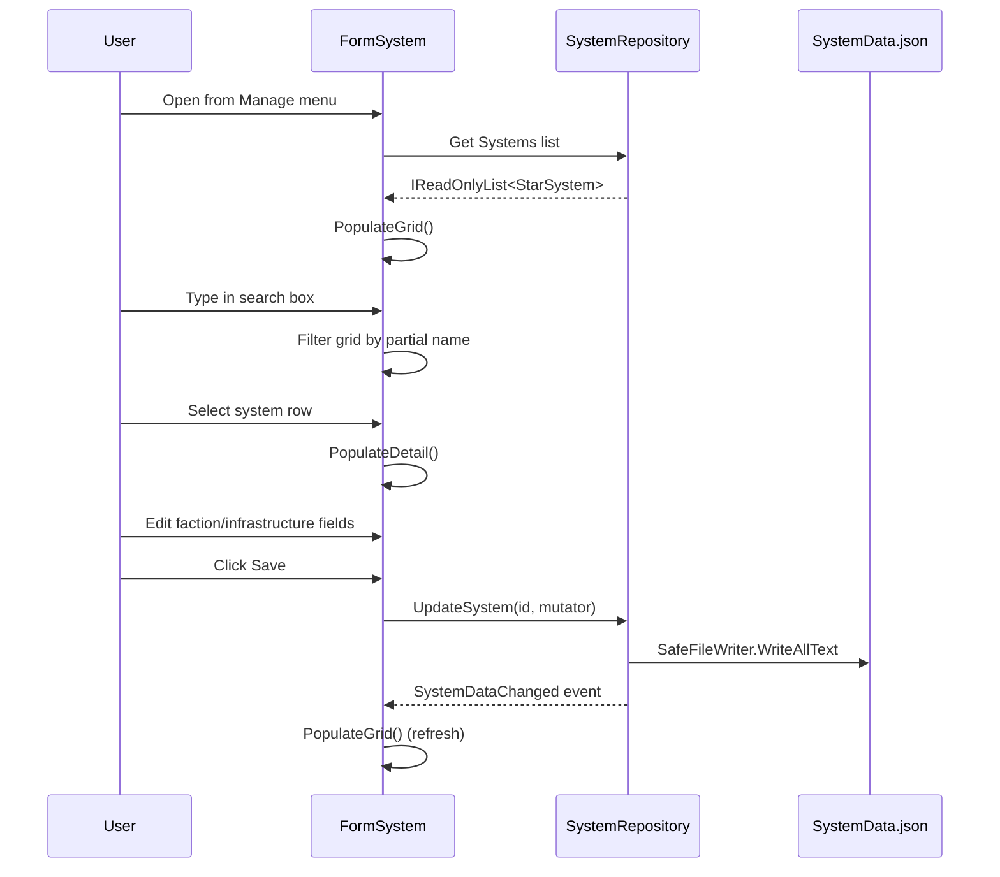
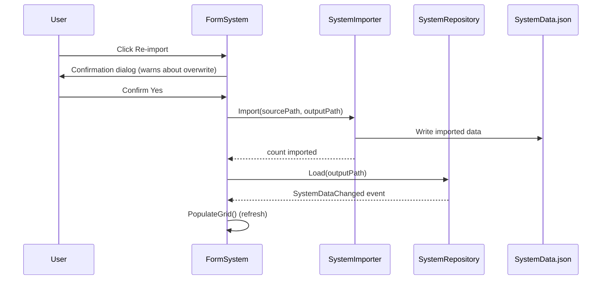

# Systems Model Requirements (BL-019)

## Overview

The Systems Model provides star system coordinate data for the OE2 Empire Tracker. The galaxy contains 23,631 star systems, each with spatial coordinates, a grid hierarchy, spectral class, faction ownership, and infrastructure flags.

## Classes

- **StarSystem** — POCO model with 15 properties (Id, Name, X, Y, Quadrant, Sector, Region, Locality, SpectralClass, FactionId, FactionName, FactionColor, HasOrbital, HasSpaceport, HasStarbase)
- **ReadOnlyStarSystem** — Immutable wrapper exposing read-only getters
- **SystemRepository** — In-memory store with Dictionary-based O(1) lookups by Id and Name, grid/infrastructure/faction queries, mutation with persistence and event notification
- **DistanceCalculator** — Static utility computing Euclidean distance between systems
- **SystemImporter** — Static utility importing galaxy extract data into SystemData.json
- **SystemViewModel** — Display wrapper for DataGridView binding with computed GridLocation
- **FormSystem** — MDI child form for viewing/editing star system data (search, detail, save, re-import)

## Requirements

See `.kiro/specs/systems-model/requirements.md` for full requirements (REQ 1-12).

### REQ-SYS-001: Star System Data Model
The StarSystem SHALL have all 15 properties with JSON serialization using compact property names.

### REQ-SYS-002: System Data Storage
The application SHALL store system data in a separate SystemData.json file loaded at startup.

### REQ-SYS-003: System Repository and Lookup
The SystemRepository SHALL provide O(1) lookup by Id and Name, grid filtering, and partial name search.

### REQ-SYS-004: Distance Calculation
The DistanceCalculator SHALL compute Euclidean distance between systems using normalized coordinates.

### REQ-SYS-005: Colony-to-System Association
Colony.SystemName SHALL resolve via SystemRepository.FindByName at runtime (no Colony model modification).

### REQ-SYS-006: Infrastructure Query
The SystemRepository SHALL provide methods to find systems with spaceport, starbase, or any infrastructure.

### REQ-SYS-007: Faction Query
The SystemRepository SHALL provide methods to find systems by faction and summarize faction territories.

### REQ-SYS-008: Data Import
The SystemImporter SHALL import from a user-selected JSON file (via OpenFileDialog), mapping fields and converting int flags to booleans. The file dialog SHALL default to "oe2-galaxy-systems.json" filter.

### REQ-SYS-009: Serialization Round-Trip
Serialization with DefaultValueHandling.Ignore SHALL preserve all data through round-trip.

### REQ-SYS-010: Performance
Dictionary-based indexes SHALL provide O(1) lookups; DistanceCalculator SHALL be constant-time.

### REQ-SYS-011: System Editor Form
FormSystem SHALL provide a searchable list, detail panel, editable faction/infrastructure fields, save, and re-import.

### REQ-SYS-012: System Data Mutability
The SystemRepository SHALL support updating mutable properties with persistence and event notification.

## User Flows

### View and Edit System Data

### Re-import Galaxy Data

