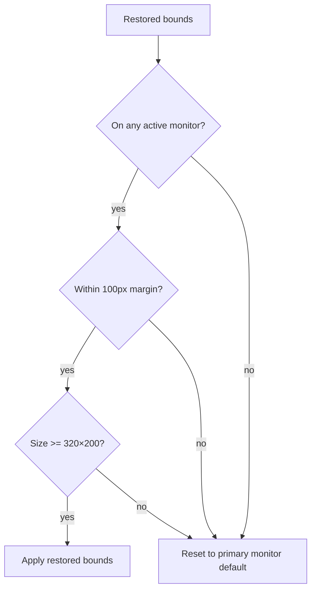

# UI State Persistence Requirements

## User Goal

The user expects that window positions, sizes, column widths, sort orders, and filter selections are remembered between sessions — the app should look exactly as they left it.

Note: Full detailed requirements are in `.kiro/specs/window-state-persistence/requirements.md`. This is a summary for the spec/requirements index.

## Overview

**REQ-UI-001** The application SHALL persist window positions, sizes, grid layouts, filter text, and combo selections across restarts.
**REQ-UI-002** Preferences SHALL be stored in `%LOCALAPPDATA%\OE2EmpireTracker\UIPreferences.json`, separate from game data.

## Main Window

**REQ-UI-010** MainWindow position and size SHALL be saved on close and restored on startup.
**REQ-UI-011** Restored bounds SHALL be validated against active monitors — off-screen windows reset to primary monitor default.
**REQ-UI-012** Minimum window size: 320×200. Screen edge margin: 100px.

## MDI Child Windows

**REQ-UI-020** Each MDI child form type SHALL maintain a per-type window number counter (1, 2, 3...).
**REQ-UI-021** Window titles SHALL display as `#N - <FormTitle>`.
**REQ-UI-022** Each MDI child SHALL save its state (position, size, grid columns, filters, combos) on close.
**REQ-UI-023** State SHALL be restored when a new window of the same type and number is opened.
**REQ-UI-024** MDI child bounds SHALL be validated against the parent client area.

## Control State

**REQ-UI-030** TextBox text SHALL be saved and restored per form/window/control.
**REQ-UI-031** ComboBox selection SHALL be restored by value first, then by index, skipping if neither valid.
**REQ-UI-032** DataGridView column widths, display indices, and sort state SHALL be saved and restored.
**REQ-UI-033** Missing columns (removed since last save) SHALL be skipped with a debug log message.

## Persistence Mechanics

**REQ-UI-040** PreferencesStore SHALL be a singleton following the getInstance()/Reset() pattern.
**REQ-UI-041** Save SHALL use SafeFileWriter for atomic writes.
**REQ-UI-042** Malformed JSON SHALL be logged and discarded (start with empty preferences).
**REQ-UI-043** I/O errors SHALL be logged without crashing.

## Data Flow Diagram

### State Save/Restore Cycle

```mermaid
flowchart LR
    subgraph FormClose["On Form Close"]
        WP[Window position + size]
        GC[Grid column widths,<br/>display order, sort]
        FT[Filter text values]
        CS[ComboBox selections]
    end

    subgraph Store["PreferencesStore"]
        PS[UIPreferences object<br/>keyed by formType + windowNum + controlName]
    end

    subgraph Disk
        JSON["%LOCALAPPDATA%\OE2EmpireTracker\<br/>UIPreferences.json"]
    end

    subgraph FormOpen["On Form Open"]
        RW[Restore window bounds<br/>(validate vs monitors)]
        RG[Restore grid columns<br/>(skip missing columns)]
        RF[Restore filter text]
        RC[Restore combo selection<br/>(by value, then index)]
    end

    FormClose --> PS --> JSON
    JSON --> PS --> FormOpen
```

### Bounds Validation


