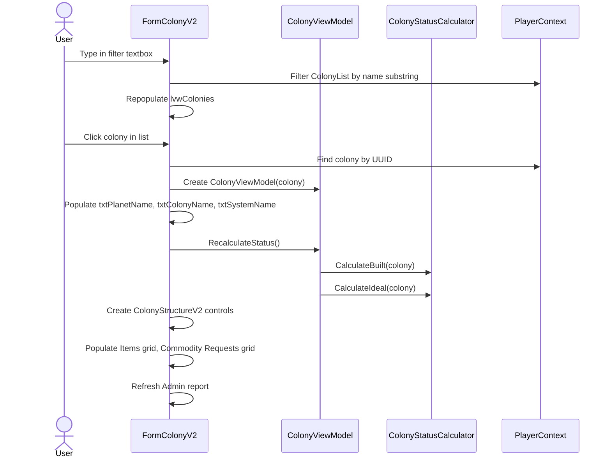
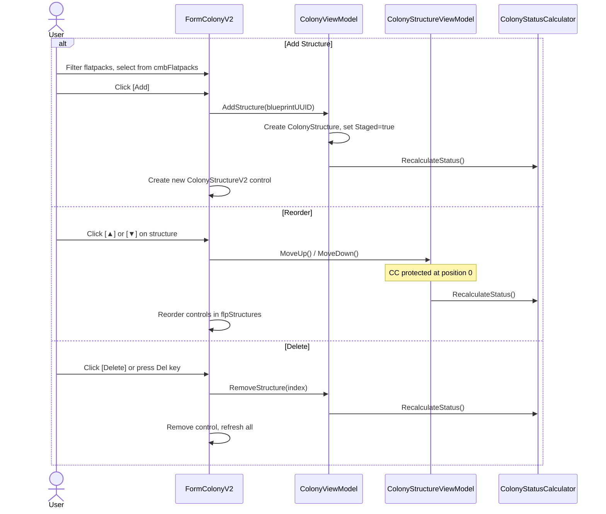
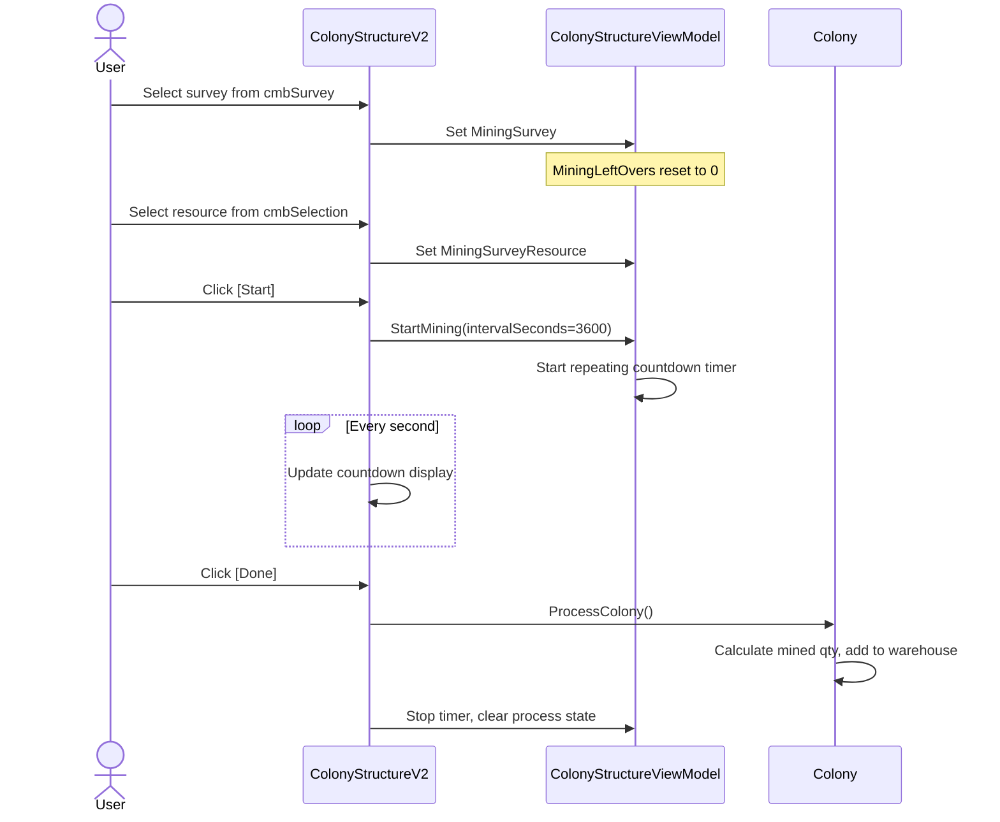
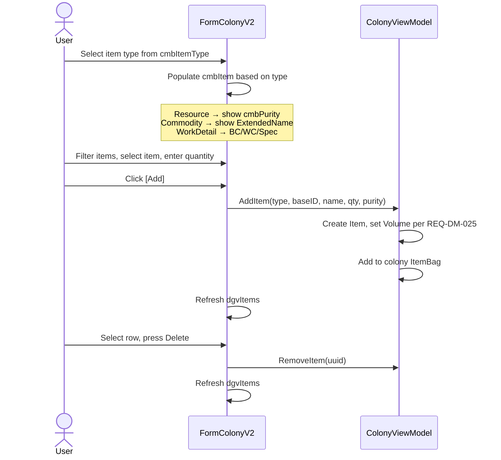
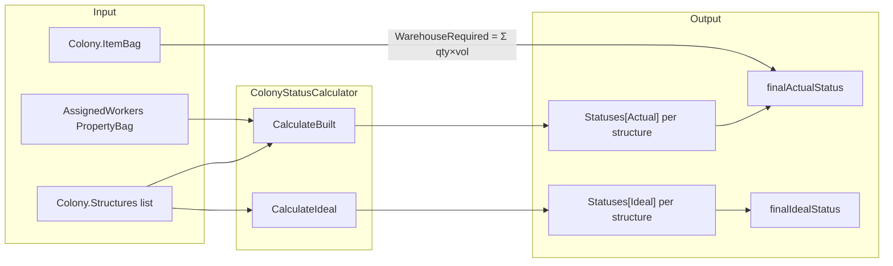
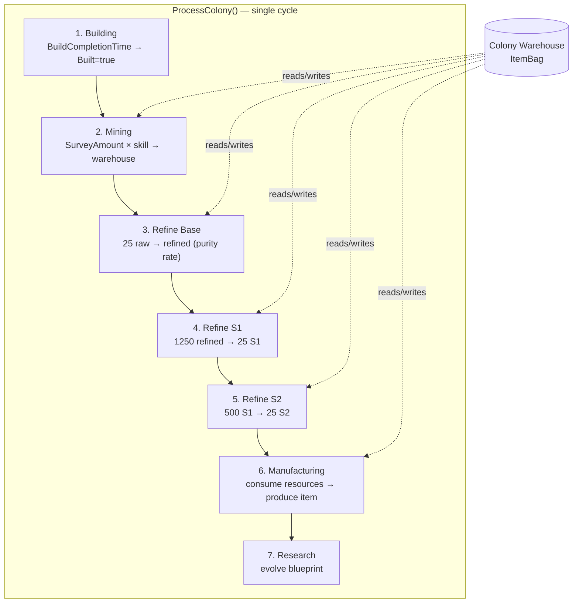

# Colony User Interaction Flows

### Colony Selection and Display

### Structure Add / Reorder / Delete

### Mining Rig Workflow

### Warehouse Item Management

## Data Flow Diagrams

### Colony Status Calculation Flow

### Colony Processing Pipeline (per cycle)


