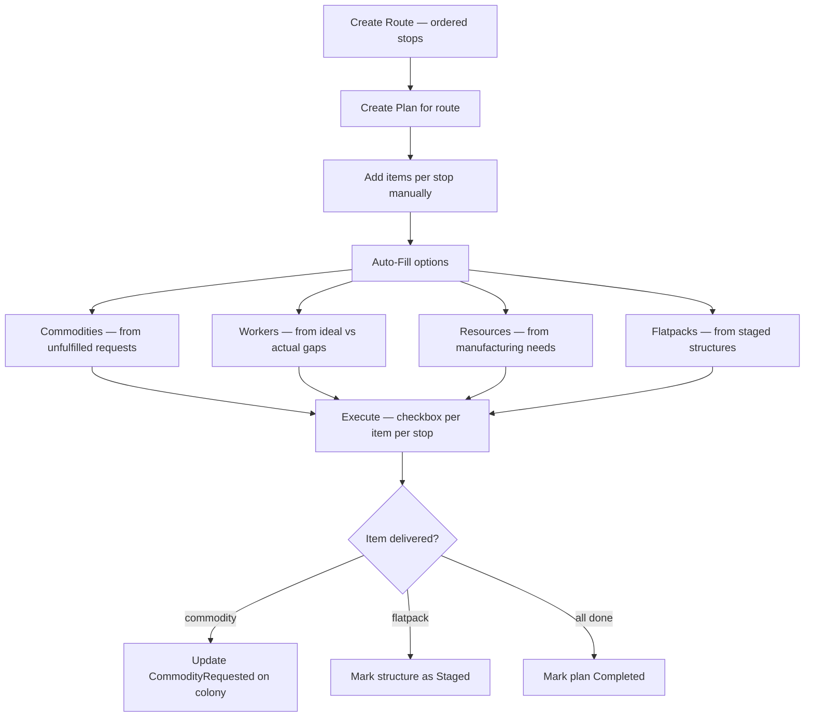

# Delivery & Route Requirements

## User Goal

The user wants to plan and execute multi-stop delivery runs between colonies and stations, tracking what needs to be loaded, dropped off, and picked up at each stop — turning complex logistics into a simple checklist.

## Out of Scope

- Travel time estimation between systems
- Automatic route optimization (shortest path, fewest jumps)
- Ship capacity enforcement as a hard block during planning (volume is displayed but not blocking)

## Background

Deliveries move items between colonies and a central hub (space station, deferred). Types of deliveries:
- Commodities requested by colonies
- Workers needed to meet ideal build plans
- Resources for manufacturing items and commodities
- Pickup of mined/refined resources to prevent warehouse overflow

Colonies are on planets. Planets are in systems. Travel between systems costs time and fuel. Travel between planets within a system costs time. Delivery routes define an ordered sequence of stops to minimize travel.

## Delivery Planning Flow

## Files

| File | Description | Requirements |
|------|-------------|--------------|
| [routes.md](routes.md) | Route builder data model, UI, system names, and station/asteroid stops | REQ-DEL-001 to REQ-DEL-025, REQ-DEL-080 to REQ-DEL-084 |
| [plans.md](plans.md) | Delivery planning data model, UI, auto-fill, and ship assignment | REQ-DEL-030 to REQ-DEL-045, REQ-DEL-060 to REQ-DEL-073 |
| [execution.md](execution.md) | Delivery execution form, fulfillment, and cargo volume | REQ-DEL-050 to REQ-DEL-057, REQ-DEL-090 to REQ-DEL-102 |
| [flows.md](flows.md) | User interaction flows and data flow diagrams | — |
| [mockups.md](mockups.md) | Form mockups and ASCII wireframes | — |
