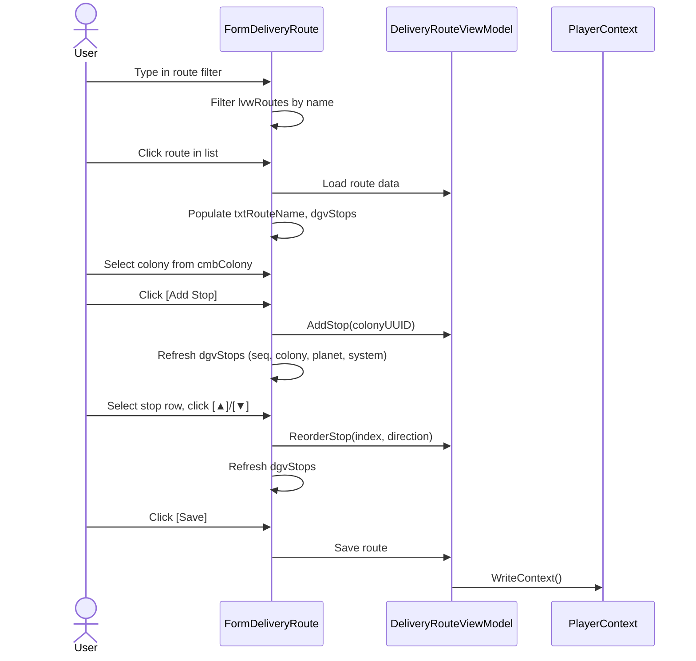
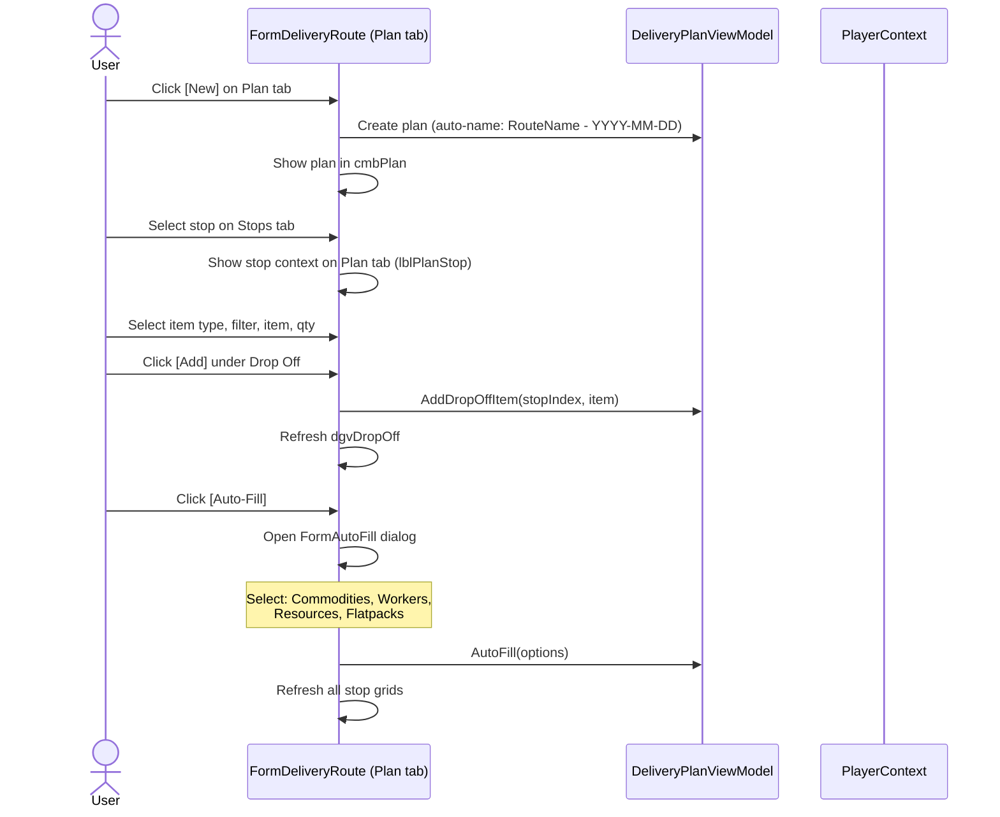
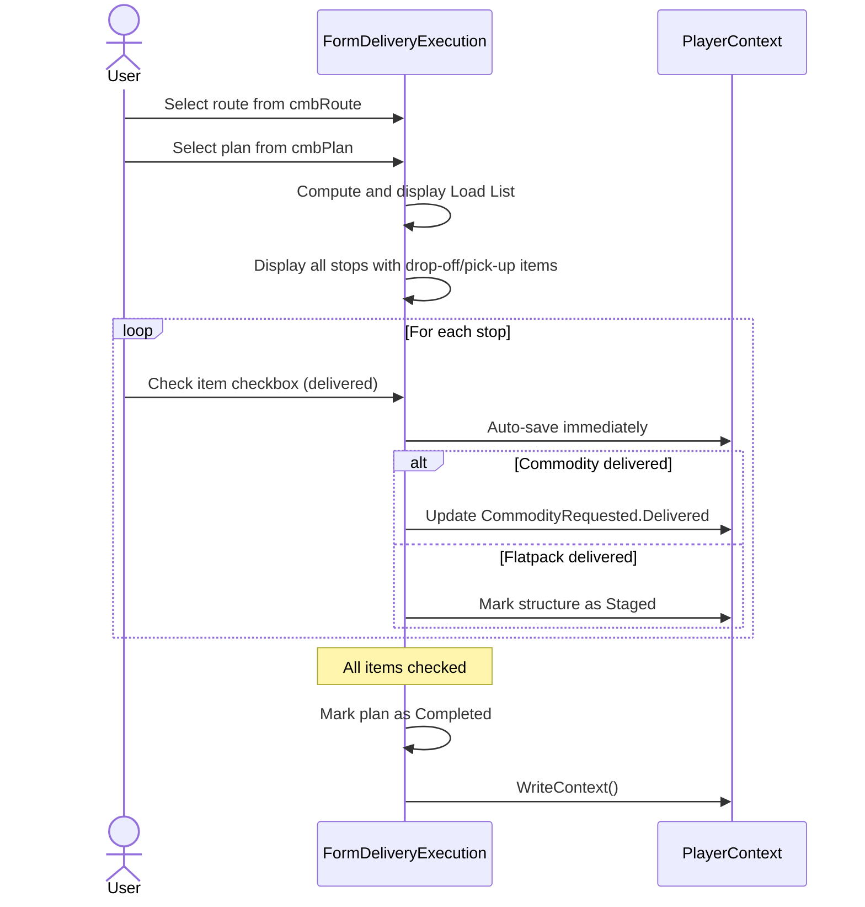
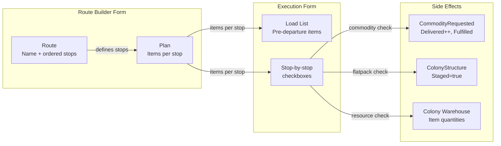
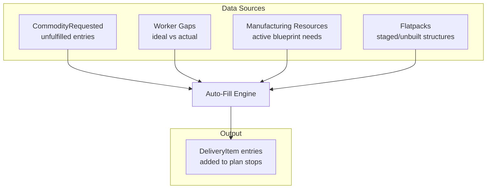

# Delivery User Interaction Flows

### Route Builder — Create and Edit Route

### Delivery Plan — Create and Populate

### Delivery Execution

## Data Flow Diagrams

### Route → Plan → Execution Pipeline

### Auto-Fill Data Sources


